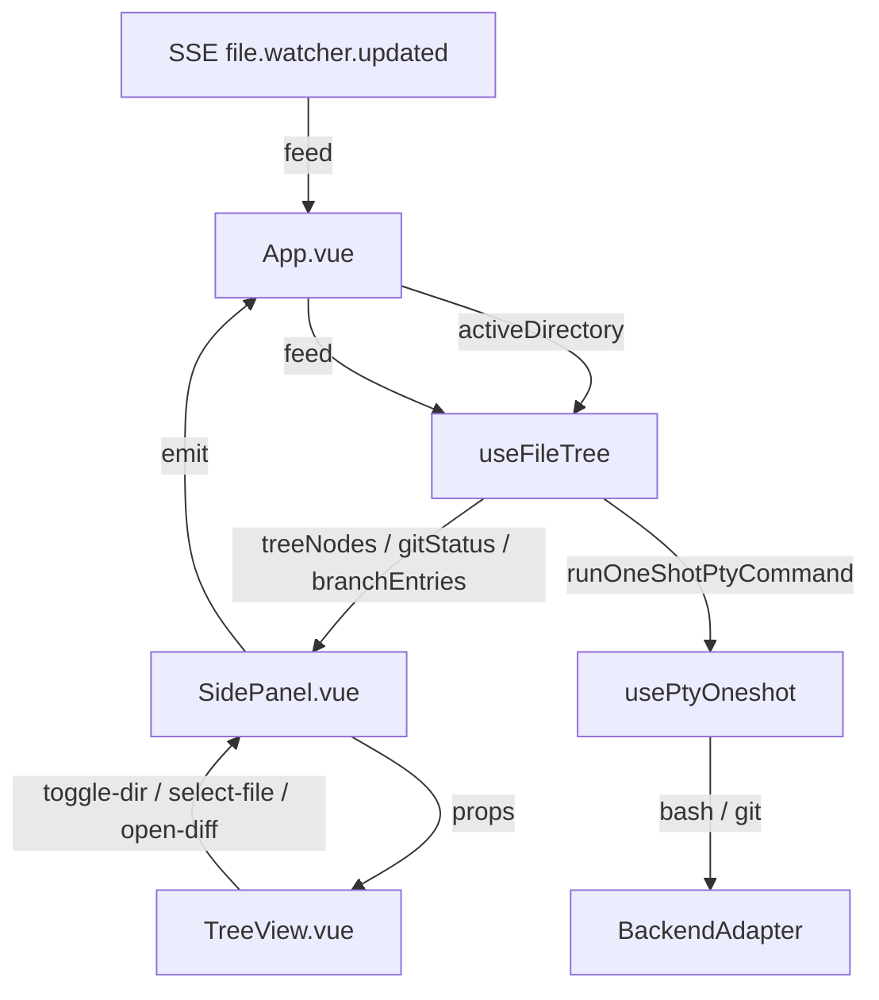
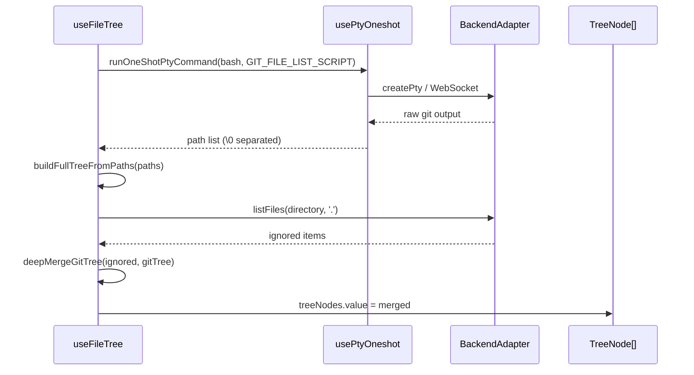
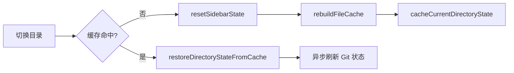

侧边栏文件树是 Vis 编辑器与项目目录之间的核心桥梁。它不仅提供层级化的文件浏览能力，还深度集成了 Git 版本控制状态——包括分支切换、文件变更标记、差异统计以及 push/pull 快捷操作。本章将系统拆解文件树的构建流程、Git 状态解析机制、虚拟滚动渲染策略，以及目录快照缓存与实时增量更新之间的协作关系。

---

## 整体架构与职责分层

文件树功能由两个核心模块协作完成：`useFileTree` 组合式函数负责所有数据逻辑（目录加载、Git 状态拉取、缓存管理），`TreeView.vue` 组件负责纯展示与交互（虚拟滚动、搜索过滤、分支下拉菜单）。两者通过 `SidePanel.vue` 作为中间层进行 props 与事件转发。这种分层设计确保了数据层与视图层可以独立演进：数据层不关心渲染细节，视图层不直接触发后端请求。

Sources: [useFileTree.ts](app/composables/useFileTree.ts#L1-L1350), [TreeView.vue](app/components/TreeView.vue#L1-L1878), [SidePanel.vue](app/components/SidePanel.vue#L1-L196)

---

## 双模式文件树策略

`useFileTree` 在初始化时会通过 `detectFileTreeStrategy` 检测当前目录是否为 Git 仓库。检测逻辑调用后端适配器的 `getVcsInfo` 接口，若返回有效分支名则启用 **git 模式**，否则回退到 **filesystem 模式**。两种模式在数据获取、树构建与缓存策略上存在本质差异。

| 维度 | git 模式 | filesystem 模式 |
|---|---|---|
| 根节点来源 | `git ls-files` 全量路径列表 | 后端 `listFiles` API 递归扫描 |
| 子目录展开 | `listFiles` API 补充 + Git 子树合并 | 纯 `listFiles` API 增量加载 |
| 文件上限 | 无硬性限制（Git 索引天然受限） | `AUTO_SCAN_FILE_LIMIT = 3000` |
| 忽略文件 | 通过 `listFiles` 单独加载并合并 | API 直接返回 |
| 状态刷新 | `git status --porcelain` + diffstat | 无 |

Sources: [useFileTree.ts](app/composables/useFileTree.ts#L712-L729), [useFileTree.ts](app/composables/useFileTree.ts#L1207-L1240)

---

## Git 模式的树构建流程

当检测到 Git 仓库后，根节点树通过 `refreshGitFileSnapshot` 构建。该流程执行 `GIT_FILE_LIST_SCRIPT`（底层为 `git ls-files --cached --others --exclude-standard -z`）获取以 `\0` 分隔的完整文件路径列表，随后调用 `buildFullTreeFromPaths` 将扁平路径递归转换为嵌套的 `TreeNode[]` 结构。与此同时，系统还会通过 `loadIgnoredRootNodes` 调用后端 `listFiles` API 获取被 Git 忽略但仍需显示的文件（如构建产物），并通过 `deepMergeGitTree` 将其合并到树中——这保证了开发者能在文件树中看到 `.gitignore` 排除的目录，同时不破坏 Git 索引的完整性。

Sources: [useFileTree.ts](app/composables/useFileTree.ts#L809-L858), [useFileTree.ts](app/composables/useFileTree.ts#L658-L710), [useFileTree.ts](app/composables/useFileTree.ts#L731-L761)

---

## Git 状态解析与差异统计

Git 状态通过 `refreshGitStatusOnly` 拉取，执行 `GIT_STATUS_SCRIPT` 脚本。该脚本并非简单调用 `git status`，而是精心编排的多命令管道：先设置无颜色、无分页的环境变量，再执行 `git status --porcelain=v1 -z -b -uall`，随后追加 `git rev-parse --short HEAD`、`git diff --shortstat`、`git diff --cached --shortstat` 以及未跟踪文件的行数统计。所有命令输出以 `\0##HEAD\0` 等标记分隔，最终由 `parseGitStatusOutput` 统一解析。

解析器按 `\0` 切分 token，遇到 `## ` 开头的行则调用 `parseGitStatusBranch` 提取分支名、上游追踪关系及 ahead/behind 计数；遇到 `XY path` 格式的 token 则映射为 `GitFileStatus`（`X` 为 index 状态，`Y` 为 worktree 状态）。对于重命名（`R`）和复制（`C`）操作，解析器会缓存 pending rename，等待下一个 token 作为 `origPath`。diffstat 部分通过正则匹配 `(\d+)\s+insertion` 和 `(\d+)\s+deletion` 分别累加 staged 与 unstaged 的增删行数。

Sources: [useFileTree.ts](app/composables/useFileTree.ts#L27-L38), [useFileTree.ts](app/composables/useFileTree.ts#L412-L534), [types/git.ts](app/types/git.ts#L1-L51)

---

## 目录快照缓存与状态恢复

为优化目录切换时的体验，`useFileTree` 实现了基于 LRU 的 `directorySidebarCache`，容量上限为 `DIRECTORY_SNAPSHOT_CACHE_LIMIT = 12`。每次目录加载完成或 Git 状态刷新后，当前完整的文件树、文件列表、Git 状态、分支列表及策略类型会被克隆并缓存。当用户切换回已缓存的目录时，`restoreDirectoryStateFromCache` 会立即恢复所有状态，避免重新请求后端。缓存失效通过 `invalidateDirectorySidebarCache` 显式触发，或在容量超限后按 FIFO 淘汰。

Sources: [useFileTree.ts](app/composables/useFileTree.ts#L559-L596), [useFileTree.ts](app/composables/useFileTree.ts#L1267-L1299)

---

## 实时增量更新与防抖

文件树并非静态数据。当后端通过 SSE 推送 `file.watcher.updated` 事件时，`App.vue` 调用 `useFileTree` 暴露的 `feed` 方法将变更注入。`feed` 方法会忽略 `.git` 内部路径，对 `unlink` 事件在 filesystem 模式下直接过滤文件列表，对其他事件则通过 `scheduleDirectoryReload` 与 `scheduleGitStatusReload` 分别触发目录重载与状态刷新，两者均带有 `120ms` 的防抖延迟。若树正处于 `treeLoading` 状态，事件会被暂存到 `pendingFileWatcherEvents` 队列，待加载完成后批量消费。

Sources: [useFileTree.ts](app/composables/useFileTree.ts#L1138-L1164), [useFileTree.ts](app/composables/useFileTree.ts#L321-L341), [App.vue](app/App.vue#L8419-L8432)

---

## 虚拟滚动与三态视图过滤

`TreeView.vue` 采用固定行高（`ROW_HEIGHT = 24px`）的虚拟滚动方案。`flattenedRows` 计算属性通过两趟遍历生成可见行列表：第一趟自底向上计算每个目录是否包含匹配搜索关键词的文件后代；第二趟自顶向下生成 `VirtualRow[]`，并根据 `expandedPaths` 或搜索状态决定是否展开子树。`visibleRows` 进一步根据 `scrollTop` 与 `containerHeight` 截取视口上下各 `OVERSCAN = 5` 行的缓冲区域，通过 `transform: translateY` 定位，避免大量 DOM 节点的创建开销。

视图支持三种过滤模式——**staged**（仅显示已暂存变更）、**changes**（仅显示未暂存变更）、**all**（全部文件）。过滤通过 `filterByPredicate` 递归实现：若节点自身或其后代满足条件，则保留该节点及其路径上的所有祖先目录。此外，对于新增、删除或未跟踪的文件，Git 状态中的路径可能尚未存在于文件树中，`withPseudoNodes` 会为其创建 `synthetic = true` 的虚拟节点，确保用户能在 staged/changes 视图中看到这些变更文件。

Sources: [TreeView.vue](app/components/TreeView.vue#L471-L473), [TreeView.vue](app/components/TreeView.vue#L829-L967), [TreeView.vue](app/components/TreeView.vue#L713-L761), [TreeView.vue](app/components/TreeView.vue#L763-L775)

---

## 分支列表与快捷操作

`TreeView.vue` 顶部分支选择器不仅展示当前分支名与 HEAD 短哈希，还通过 `ahead`/`behind` 计数渲染 push/pull 快捷按钮。点击分支名展开下拉菜单，菜单内容按需通过 `ensureBranchEntriesLoaded` 从 `useFileTree` 获取。分支列表由 `refreshBranchEntries` 通过 `git branch -a --format` 拉取，解析为 `BranchEntry[]` 后按本地/远程分组。每个分支项支持检出、合并、创建新分支、删除等操作，这些操作最终通过 `runShellCommand` 注入到后端 Shell 执行。

Sources: [TreeView.vue](app/components/TreeView.vue#L3-L222), [useFileTree.ts](app/composables/useFileTree.ts#L1011-L1066), [useFileTree.ts](app/composables/useFileTree.ts#L941-L1009)

---

## 状态码映射与样式体系

Git 状态码在类型层定义为 `GitStatusCode = '' | 'M' | 'A' | 'D' | 'R' | 'C' | '?'`，在视图层映射为单字母标签与 CSS 类名。`TreeView.vue` 中的 `getDisplayStatus` 根据当前 `viewMode` 决定展示 index 状态还是 worktree 状态；`getStatusClass` 与 `getRowStatusClass` 分别生成行内按钮样式与整行背景样式，支持 `is-staged`/`is-unstaged`、`is-modified`/`is-added`/`is-deleted`/`is-untracked` 等语义化类名，便于主题系统覆盖。

| 状态码 | 含义 | 标签 | 典型场景 |
|---|---|---|---|
| `M` | Modified | M | 文件内容变更 |
| `A` | Added | A | 新文件已暂存 |
| `D` | Deleted | D | 文件被删除 |
| `R` | Renamed | R | 文件重命名 |
| `C` | Copied | C | 文件复制 |
| `?` | Untracked | U | 未跟踪新文件 |

Sources: [types/git.ts](app/types/git.ts#L5-L12), [TreeView.vue](app/components/TreeView.vue#L1016-L1047), [TreeView.vue](app/components/TreeView.vue#L969-L1014)

---

## 下一步阅读

文件树与 Git 集成构成了侧边栏的核心数据层，而侧边栏的另一重要面板是会话树与待办列表。如果你希望了解会话的层级组织、置顶机制与批量操作，请继续阅读 [待办与会话树面板](19-dai-ban-yu-hui-hua-shu-mian-ban)。若对悬浮窗中代码差异的渲染与语法高亮感兴趣，可前往 [代码差异压缩与语法高亮](17-dai-ma-chai-yi-ya-suo-yu-yu-fa-gao-liang)。