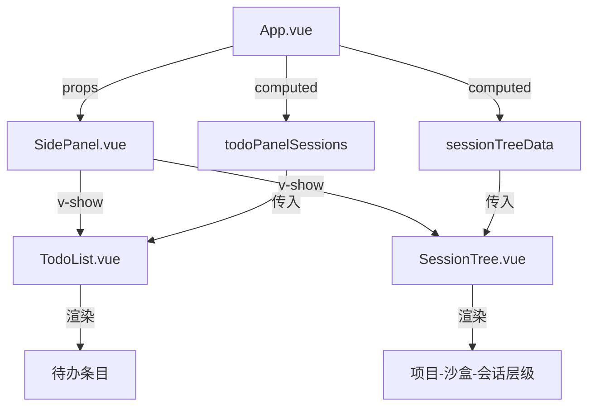
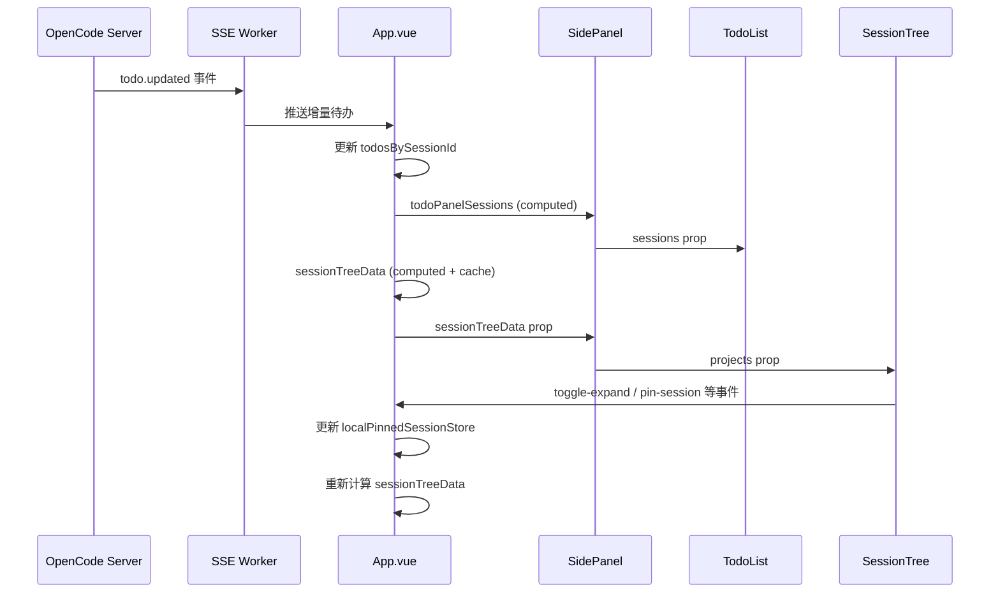

侧边栏中的「待办」与「会话树」面板是 Vis 应用左侧导航区的两大核心视图，分别承担**任务追踪**与**会话组织**的职责。二者共享同一容器 `SidePanel`，通过顶部标签页切换，底层数据均来自 SSE 实时事件流与后端 API 的协同驱动。本文将拆解这两个面板的组件层级、数据流转与状态持久化机制。

---

## 面板整体架构

`SidePanel` 是侧边栏的根容器，内部通过 `v-show` 控制三个标签视图的显隐：`todo`（待办）、`session`（会话树）、`tree`（文件树）。待办与会话树面板的数据链路彼此独立，但共享同一套折叠/展开、主题变量与本地化体系。



Sources: [SidePanel.vue](app/components/SidePanel.vue#L13-L78), [App.vue](app/App.vue#L62-L100)

---

## 待办面板（TodoList）

### 数据模型

待办数据的核心类型定义在 `useTodos` 组合式函数中。每个待办条目包含 `content`（内容）、`status`（状态）与 `priority`（优先级）三个字段，其中状态支持 `completed`、`in_progress`、`cancelled` 与 `pending` 四种取值，优先级支持 `high`、`medium`、`low` 三种取值。

```ts
export type TodoItem = {
  content: string;
  status: string;
  priority: string;
};
```

Sources: [useTodos.ts](app/composables/useTodos.ts#L5-L9)

### 数据获取与归一化

`useTodos` 接收三个依赖：`selectedSessionId`（当前选中会话）、`allowedSessionIds`（允许查看的会话集合，含子会话）、`activeDirectory`（活动目录）。当调用 `reloadTodosForAllowedSessions` 时，它会遍历所有允许的会话 ID，通过后端适配器的 `getSessionTodos` 方法并行拉取数据，并使用 `normalizeTodoItems` 对原始响应进行防御式清洗——过滤掉非对象、缺 `content` 或字段类型不合法的条目，同时为缺失的 `status` 与 `priority` 提供默认值 `pending` 与 `medium`。

```ts
function normalizeTodoItem(value: unknown): TodoItem | null {
  const record = value as Record<string, unknown>;
  const content = typeof record.content === 'string' ? record.content.trim() : '';
  const status = typeof record.status === 'string' ? record.status.trim() : '';
  const priority = typeof record.priority === 'string' ? record.priority.trim() : '';
  if (!content) return null;
  return { content, status: status || 'pending', priority: priority || 'medium' };
}
```

Sources: [useTodos.ts](app/composables/useTodos.ts#L21-L29)

### 实时增量更新

除了主动拉取，待办数据还通过 SSE 事件 `todo.updated` 实现增量推送。`App.vue` 在全局事件系统的 `sessionScope` 上监听该事件，收到后直接更新 `todosBySessionId` 中对应会话的条目，并清除该会话的错误状态。这种「拉取兜底 + 推送实时」的双轨策略，确保用户在切换会话或后台数据变更时都能获得一致视图。

Sources: [App.vue](app/App.vue#L8387-L8397), [types/sse.ts](app/types/sse.ts#L456-L457)

### 视图渲染

`TodoList.vue` 接收 `sessions` 数组，按会话分组渲染。每组显示会话标题与子代理（subagent）徽章，内部以无序列表展示待办条目。每个条目左侧为状态图标（`✓`、`◐`、`✕`、`○`），中间为内容文本，右侧为优先级标签。样式层面通过 `is-${status}` 与 `is-${priority}` 动态类名绑定主题色，确保高优先级与异常状态在视觉上具有显著区分度。

Sources: [TodoList.vue](app/components/TodoList.vue#L1-L76), [TodoPanel.vue](app/components/TodoPanel.vue#L89-L279)

---

## 会话树面板（SessionTree）

### 层级数据模型

会话树采用三级嵌套结构：`SessionTreeProject` → `SessionTreeSandbox` → `SessionTreeSession`。每个层级均携带 `pinnedAt`、`isPinned` 与 `isImplicitlyPinned` 三个置顶相关字段，用于实现「显式置顶」与「继承置顶」的混合逻辑。

```ts
export type SessionTreeProject = {
  type: 'project';
  projectId: string;
  name: string;
  pinnedAt: number;
  isPinned: boolean;
  sandboxes: SessionTreeSandbox[];
};
```

Sources: [types/session-tree.ts](app/types/session-tree.ts#L1-L35)

### 置顶状态的继承与覆盖

会话树的置顶逻辑是设计的核心难点。`App.vue` 中的 `sessionTreeData` computed 属性负责将原始 `serverState.projects` 转换为树形数据。转换过程中遵循以下优先级规则：

1. **显式置顶优先**：若会话、沙盒或项目本身在本地存储中有正数 `pinnedAt`，则视为直接置顶。
2. **继承置顶**：若父级（沙盒或项目）被置顶，且子级未被显式取消置顶，则子级隐式继承置顶状态。
3. **取消置顶覆盖**：本地存储中的负数值表示用户显式取消了该节点的置顶，优先级高于继承。

这种设计允许用户「置顶一个项目」即可让该项目下所有沙盒和会话自动可见，同时又能对个别沙盒或会话进行细粒度取消。

Sources: [App.vue](app/App.vue#L2142-L2261)

### 缓存策略

由于会话树数据涉及多层嵌套遍历与置顶状态计算，直接每次重新计算在会话频繁更新时会造成不必要的性能开销。`App.vue` 引入了一个基于哈希的缓存机制：`computeProjectsHash` 将项目结构、置顶存储与删除沙盒存储混合为一个字符串哈希，`sessionTreeData` 在计算前会先比对缓存的哈希值与时间戳（TTL 15 秒），若命中则直接返回缓存数据。

Sources: [App.vue](app/App.vue#L1600-L1643), [App.vue](app/App.vue#L2146-L2152)

### 交互与持久化

`SessionTree.vue` 渲染三级树形结构，支持以下交互：

- **展开/折叠**：点击项目或沙盒行可切换子级显隐，展开路径通过 `expandedPaths` 数组管理，并持久化到 `localStorage` 键 `state.sessionTreeExpanded.v1`。
- **会话选择**：点击会话行触发 `select-session` 事件，由 `App.vue` 调用 `switchSessionSelection` 完成会话切换。
- **置顶操作**：每行右侧的图钉按钮支持对项目、沙盒、会话分别置顶/取消置顶，事件通过 `pin-project`、`unpin-project`、`pin-sandbox`、`unpin-sandbox`、`pin-session`、`unpin-session` 向上冒泡，最终由 `App.vue` 中的 `pinProject`、`unpinProject`、`pinSandbox`、`unpinSandbox` 等函数修改本地置顶存储。

Sources: [SessionTree.vue](app/components/SessionTree.vue#L1-L180), [App.vue](app/App.vue#L2811-L2828), [App.vue](app/App.vue#L4292-L4362)

### 状态图标

会话行左侧的状态图标直接映射后端状态字段：`busy` 显示 🤔（思考中）、`idle` 显示 🟢（空闲）、`retry` 显示 🔴（重试）、`unknown` 显示 ⚪（未知），通过 CSS 类 `is-${status}` 附加颜色主题。

Sources: [SessionTree.vue](app/components/SessionTree.vue#L174-L179)

---

## 侧边栏状态持久化

`SidePanel` 的折叠状态与当前标签页均通过 `storageKeys.ts` 中定义的键持久化：

| 状态项 | 存储键 | 默认值 |
|--------|--------|--------|
| 折叠状态 | `state.sidePanelCollapsed.v1` | `false` |
| 当前标签 | `state.sidePanelTab.v1` | `'tree'` |
| 会话树展开路径 | `state.sessionTreeExpanded.v1` | `[]` |

Sources: [utils/storageKeys.ts](app/utils/storageKeys.ts#L67-L74), [App.vue](app/App.vue#L3066-L3098)

---

## 数据流总结



Sources: [App.vue](app/App.vue#L2036-L2042), [App.vue](app/App.vue#L2115-L2140), [App.vue](app/App.vue#L2142-L2261)

---

## 相关阅读

- 若要理解会话树的置顶与批量操作底层逻辑，请参阅 [会话选择、置顶与批量操作](13-hui-hua-xuan-ze-zhi-ding-yu-pi-liang-cao-zuo)
- 若要了解 SSE 事件如何路由到会话作用域，请参阅 [SSE 连接管理与事件协议](8-sse-lian-jie-guan-li-yu-shi-jian-xie-yi)
- 若要深入文件树面板的实现，请参阅 [文件树构建与 Git 状态集成](18-wen-jian-shu-gou-jian-yu-git-zhuang-tai-ji-cheng)