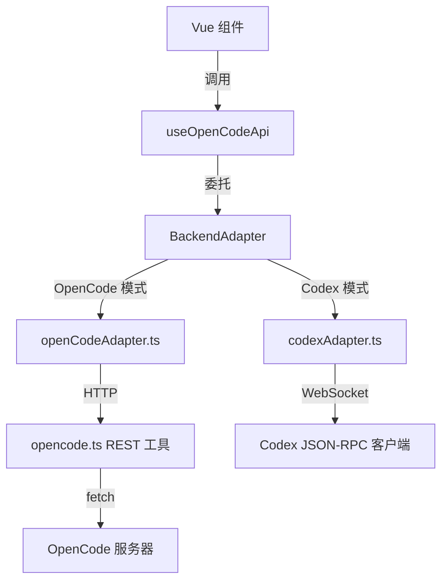

本文档深入解析 Vis 前端与 OpenCode 服务器之间的通信桥梁，涵盖从底层 HTTP 请求封装到高层业务 Composable 的完整链路。理解这一架构有助于开发者扩展后端适配器、调试网络问题，以及在不同部署模式下（本地服务器或远程 Codex 桥接）保持接口一致性。

---

## 架构分层概览

Vis 采用**三层适配架构**隔离 OpenCode REST API 的直接调用：最底层是 `app/utils/opencode.ts` 中的原始 HTTP 工具函数；中间层由 `app/backends/openCodeAdapter.ts` 实现 `BackendAdapter` 接口，将工具函数映射为统一的后端契约；最上层通过 `useOpenCodeApi` Composable 为 Vue 组件提供带有状态同步与加载状态管理的高级 API。这种分层设计使得同一套 UI 代码可以同时对接 OpenCode 服务器和 Codex JSON-RPC 桥接器，而无需修改业务逻辑。

Sources: [opencode.ts](app/utils/opencode.ts#L1-L568), [openCodeAdapter.ts](app/backends/openCodeAdapter.ts#L1-L85), [types.ts](app/backends/types.ts#L1-L118)

---

## 底层 HTTP 工具层：`app/utils/opencode.ts`

`opencode.ts` 是整个 OpenCode 通信的基础，包含约 49 个导出的 API 函数。它维护两个模块级状态变量——`configuredBaseUrl` 和 `configuredAuthorization`——并通过 `setBaseUrl` 和 `setAuthorization` 进行配置。所有请求统一使用原生 `fetch`，不依赖外部 HTTP 库，确保在浏览器和 Electron 环境中行为一致。

**核心内部机制**包括：URL 构建器 `createUrl` 会自动去除尾部斜杠并拼接查询参数；`buildQuery` 会跳过值为 `undefined` 的字段；`buildHeaders` 根据请求选项注入 `Content-Type`、`x-opencode-directory` 和 `Authorization` 头。对于响应处理，`parseJson` 会优雅处理 204/205 状态码、空 body 以及非 JSON 响应（此时返回原始文本）。这一设计保证了与 OpenCode 服务器各种返回风格的兼容性。

**HTTP 方法封装**分为两类：`getJson` 用于所有 GET 请求，`sendJson` 用于 POST、PUT、PATCH、DELETE。两者都会在响应非 OK 时抛出包含路径和状态码的错误。唯一的例外是 `readFileContentBytes`，它直接返回 `Uint8Array` 而非 JSON，用于二进制文件（如图标、图片）的读取。

Sources: [opencode.ts](app/utils/opencode.ts#L1-L100), [opencode.ts](app/utils/opencode.ts#L157-L180)

---

## 后端适配器与多后端切换

`app/backends/types.ts` 定义了 `BackendAdapter` 接口，这是 Vis 支持多后端的核心抽象。接口包含 `kind`（`'opencode' | 'codex'`）、`label`、`capabilities` 以及约 50 个可选或必需的方法。`capabilities` 是一个布尔标志集合，用于运行时判断当前后端是否支持某类功能（如 `projects`、`worktrees`、`todos`），这在 UI 层面决定了某些菜单项是否显示。

`openCodeAdapter.ts` 实现了该接口的完整映射。它的 `configure` 方法接收 `baseUrl` 和 `authorization`，直接设置到 `opencode.ts` 的模块状态中。所有方法几乎都是对 `opencode.ts` 对应函数的透传，例如 `createSession` 映射到 `opencodeApi.createSession`，`sendPromptAsync` 映射到 `opencodeApi.sendPromptAsync`。这种"薄适配器"模式保持了 OpenCode 端的简洁，而将复杂的协议转换留给 Codex 端处理。

`app/backends/registry.ts` 负责管理适配器实例和激活状态。它维护 `adapters` 映射表和 `activeBackendKind`，提供 `getActiveBackendAdapter()` 供上层调用。当用户在登录界面切换后端时，`setActiveBackendKind` 会触发所有监听者，使 UI 状态与后端同步。

Sources: [types.ts](app/backends/types.ts#L1-L118), [openCodeAdapter.ts](app/backends/openCodeAdapter.ts#L1-L85), [registry.ts](app/backends/registry.ts#L1-L77)

---

## 高层业务封装：`useOpenCodeApi`

`useOpenCodeApi` 是 Vue 组件直接使用的 Composable，它在原始适配器之上增加了三项关键能力：**加载状态管理**、**SSE 状态同步等待** 和 **业务语义封装**。

**加载状态**通过内部的 `pendingCount` ref 和 `withPending` 包装器实现。任何被 `withPending` 包裹的异步操作都会自动递增/递减计数，组件可通过返回的 `pending` computed 属性显示全局加载指示器。

**SSE 状态同步**是 `useOpenCodeApi` 最精妙的设计。OpenCode 的 REST API 返回成功仅代表服务器已接受请求，实际的状态变更（如会话创建、归档、重命名）通过 SSE 事件流异步推送到前端。`useOpenCodeApi` 使用 `waitForState` 工具监听 `projects` 响应式对象，直到目标状态条件满足才 resolve。例如 `createSession` 在调用 `getBackend().createSession` 后，会等待 `findSession(state[effectiveProjectId], sessionId)` 返回真值，确保组件在拿到返回值时，本地状态树已经包含了新会话。

**业务语义方法**包括会话生命周期管理（`createSession`、`forkSession`、`archiveSession`、`unarchiveSession`、`renameSession`、`deleteSession`）、项目操作（`updateProject`）、工作区管理（`createWorktree`、`deleteWorktree`）以及查询方法（`listSessions`、`openProject`）。其中 `pinSession` 和 `unpinSession` 是乐观更新——它们不等待 SSE 确认，直接返回 PATCH 响应结果，以避免置顶操作在 UI 上产生可感知的延迟。

Sources: [useOpenCodeApi.ts](app/composables/useOpenCodeApi.ts#L76-L431), [waitForState.ts](app/utils/waitForState.ts#L1-L39)

---

## REST 端点与前端方法对照表

下表汇总了 `opencode.ts` 中封装的主要 REST 端点及其在前端的使用场景：

| 端点 | 方法 | 前端方法 | 典型使用场景 |
|------|------|----------|-------------|
| `GET /global/health` | 健康检查 | `getGlobalHealth` | 状态监控面板 |
| `GET /global/config` | 读取全局配置 | `getGlobalConfig` | 提供商管理、设置初始化 |
| `PATCH /global/config` | 更新全局配置 | `updateGlobalConfig` | 启用/禁用模型提供商 |
| `GET /project` | 列出项目 | `listProjects` | SSE Worker 初始化项目列表 |
| `GET /project/current` | 当前项目 | `getCurrentProject` | SSE Worker 目录匹配 |
| `PATCH /project/{id}` | 更新项目元数据 | `updateProject` | 项目设置对话框 |
| `GET /session` | 列出会话 | `listSessions` | 会话树加载、打开项目 |
| `POST /session` | 创建会话 | `createSession` | 新建会话按钮 |
| `GET /session/{id}` | 获取会话 | `getSession` | 会话详情查询 |
| `DELETE /session/{id}` | 删除会话 | `deleteSession` | 删除会话菜单 |
| `PATCH /session/{id}` | 更新会话 | `updateSession` | 重命名、归档、置顶 |
| `POST /session/{id}/fork` | 分叉会话 | `forkSession` | 消息分叉操作 |
| `POST /session/{id}/revert` | 回退消息 | `revertSession` | 撤销消息修改 |
| `POST /session/{id}/unrevert` | 恢复回退 | `unrevertSession` | 恢复被撤销的消息 |
| `POST /session/{id}/abort` | 中止会话 | `abortSession` | 停止生成按钮 |
| `POST /session/{id}/command` | 执行命令 | `sendCommand` | 斜杠命令解析 |
| `POST /session/{id}/prompt_async` | 异步发送消息 | `sendPromptAsync` | 用户消息发送 |
| `GET /session/{id}/message` | 列出消息 | `listSessionMessages` | 历史记录加载 |
| `GET /session/{id}/diff` | 获取差异 | `getSessionDiff` | 消息差异查看 |
| `GET /file` | 列出文件 | `listFiles` | 文件树、项目选择器 |
| `GET /file/content` | 读取文件 | `readFileContent` | 代码查看、设置读取 |
| `GET /vcs` | VCS 信息 | `getVcsInfo` | Git 分支检测 |
| `GET /provider` | 列出提供商 | `listProviders` | 模型选择下拉框 |
| `GET /agent` | 列出代理 | `listAgents` | 代理模式选择 |
| `GET /pty` | 列出终端 | `listPtys` | 终端面板 |
| `POST /pty` | 创建终端 | `createPty` | 新建终端会话 |
| `PUT /pty/{id}` | 调整终端大小 | `updatePtySize` | 终端窗口 resize |
| `DELETE /pty/{id}` | 删除终端 | `deletePty` | 关闭终端 |
| `GET /permission` | 待处理权限 | `listPendingPermissions` | 权限对话框初始化 |
| `POST /permission/{id}/reply` | 回复权限 | `replyPermission` | 允许/拒绝权限请求 |
| `GET /question` | 待处理问题 | `listPendingQuestions` | 问题对话框初始化 |
| `POST /question/{id}/reply` | 回复问题 | `replyQuestion` | 提交问题答案 |
| `POST /question/{id}/reject` | 拒绝问题 | `rejectQuestion` | 关闭问题对话框 |
| `GET /mcp` | MCP 状态 | `getMcpStatus` | 状态监控 MCP 标签页 |
| `POST /mcp` | 更新 MCP | `updateMcp` | 启用/禁用 MCP 服务器 |
| `GET /lsp` | LSP 状态 | `getLspStatus` | 状态监控 LSP 标签页 |
| `GET /skill` | Skill 状态 | `getSkillStatus` | 状态监控插件标签页 |

Sources: [opencode.ts](app/utils/opencode.ts#L118-L565), [API.md](docs/API.md#L1-L200)

---

## 认证与连接配置

OpenCode 后端的认证信息通过 `useCredentials` Composable 管理，存储在 `localStorage`（或 Electron 持久化存储）中。`credentials.authHeader` 生成 `Basic base64(username:password)` 格式的授权头，`credentials.baseUrl` 提供去除尾部斜杠的服务器地址。`App.vue` 中的 `watchEffect` 会在这些值变化时自动调用 `configureOpenCodeBackend`，实时更新 `opencode.ts` 的全局状态。

默认 OpenCode 服务器地址为 `http://localhost:4096`，定义在 `app/utils/constants.ts` 中。所有国际化文件都引用该常量作为登录表单的默认值。

Sources: [useCredentials.ts](app/composables/useCredentials.ts#L1-L236), [App.vue](app/App.vue#L6847-L6870), [constants.ts](app/utils/constants.ts#L1-L2)

---

## SSE Worker 中的并发控制

`app/workers/sse-shared-worker.ts` 是 OpenCode 状态同步的核心，它直接实例化 `createOpenCodeAdapter()` 作为 `opencodeBackend`。为了避免在 Shared Worker 中同时发起过多 HTTP 请求导致浏览器连接池耗尽，Worker 实现了**读取并发槽位**机制：`OPENCODE_READ_CONCURRENCY` 限制为 12 个并发任务，`runOpencodeReadTask` 在执行实际请求前会获取槽位，并在完成后释放。所有涉及 OpenCode 的读取操作（如 `listProjects`、`listSessions`、`getVcsInfo`）都通过该包装器执行。

Sources: [sse-shared-worker.ts](app/workers/sse-shared-worker.ts#L50-L80), [sse-shared-worker.ts](app/workers/sse-shared-worker.ts#L583-L596)

---

## 测试覆盖

OpenCode API 层拥有完善的单元测试。`app/utils/opencode.test.ts` 验证了 URL 构建、查询参数处理、HTTP 方法封装、认证头注入以及特殊响应（204、空 body、非 JSON）的处理逻辑。`app/composables/useOpenCodeApi.test.ts` 则聚焦于业务语义，特别是置顶/取消置顶操作的乐观更新行为，以及工作区删除后的乐观状态清理。这些测试使用 Vitest 的 `vi.mock` 隔离底层依赖，确保 Composable 逻辑的可测试性。

Sources: [opencode.test.ts](app/utils/opencode.test.ts#L1-L242), [useOpenCodeApi.test.ts](app/composables/useOpenCodeApi.test.ts#L1-L139)

---

## 与其他模块的关联

OpenCode API 层是 Vis 多个功能模块的基础依赖。会话与项目管理由 [useOpenCodeApi](app/composables/useOpenCodeApi.ts) 直接提供；文件树和 Git 状态集成通过 `listFiles` 和 `getVcsInfo` 实现，详见 [文件树构建与 Git 状态集成](18-wen-jian-shu-gou-jian-yu-git-zhuang-tai-ji-cheng)；权限与问题对话框分别由 [usePermissions](app/composables/usePermissions.ts) 和 [useQuestions](app/composables/useQuestions.ts) 调用 `replyPermission`、`replyQuestion` 等方法；终端功能依赖 `createPty` 和 WebSocket URL 构建；状态监控面板聚合了 `getGlobalHealth`、`getMcpStatus`、`getLspStatus` 等多个端点。若需了解 Codex 后端的 JSON-RPC 桥接实现，请参考 [Codex 桥接器与 JSON-RPC 转发](24-codex-qiao-jie-qi-yu-json-rpc-zhuan-fa)。