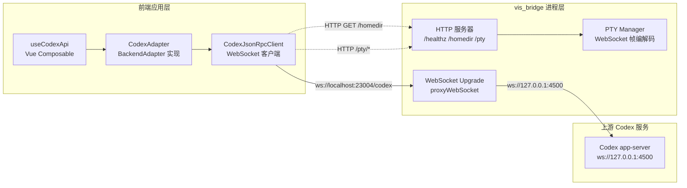
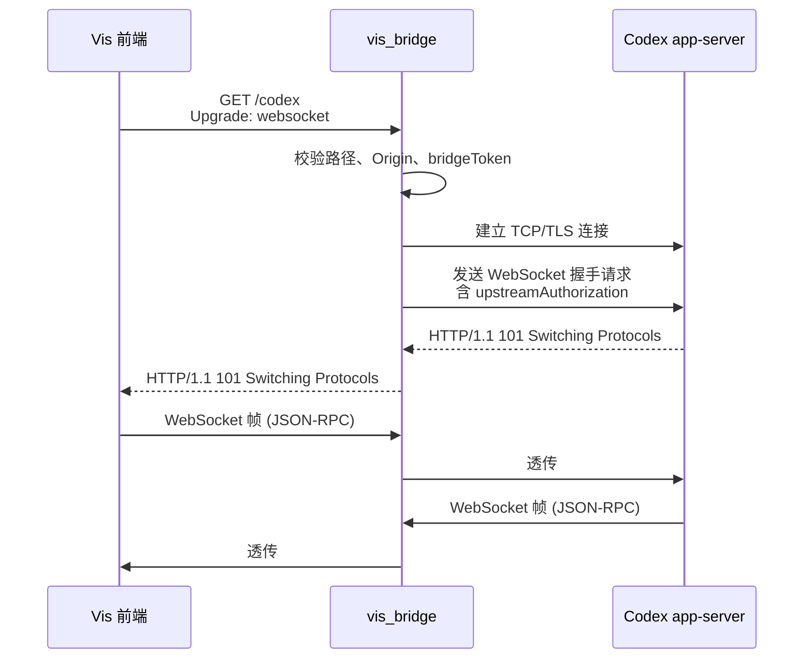
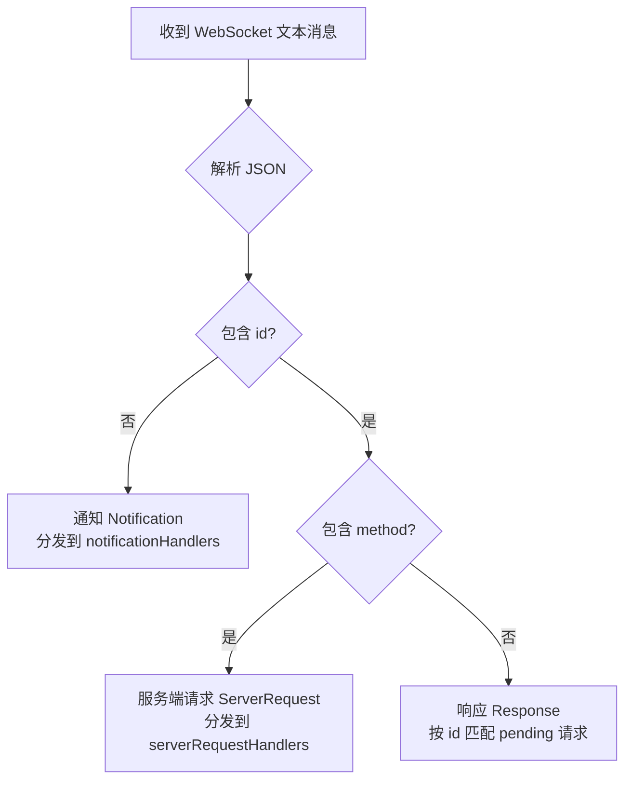
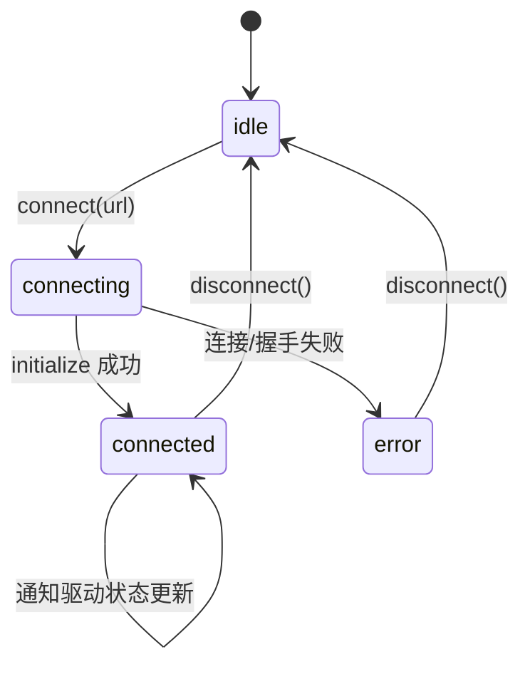

本页深入解析 Vis 与 OpenAI Codex app-server 之间的通信架构，涵盖 `vis_bridge` 本地桥接器进程、前端 JSON-RPC 客户端、Codex 后端适配器以及高层 Vue Composable 四层栈。理解这一架构有助于排查连接故障、扩展 Codex 协议支持，以及在 Electron 与浏览器环境中安全地转发 WebSocket 与 PTY 流量。

---

## 架构总览：四层转发模型

Vis 并非直接连接 Codex app-server，而是通过一个本地 Node.js 桥接器 `vis_bridge` 进行中转。该设计解决了浏览器 WebSocket 无法直接访问本地 stdio 服务的问题，同时统一了认证、CORS 与 PTY 终端管理。



四层职责划分如下：

| 层级 | 核心模块 | 职责 |
|------|----------|------|
| **桥接进程** | `vis_bridge.js` | 本地 HTTP/WebSocket 服务器，转发到 Codex app-server；提供 PTY REST/WebSocket 端点 |
| **JSON-RPC 客户端** | `jsonRpcClient.ts` | WebSocket 连接管理、请求-响应匹配、通知/服务端请求路由 |
| **后端适配器** | `codexAdapter.ts` | 将 Codex 的 thread/turn/item 协议映射为 Vis 通用的 BackendAdapter 接口 |
| **应用状态层** | `useCodexApi.ts` | Vue 响应式状态、通知分发、对话历史归一化、UI 交互封装 |

Sources: [vis_bridge.js](vis_bridge.js#L1-L703), [jsonRpcClient.ts](app/backends/codex/jsonRpcClient.ts#L1-L321), [codexAdapter.ts](app/backends/codex/codexAdapter.ts#L1-L2015), [useCodexApi.ts](app/composables/useCodexApi.ts#L1-L2118)

---

## vis_bridge：本地桥接器进程

`vis_bridge` 是一个独立的 Node.js 可执行脚本，位于仓库根目录，既可通过命令行直接运行，也可作为模块被导入使用。

### 启动与配置

桥接器支持命令行参数与环境变量两种配置方式，默认监听 `ws://127.0.0.1:23004/codex`，上游默认指向 `ws://127.0.0.1:4500`。

```bash
# 命令行启动
vis_bridge --target ws://127.0.0.1:4500 --port 23004 --path /codex

# 环境变量等价形式
VIS_BRIDGE_CODEX_WS_URL=ws://127.0.0.1:4500 VIS_BRIDGE_PORT=23004 vis_bridge
```

| 参数 / 环境变量 | 说明 | 默认值 |
|----------------|------|--------|
| `--target` / `VIS_BRIDGE_CODEX_WS_URL` | 上游 Codex WebSocket 地址 | `ws://127.0.0.1:4500` |
| `--host` / `VIS_BRIDGE_HOST` | 监听主机 | `127.0.0.1` |
| `--port` / `VIS_BRIDGE_PORT` | 监听端口 | `23004` |
| `--path` / `VIS_BRIDGE_PATH` | WebSocket 路径 | `/codex` |
| `--bridge-token` / `VIS_BRIDGE_TOKEN` | 客户端访问桥接器的 Bearer Token | — |
| `--upstream-token` / `VIS_BRIDGE_CODEX_TOKEN` | 转发给上游的 Bearer Token | — |
| `--upstream-token-file` / `VIS_BRIDGE_CODEX_TOKEN_FILE` | 从文件读取上游 Token | — |

Sources: [vis_bridge.js](vis_bridge.js#L16-L78)

### 核心转发机制

桥接器基于 Node.js 原生 `http.createServer` 构建，对 `upgrade` 事件进行 WebSocket 握手拦截，随后将客户端 Socket 与上游 Codex 的原始 TCP/TLS Socket 通过 `pipe` 进行双向透传。



关键安全控制包括：

- **Origin 校验**：仅允许 `localhost`、`127.0.0.1`、`::1` 以及 `file://`、`app://` 等本地协议，拒绝任何外部浏览器 Origin。
- **双重 Token**：`bridgeToken` 保护桥接器本身，`upstreamAuthorization` 保护上游 Codex，二者独立。
- **路径隔离**：WebSocket 仅在配置的 `path` 上升级，其他路径返回 404。

Sources: [vis_bridge.js](vis_bridge.js#L235-L289), [vis_bridge.js](vis_bridge.js#L118-L136)

### PTY 终端扩展

除 JSON-RPC 转发外，桥接器还内嵌了基于 `node-pty` 的伪终端管理，提供与 OpenCode 兼容的 REST/WebSocket 接口：

| 端点 | 方法 | 功能 |
|------|------|------|
| `GET /pty` | HTTP | 列出活跃 PTY 会话 |
| `POST /pty` | HTTP | 创建新 PTY 会话 |
| `PUT /pty/:id` | HTTP | 调整终端尺寸 |
| `DELETE /pty/:id` | HTTP | 终止 PTY 会话 |
| `WS /pty/:id/connect` | WebSocket | 实时终端 I/O |

PTY 端点通过完整的 WebSocket 帧编解码（`encodeWebSocketFrame` / `decodeWebSocketFrames`）实现二进制数据透传，支持文本、关闭、Ping/Pong 四种操作码。

Sources: [vis_bridge.js](vis_bridge.js#L398-L510), [vis_bridge.js](vis_bridge.js#L342-L396)

### 健康检查与元数据

桥接器暴露以下 HTTP 端点供前端探测：

- `GET /healthz` / `GET /readyz` — 返回 `{ ok: true, service: 'vis_bridge' }`
- `GET /homedir` — 返回 `{ home: '/home/user' }`，用于前端路径展开

所有 HTTP 端点均受相同的 Origin 与 Token 认证保护。

Sources: [vis_bridge.js](vis_bridge.js#L631-L641)

---

## CodexJsonRpcClient：协议级 WebSocket 客户端

前端不直接使用浏览器 `WebSocket`，而是通过 `CodexJsonRpcClient` 封装，实现请求-响应匹配、超时控制、通知分发与服务端请求处理。

### 消息类型与路由

Codex app-server 使用类 JSON-RPC 2.0 协议（省略 `"jsonrpc":"2.0"` 字段）。客户端需要区分三种入站消息：



- **请求（Request）**：`{ id, method, params }`，由客户端发起，期待响应。
- **响应（Response）**：`{ id, result? | error? }`，由服务端返回，通过 `id` 匹配到 `pending` 中的 Promise。
- **通知（Notification）**：`{ method, params }`，无 `id`，单向广播。
- **服务端请求（Server Request）**：`{ id, method, params }`，由服务端主动发起，客户端需调用 `respond(id, result)` 回复。

Sources: [jsonRpcClient.ts](app/backends/codex/jsonRpcClient.ts#L89-L132), [jsonRpcClient.ts](app/backends/codex/jsonRpcClient.ts#L278-L311)

### 连接与超时管理

```typescript
const client = new CodexJsonRpcClient({
  url: 'ws://localhost:23004/codex?token=secret',
  requestTimeoutMs: 30_000,
});

await client.connect();
const result = await client.request('thread/list', { limit: 10 });
client.notify('initialized', {});
```

- `connect()` 返回可复用的 Promise，避免重复连接。
- `request()` 自动分配递增 `id`，超时后自动清理并拒绝 Promise。
- 连接异常时，URL 中的 `token` 参数会被脱敏为 `REDACTED`，防止日志泄露。

Sources: [jsonRpcClient.ts](app/backends/codex/jsonRpcClient.ts#L134-L202), [jsonRpcClient.ts](app/backends/codex/jsonRpcClient.ts#L228-L256)

---

## CodexAdapter：协议映射与 BackendAdapter 实现

`CodexAdapter` 将 Codex 的专有协议（thread/turn/item）转换为 Vis 通用的 `BackendAdapter` 接口，使上层 UI 无需感知后端差异。

### 能力声明

```typescript
readonly capabilities = {
  projects: false,
  worktrees: false,
  sessions: true,
  sessionFork: true,
  sessionRevert: true,
  files: true,
  terminal: true,
  permissions: true,
  questions: true,
  todos: false,
  status: true,
};
```

Codex 不支持项目与工作树概念，但完整支持会话、文件系统、终端、权限与问题回复。

Sources: [codexAdapter.ts](app/backends/codex/codexAdapter.ts#L1117-L1132)

### 核心映射关系

| Vis 通用接口 | Codex 协议方法 | 说明 |
|-------------|---------------|------|
| `createSession(directory)` | `thread/start` | 创建新会话 |
| `forkSession(sessionId)` | `thread/fork` | 分支会话历史 |
| `revertSession(sessionId)` | `thread/rollback` | 回退最近一轮 |
| `listSessions()` | `thread/list` | 分页列出会话 |
| `sendPromptAsync()` | `thread/resume` + `turn/start` | 恢复并发送用户输入 |
| `listFiles()` | `fs/readDirectory` | 目录浏览 |
| `readFileContent()` | `fs/readFile` | 文件读取 |
| `replyPermission()` | `respondToServerRequest` | 回复命令/文件变更审批 |
| `getVcsInfo()` | `command/exec` (git) | 通过 shell 命令获取 Git 信息 |

Sources: [codexAdapter.ts](app/backends/codex/codexAdapter.ts#L1244-L2014)

### 初始化握手

Codex 要求每个连接必须先完成 `initialize` / `initialized` 握手。`CodexAdapter` 在 `initialize()` 中自动处理：

1. 发送 `initialize` 请求，携带 `clientInfo` 与 `capabilities`（含 `experimentalApi`）。
2. 收到响应后发送 `initialized` 通知。
3. 若服务端返回 "already initialized" 错误，视为已初始化，不抛异常。

后续所有方法均通过 `ensureInitialized()` 隐式确保握手完成。

Sources: [codexAdapter.ts](app/backends/codex/codexAdapter.ts#L1217-L1242)

### 服务端请求处理

Codex 通过服务端请求实现交互式审批（命令执行、文件变更）。`CodexAdapter` 提供 `replyPermission()` 与 `replyQuestion()` 方法，将 Vis 的通用回复格式转换为 Codex 的响应格式：

- **权限请求**：`codex:42` → 解析为 JSON-RPC `id: 42`，回复 `accept` / `decline` / `acceptForSession`。
- **工具问题**：`codex-tool:{"id":43,"questionIds":["q1"]}` → 解析为结构化响应。
- **动态工具**：`codex-dynamic:44` → 回复 `contentItems` 数组。

Sources: [codexAdapter.ts](app/backends/codex/codexAdapter.ts#L1068-L1115), [codexAdapter.ts](app/backends/codex/codexAdapter.ts#L1926-L1953)

---

## useCodexApi：Vue Composable 状态管理层

`useCodexApi` 是前端与 Codex 交互的唯一入口，封装了连接、会话管理、通知处理、对话历史归一化与文件系统浏览。

### 连接生命周期



连接时序：

1. 创建 `CodexAdapter`，注入桥接 URL 与 Token。
2. 订阅通知与服务端请求处理器。
3. 调用 `adapter.initialize()` 完成握手。
4. 加载会话列表、刷新账户信息、打开默认沙盒目录。

Sources: [useCodexApi.ts](app/composables/useCodexApi.ts#L974-L1010)

### 通知分发架构

`useCodexApi` 维护一个大型通知处理器，将 Codex 的数十种通知映射到 Vue 响应式状态：

| 通知方法 | 状态更新 |
|---------|---------|
| `thread/started` | 插入新会话，异步获取 Git 元数据 |
| `thread/name/updated` | 更新会话标题 |
| `turn/started` / `turn/completed` | 更新 `activeTurn`，清理过期审批 |
| `item/agentMessage/delta` | 追加助手消息增量到 `transcript` |
| `item/completed` | 完成时校准最终文本 |
| `item/started` (enteredReviewMode) | 进入代码审查模式 |
| `command/exec/outputDelta` | 流式命令输出 |
| `account/updated` | 更新账户认证状态 |
| `account/rateLimits/updated` | 更新配额信息 |
| `fs/changed` | 刷新当前目录列表 |
| `turn/plan/updated` | 更新计划步骤状态 |
| `turn/diff/updated` | 更新代码差异状态 |
| `item/reasoning/*` | 累积推理摘要与原始文本 |

Sources: [useCodexApi.ts](app/composables/useCodexApi.ts#L572-L873)

### 对话历史归一化

Codex 的 `turn` 与 `item` 模型与 Vis 的 `MessageInfo` / `MessagePart` 模型不同。`useCodexApi` 依赖 `normalizeCodexTurnsToHistory()` 进行双向转换：

- `userMessage` → `UserMessageInfo` + `TextPart`
- `agentMessage` → `AssistantMessageInfo` + `TextPart`
- `commandExecution` → `ToolPart`（工具名 `bash`）
- `fileChange` → `ToolPart`（工具名 `edit`）

归一化后的 `canonicalHistory` 可直接被 `useMessages` 等通用模块消费。

Sources: [normalize.ts](app/backends/codex/normalize.ts#L1-L256), [useCodexApi.ts](app/composables/useCodexApi.ts#L539-L557)

### 会话选择与恢复

选择会话时，`useCodexApi` 执行以下操作：

1. 调用 `readThread({ includeTurns: true })` 获取完整历史。
2. 若会话未物化（`not materialized`），降级为 `includeTurns: false`。
3. 调用 `resumeThread()` 恢复会话上下文。
4. 若恢复失败且因未物化，自动创建新会话替代。

Sources: [useCodexApi.ts](app/composables/useCodexApi.ts#L1093-L1118)

---

## 安全与认证机制

### 桥接器安全

`vis_bridge` 实施三层安全控制：

1. **Origin 白名单**：仅允许环回地址与本地协议，阻止 CSRF。
2. **Bridge Token**：可选的 Bearer Token，通过 Header 或 Query 参数传递。
3. **上游 Token**：独立的上游认证，桥接器在握手时注入 `Authorization` Header。

当桥接器监听非环回地址（如 `0.0.0.0`）时，PTY 端点强制要求配置 `VIS_BRIDGE_TOKEN`，防止远程未授权访问终端。

Sources: [vis_bridge.js](vis_bridge.js#L545-L556), [vis_bridge.js](vis_bridge.js#L108-L116)

### 前端 Token 管理

桥接 URL 与 Token 通过 `storageKeys` 持久化到 `localStorage`。`bridgeUrl.ts` 提供工具函数将 Token 安全附加到 URL Query 中，同时 `codexBridgeHttpUrl()` 负责在 WebSocket 与 HTTP 协议间转换。

```typescript
// 将 Token 附加到 WebSocket URL
const wsUrl = appendCodexBridgeToken('ws://localhost:23004/codex', 'secret');
// → ws://localhost:23004/codex?token=secret

// 从桥接 URL 派生 HTTP 端点
const httpUrl = codexBridgeHttpUrl(wsUrl, '/homedir');
// → http://localhost:23004/homedir?token=secret
```

Sources: [bridgeUrl.ts](app/backends/codex/bridgeUrl.ts#L1-L25), [registry.ts](app/backends/registry.ts#L1-L77)

---

## 测试覆盖

Codex 桥接与 JSON-RPC 转发拥有完整的单元测试覆盖：

| 测试文件 | 覆盖范围 |
|---------|---------|
| `vis_bridge.test.ts` | 桥接器 HTTP 端点、WebSocket 升级、认证、PTY REST API |
| `jsonRpcClient.test.ts` | 连接、请求-响应匹配、超时、通知路由、服务端请求响应 |
| `codexAdapter.test.ts` | 初始化握手、会话生命周期、提示发送、权限回复、模型映射、文件系统 |
| `bridgeUrl.test.ts` | Token 附加、协议转换、路径推导 |
| `normalize.test.ts` | Turn/Item 到 MessageInfo/Part 的归一化 |
| `useCodexApi.test.ts` | 连接流程、通知状态更新、会话选择、审批处理、历史加载 |

Sources: [vis_bridge.test.ts](app/vis_bridge.test.ts#L1-L258), [jsonRpcClient.test.ts](app/backends/codex/jsonRpcClient.test.ts#L1-L242), [codexAdapter.test.ts](app/backends/codex/codexAdapter.test.ts#L1-L890), [useCodexApi.test.ts](app/composables/useCodexApi.ts#L1-L477)

---

## 相关阅读

- [模块化后端适配器设计](7-mo-kuai-hua-hou-duan-gua-pei-qi-she-ji) — 了解 `BackendAdapter` 通用接口与 OpenCode 适配器对比
- [OpenCode API 与 REST 接口](23-opencode-api-yu-rest-jie-kou) — 对比另一后端集成的 REST 架构
- [SSE 连接管理与事件协议](8-sse-lian-jie-guan-li-yu-shi-jian-xie-yi) — Vis 的另一种实时通信机制
- [提供商与模型管理](25-ti-gong-shang-yu-mo-xing-guan-li) — 模型列表、认证与配置的通用抽象