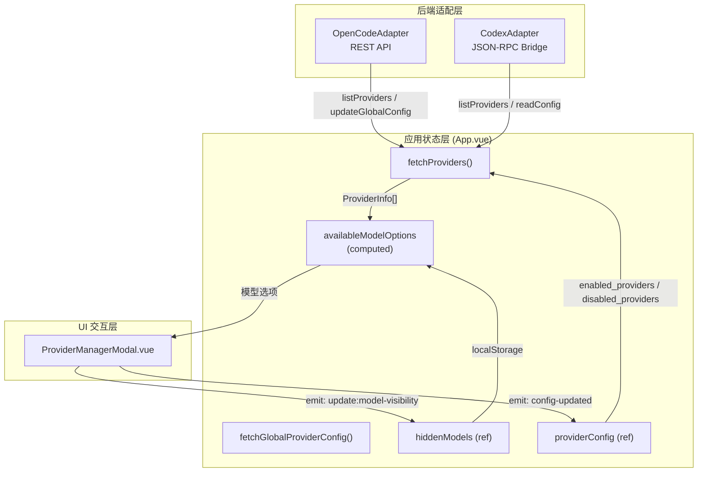

Vis 的提供商与模型管理模块负责统一接入多种 LLM 后端（OpenCode 与 Codex），让用户可以在同一界面中完成提供商连接、认证、启用/禁用控制，以及模型级别的可见性筛选。该模块的核心设计目标是**解耦后端差异**——无论底层是 OpenCode 的 REST API 还是 Codex 的 JSON-RPC 桥接，前端都通过统一的 `BackendAdapter` 接口与类型定义进行操作。

## 架构概览

整个提供商与模型管理子系统由三层协作构成：**后端适配层**负责协议转换，**应用状态层**负责数据归一化与持久化，**UI 交互层**（`ProviderManagerModal`）负责用户操作与反馈。以下 Mermaid 图展示了关键组件之间的数据流与控制流：



Sources: [backends/types.ts](app/backends/types.ts#L53-L117), [backends/openCodeAdapter.ts](app/backends/openCodeAdapter.ts#L52-L57), [backends/codex/codexAdapter.ts](app/backends/codex/codexAdapter.ts#L1696-L1729), [App.vue](app/App.vue#L4782-L4868)

## 核心类型与数据模型

### 提供商信息 (ProviderInfo)

`ProviderInfo` 是跨后端归一化后的提供商数据结构，包含标识、来源、以及模型字典。`source` 字段决定了该提供商的**生命周期控制权**归属——`env` 表示由服务器环境变量注入，不可断开；`config`/`custom` 表示由用户配置创建，可通过全局配置更新；`codex-app-server` 表示由 Codex 后端托管，前端仅可查看不可修改。

| 字段 | 类型 | 说明 |
|------|------|------|
| `id` | `string` | 提供商唯一标识，如 `openai`、`anthropic` |
| `name` | `string?` | 人类可读名称 |
| `source` | `string?` | 来源：`env`、`api`、`config`、`custom`、`codex-app-server` |
| `models` | `Record<string, ProviderModel>?` | 该提供商下的模型字典 |

Sources: [App.vue](app/App.vue#L1157-L1163)

### 模型信息 (ProviderModel)

每个模型除了基础标识外，还携带**能力标签**（`capabilities`）与**上下文/输出限制**（`limit`）。前端在渲染模型列表时，会根据这些元数据显示推理（reasoning）、工具调用（toolcall）、附件（attachment）等能力徽章。

```typescript
type ProviderModel = {
  id: string;
  name?: string;
  providerID?: string;
  family?: string;
  status?: string;
  limit?: { context?: number; input?: number; output?: number };
  capabilities?: { attachment?: boolean; reasoning?: boolean; toolcall?: boolean };
};
```

Sources: [App.vue](app/App.vue#L1138-L1155)

### 提供商配置状态 (ProviderConfigState)

该类型用于描述后端全局配置中与提供商相关的子集。Vis 采用**禁用列表优先**的策略：当 `enabled_providers` 为空时，默认所有已连接提供商可用，仅排除 `disabled_providers` 中的项；当 `enabled_providers` 非空时，则仅启用白名单内的提供商，且仍受 `disabled_providers` 约束。

```typescript
type ProviderConfigState = {
  enabled_providers?: string[];
  disabled_providers?: string[];
  provider?: Record<string, unknown>;
};
```

Sources: [utils/providerConfig.ts](app/utils/providerConfig.ts#L1-L5)

## 提供商启停控制

### 禁用补丁生成 (buildProviderDisabledPatch)

`providerConfig.ts` 中提供了一个纯函数 `buildProviderDisabledPatch`，用于根据当前配置与目标状态生成最小化的配置补丁。该函数始终只操作 `disabled_providers`，避免覆盖服务器端的其他配置字段，从而保证**幂等性与安全性**。

```typescript
export function buildProviderDisabledPatch(
  providerConfig: ProviderConfigState | null | undefined,
  providerId: string,
  nextEnabled: boolean,
) {
  const currentDisabled = new Set(normalizeProviderIds(providerConfig?.disabled_providers));
  if (nextEnabled) {
    currentDisabled.delete(providerId);
  } else {
    currentDisabled.add(providerId);
  }
  return { disabled_providers: Array.from(currentDisabled) };
}
```

Sources: [utils/providerConfig.ts](app/utils/providerConfig.ts#L13-L30), [utils/providerConfig.test.ts](app/utils/providerConfig.test.ts#L11-L39)

### 前端启用判定 (isProviderEnabled)

`App.vue` 中的 `isProviderEnabled` 函数实现了与上述补丁逻辑一致的运行时判定规则：优先检查白名单 `enabled_providers`，再检查黑名单 `disabled_providers`。`ProviderManagerModal` 中的同名函数则基于 `props.providerConfig` 进行局部计算，确保模态框内的开关状态与全局状态实时同步。

Sources: [App.vue](app/App.vue#L2604-L2612), [ProviderManagerModal.vue](app/components/ProviderManagerModal.vue#L816-L823)

## 模型可见性管理

### 隐藏模型存储结构

模型级别的可见性控制通过浏览器 `localStorage` 持久化，存储键为 `opencode.global.dat:model`。数据结构采用 `ModelVisibilityStore`，其中 `user` 数组记录用户显式设置的可见性条目（目前仅支持 `hide`），`recent` 与 `variant` 字段为后续扩展预留。

```typescript
type ModelVisibilityStore = {
  user: Array<{ providerID: string; modelID: string; visibility: 'show' | 'hide' }>;
  recent: string[];
  variant: Record<string, string>;
};
```

Sources: [App.vue](app/App.vue#L1183-L1190)

### 读写与跨标签同步

`readHiddenModelsToStorage` 函数在读取时会自动迁移旧版存储键 `opencode.settings.disabledModels.v1` 中的简单字符串数组，保证**向后兼容**。`writeHiddenModelsToStorage` 在写入时会保留 `user` 数组中非隐藏条目，仅追加/更新被隐藏的模型。`App.vue` 还通过监听 `window.storage` 事件实现跨标签页同步。

Sources: [App.vue](app/App.vue#L2554-L2598), [App.vue](app/App.vue#L3319-L3327)

### 可用模型选项 (availableModelOptions)

输入面板中的模型下拉选项并非直接使用后端原始数据，而是经过三层过滤后的计算属性：

1. **连接过滤**：`isProviderConnected(providerId)` —— 该提供商必须处于已连接状态
2. **启用过滤**：`isProviderEnabled(providerId)` —— 该提供商未被全局禁用
3. **可见性过滤**：`isModelAvailable(modelId)` —— 该模型未被用户手动隐藏

Sources: [App.vue](app/App.vue#L2315-L2327)

## ProviderManagerModal 交互设计

### 双标签页布局

模态框采用 `providers` 与 `models` 两个标签页。提供商标签页分为**已连接区域**与**全部提供商区域**（可折叠），后者以紧凑的双列网格展示所有提供商，支持一键连接。模型标签页则按提供商分组，提供实时搜索与逐模型开关。

Sources: [ProviderManagerModal.vue](app/components/ProviderManagerModal.vue#L24-L43), [ProviderManagerModal.vue](app/components/ProviderManagerModal.vue#L205-L465)

### 认证流程抽象

模态框内部定义了与后端无关的认证类型系统，包括 `ProviderAuthMethod`（`oauth` 或 `api`）、`ProviderAuthPrompt`（支持条件显示与下拉选择）以及 `ProviderAuthAuthorization`（OAuth 授权 URL 与回调方式）。当用户点击"连接"时，组件会根据认证方式自动分流：

- **API Key**：弹出 prompt 输入密钥，调用 `setProviderAuth` 直接写入
- **OAuth**：调用 `authorizeProviderOAuth` 获取授权 URL，打开新窗口；若为 `code` 模式则等待用户粘贴授权码，再调用 `completeProviderOAuth` 完成握手

Sources: [ProviderManagerModal.vue](app/components/ProviderManagerModal.vue#L512-L543), [ProviderManagerModal.vue](app/components/ProviderManagerModal.vue#L1129-L1184)

### 自定义提供商

用户可通过"自定义提供商"入口添加 OpenAI 兼容端点。表单收集 `providerID`、`name`、`baseURL`、`apiKey`、模型列表与自定义请求头，前端进行本地校验（ID 格式、URL 协议、重复性检查），最终组装为以下配置结构提交：

```typescript
type CustomProviderConfig = {
  npm: '@ai-sdk/openai-compatible';
  name: string;
  env?: string[];
  options: { baseURL: string; headers?: Record<string, string> };
  models: Record<string, { name: string }>;
};
```

提交时先调用 `updateGlobalConfig` 写入 `provider` 字段，若存在 API Key 则再调用 `setProviderAuth` 设置认证信息。

Sources: [ProviderManagerModal.vue](app/components/ProviderManagerModal.vue#L574-L595), [ProviderManagerModal.vue](app/components/ProviderManagerModal.vue#L978-L1023)

## 后端差异处理

### OpenCode 后端

OpenCode 后端通过标准 REST API 暴露 `/provider`、`/provider/auth`、`/auth/:providerId` 等端点。`openCodeAdapter.ts` 将这些端点直接映射为 `BackendAdapter` 方法，支持完整的增删改查与 OAuth 流程。

Sources: [utils/opencode.ts](app/utils/opencode.ts#L302-L346), [backends/openCodeAdapter.ts](app/backends/openCodeAdapter.ts#L52-L57)

### Codex 后端

Codex 后端通过 `vis_bridge` 的 JSON-RPC 桥接与 Codex CLI 通信。其 `listProviders` 实现并非调用独立端点，而是复用 `listModels` 结果，将 Codex 的模型列表包装为单一的 `CodexProviderInfo`，`source` 固定为 `codex-app-server`。这意味着在 Codex 模式下，所有提供商操作（启用/禁用、断开、自定义提供商）都会被前端拦截并提示"此提供商由当前后端管理"。

Sources: [backends/codex/codexAdapter.ts](app/backends/codex/codexAdapter.ts#L1696-L1733)

## 事件契约与测试保障

`ProviderManagerModal` 通过三个自定义事件与父组件 `App.vue` 通信：

| 事件 | 方向 | 说明 |
|------|------|------|
| `update:model-visibility` | Modal → App | 用户切换模型可见性时触发 |
| `config-updated` | Modal → App | 提供商全局配置变更时触发 |
| `providers-changed` | Modal → App | 认证状态变更后请求重新拉取提供商列表 |

`ProviderManagerModal.events.test.ts` 通过静态源码断言确保这些事件名称、参数类型与 `App.vue` 中的处理器严格匹配，同时验证自定义提供商流程、断开连接持久化、紧凑布局等关键行为。

Sources: [ProviderManagerModal.events.test.ts](app/components/ProviderManagerModal.events.test.ts#L1-L102)

## 相关阅读

- 如需了解后端适配器如何抽象 OpenCode 与 Codex 的差异，请参阅 [模块化后端适配器设计](7-mo-kuai-hua-hou-duan-gua-pei-qi-she-ji)
- 如需了解 SSE 连接管理与事件协议，请参阅 [SSE 连接管理与事件协议](8-sse-lian-jie-guan-li-yu-shi-jian-xie-yi)
- 如需了解状态监控与 Token 用量追踪，请参阅 [状态监控与 Token 用量追踪](26-zhuang-tai-jian-kong-yu-token-yong-liang-zhui-zong)
- 如需了解 OpenCode API 的具体接口，请参阅 [OpenCode API 与 REST 接口](23-opencode-api-yu-rest-jie-kou)
- 如需了解 Codex 桥接器与 JSON-RPC 转发，请参阅 [Codex 桥接器与 JSON-RPC 转发](24-codex-qiao-jie-qi-yu-json-rpc-zhuan-fa)