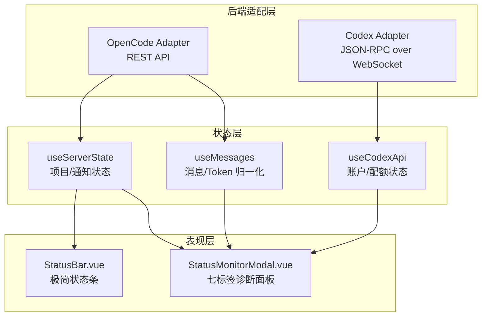
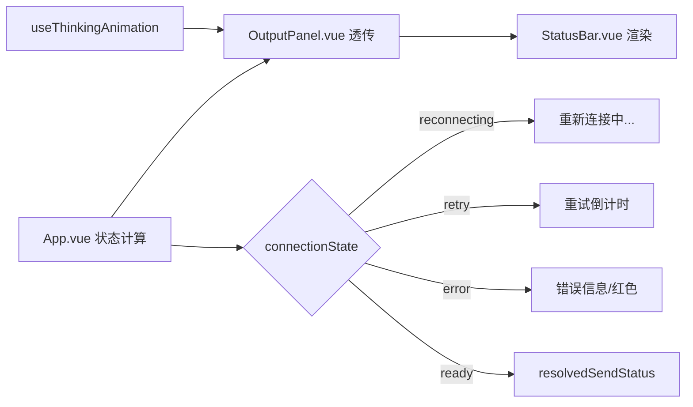
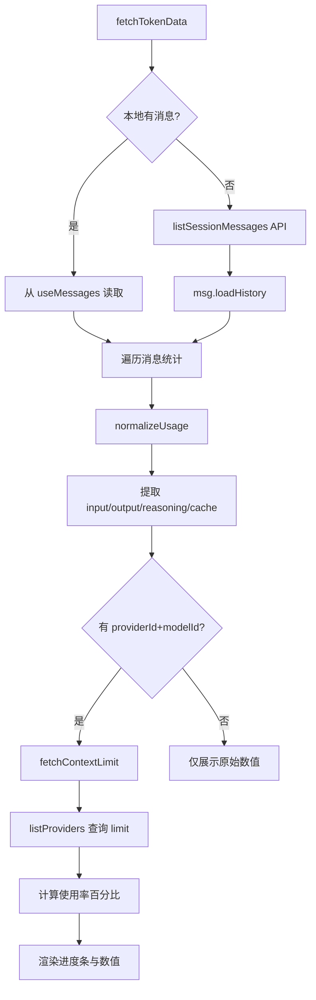

状态监控与 Token 用量追踪是 Vis 应用中面向开发者的运维与成本感知模块。它通过底部状态栏提供实时连接与推理状态的极简反馈，同时以弹层面板的形式聚合服务器健康、MCP/LSP 服务状态、插件与技能列表、当前会话 Token 消耗明细以及 Codex 账户配额等多维度信息。该模块的设计遵循"即时可见、按需深入"的分层原则：状态栏负责毫秒级感知，监控面板负责诊断与用量分析，Token 追踪则通过消息存储的归一化机制实现零额外请求的数据呈现。

## 架构总览

状态监控模块由三个核心层次构成：**状态栏（StatusBar）** 提供持续可见的极简状态；**状态监控弹层（StatusMonitorModal）** 通过七标签页聚合后端诊断信息；**Token 用量追踪** 则基于消息存储的归一化机制实现成本透明化。三者的数据流从底层的后端适配器（BackendAdapter）向上汇聚，经过组合式函数（Composables）的状态抽象，最终由 Vue 组件完成视觉呈现。

Sources: [StatusBar.vue](app/components/StatusBar.vue#L1-L62), [StatusMonitorModal.vue](app/components/StatusMonitorModal.vue#L1-L60), [useServerState.ts](app/composables/useServerState.ts#L1-L68), [useMessages.ts](app/composables/useMessages.ts#L1-L200), [useCodexApi.ts](app/composables/useCodexApi.ts#L1-L200)

## 底部状态栏：实时连接与推理感知

状态栏组件 `StatusBar` 是一个纯展示型组件，接收四个 props：`thinkingDisplayText`、`statusText`、`isStatusError`、`isRetryStatus`。它本身不持有任何状态，完全由父组件 `OutputPanel` 和根组件 `App.vue` 驱动。

状态栏左侧显示当前会话的推理状态。当模型正在生成回复时，`useThinkingAnimation` 组合式函数会启动一个 350ms 间隔的帧动画，在"思考中"文本后循环附加 `.` `..` `...` 后缀，同时在文本前渲染多个 `🤔` 表情以直观反映并发子会话的数量。当会话空闲时，左侧显示 `🟢 空闲`。右侧则显示连接状态文本，可能是"就绪"、"重新连接中"、具体的重试倒计时，或是项目/工作区/会话加载错误信息。当状态为错误或重试时，文本颜色会切换为主题危险色。

Sources: [StatusBar.vue](app/components/StatusBar.vue#L15-L22), [useThinkingAnimation.ts](app/composables/useThinkingAnimation.ts#L1-L57), [App.vue](app/App.vue#L1537-L1552), [OutputPanel.vue](app/components/OutputPanel.vue#L111-L116)

## 状态监控弹层：七标签诊断面板

`StatusMonitorModal` 是一个固定定位的弹层面板，宽度最大 420px，通过 `open` prop 控制显隐。面板内部采用标签页导航，包含七个标签：`server`（服务器）、`mcp`（MCP 服务）、`lsp`（LSP 服务）、`plugins`（插件）、`skills`（技能）、`token`（Token 用量）、`codex`（Codex 账户）。

弹层的打开逻辑包含一个关键细节：当 `open` 变为 `true` 时，组件会通过 `setTimeout(..., 0)` 延迟绑定点击外部关闭事件，以避免触发打开弹层的那个点击事件立即关闭面板。同时绑定 `Escape` 键盘事件用于关闭。所有事件监听器在弹层关闭或组件卸载时被清理。

面板的刷新逻辑 `refresh()` 使用 `Promise.allSettled` 并发请求五个后端接口：`getGlobalHealth`、`getMcpStatus`、`getLspStatus`、`getSkillStatus`、`getGlobalConfig`。这种设计确保单个接口的失败不会阻塞其他数据的加载。如果所有接口均失败，则显示统一的错误提示。MCP 标签页支持通过开关直接启用/禁用服务，操作会调用 `updateMcp` 接口并即时更新本地状态。

| 标签 | 数据源 | 关键操作 |
|------|--------|----------|
| server | `getGlobalHealth` | 只读展示健康状态与版本 |
| mcp | `getMcpStatus` | 支持 toggle 启用/禁用 |
| lsp | `getLspStatus` | 只读展示连接状态 |
| plugins | `getGlobalConfig` 中的 `plugin` 字段 | 只读列表 |
| skills | `getSkillStatus` 或 `getGlobalConfig` | 只读列表，支持降级 |
| token | `useMessages` + `listProviders` | 只读用量统计 |
| codex | `useCodexApi` | 支持登录/登出/刷新 |

Sources: [StatusMonitorModal.vue](app/components/StatusMonitorModal.vue#L86-L163), [StatusMonitorModal.vue](app/components/StatusMonitorModal.vue#L370-L378), [backends/types.ts](app/backends/types.ts#L112-L116), [opencode.ts](app/utils/opencode.ts#L536-L567)

## Token 用量追踪：消息存储的归一化机制

Token 用量追踪不依赖独立的后端 API，而是复用已有的消息存储系统。其核心流程分为三步：获取会话消息、归一化 Token 数据、计算上下文使用率。

当用户切换到 `token` 标签页或切换会话时，`fetchTokenData()` 被触发。它首先尝试从 `useMessages` 的内存存储中获取当前会话的所有消息；如果本地未命中（例如首次打开监控面板），则通过 `listSessionMessages` API 加载历史消息并注入存储。随后遍历消息列表，统计用户消息数和助手消息数，并提取最近一条包含有效 Token 数据的助手消息作为展示来源。

Token 数据的归一化由 `useMessages` 中的 `normalizeUsage` 函数完成。它从 `AssistantMessageInfo` 的 `tokens` 字段中提取 `input`、`output`、`reasoning`，以及可选的 `total` 和 `cache.read`/`cache.write`。同时提取 `providerID` 和 `modelID` 用于后续的上下文限制查询。归一化后的 `MessageUsage` 类型具有统一的结构，无论底层后端是 OpenCode 还是 Codex。

上下文限制的计算通过 `fetchContextLimit` 实现：它调用 `listProviders` 获取提供商列表，根据 `providerId` 和 `modelId` 查找对应模型的 `limit.context` 值。最终在 UI 中以进度条形式展示当前 Token 总量占上下文限制的比例。

Sources: [StatusMonitorModal.vue](app/components/StatusMonitorModal.vue#L213-L280), [useMessages.ts](app/composables/useMessages.ts#L108-L151), [message.ts](app/types/message.ts#L1-L21), [sse.ts](app/types/sse.ts#L276-L302)

## Codex 账户与配额监控

`codex` 标签页专用于 Codex 后端的账户状态监控，其数据完全来自 `useCodexApi` 组合式函数。当 Codex 未连接时，面板显示"Codex 未连接"。已连接状态下，展示账户类型（如 `apiKey`、`chatgpt`）、套餐类型以及速率限制使用率。

账户状态通过 `refreshAccount()` 拉取，`refreshAccountRateLimits()` 拉取配额桶数据。配额数据类型 `CodexAccountRateLimitBucket` 包含 `primary.usedPercent` 字段，表示主配额桶的已使用百分比。该值以进度条形式可视化。此外，Codex 后端通过 JSON-RPC 通知 `account/rateLimits/updated` 主动推送配额变化，实现准实时的配额监控。

登录支持三种方式：API Key 直接输入、ChatGPT OAuth 跳转、设备码流程。登出操作会清空本地账户状态与配额缓存。

Sources: [StatusMonitorModal.vue](app/components/StatusMonitorModal.vue#L675-L770), [useCodexApi.ts](app/composables/useCodexApi.ts#L416-L423), [useCodexApi.ts](app/composables/useCodexApi.ts#L702-L709), [useCodexApi.ts](app/composables/useCodexApi.ts#L1487-L1553), [codexAdapter.ts](app/backends/codex/codexAdapter.ts#L311-L328), [codexAdapter.ts](app/backends/codex/codexAdapter.ts#L1410-L1413)

## 国际化与主题适配

状态监控模块的所有用户可见文本均通过 `vue-i18n` 的 `$t` 函数或 `useI18n` 组合式函数进行本地化。中文 locale 文件 `zh-CN.ts` 中为 `statusMonitor` 命名空间定义了完整的翻译键，涵盖七个标签页的标题、状态枚举值（如"已连接"、"已禁用"、"启动失败"）、操作按钮（如"刷新"、"重试"、"退出登录"）以及 Token 相关的各项指标名称（如"输入 Token"、"推理 Token"、"缓存 Token（读/写）"）。

视觉样式全面采用 CSS 变量主题系统，所有颜色、背景、边框均引用 `--theme-*` 系列变量，确保在不同主题下保持一致的可读性和视觉层次。状态点（status-dot）通过不同的 CSS 类名映射到成功（绿色）、错误（红色）、警告（黄色）、静默（灰色）四种语义色。

Sources: [zh-CN.ts](app/locales/zh-CN.ts#L245-L328), [StatusMonitorModal.vue](app/components/StatusMonitorModal.vue#L788-L1285)

## 相关阅读

- 如需了解后端适配器的完整接口定义与能力模型，请参阅 [模块化后端适配器设计](7-mo-kuai-hua-hou-duan-gua-pei-qi-she-ji)
- 如需了解消息流的数据结构与增量更新机制，请参阅 [消息流处理与增量更新](14-xiao-xi-liu-chu-li-yu-zeng-liang-geng-xin)
- 如需了解 Codex 桥接器的 JSON-RPC 通信细节，请参阅 [Codex 桥接器与 JSON-RPC 转发](24-codex-qiao-jie-qi-yu-json-rpc-zhuan-fa)
- 如需了解提供商与模型的配置管理，请参阅 [提供商与模型管理](25-ti-gong-shang-yu-mo-xing-guan-li)