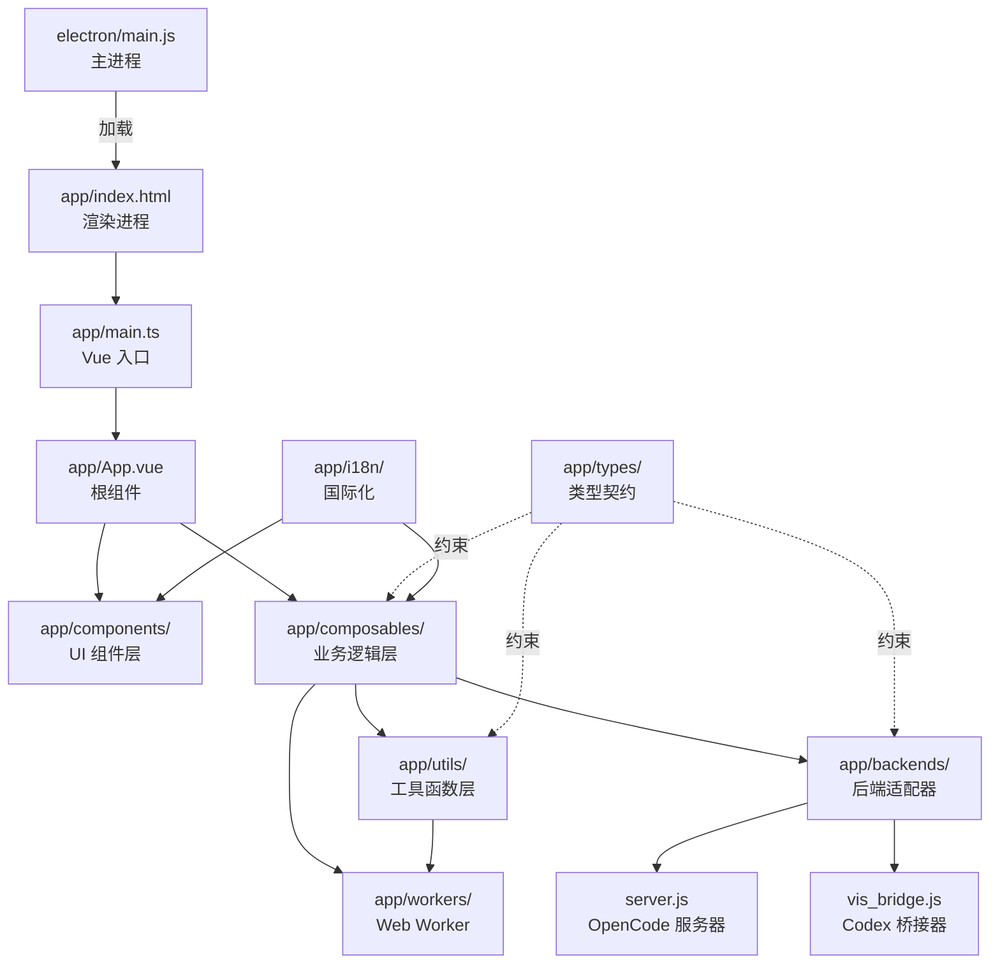

本文档面向初次接触本项目的开发者，系统梳理仓库的目录组织方式与核心文件职责。理解这些结构有助于快速定位代码、遵循既有约定进行开发，并为阅读其他架构文档建立上下文基础。

Sources: [package.json](package.json#L1-L85) [vite.config.ts](vite.config.ts#L1-L67) [tsconfig.json](tsconfig.json)

## 顶层概览

仓库采用**单仓库（monorepo）**布局，前端应用源码集中在 `app/` 目录，同时包含 Electron 桌面端、独立服务器、CLI 桥接器与文档等并行入口。顶层关键文件如下表所示：

| 文件/目录 | 职责 |
|-----------|------|
| `package.json` | 项目元数据、依赖、脚本命令（dev/build/test/electron 等） |
| `vite.config.ts` | Vite 构建配置，指定 `app/` 为根目录，配置路径别名与代码分割策略 |
| `tsconfig.json` | TypeScript 编译配置 |
| `pnpm-workspace.yaml` | pnpm workspace 配置（当前为单包，预留扩展） |
| `electron-builder.yml` | Electron 打包配置，定义应用 ID、图标与输出目录 |
| `server.js` | 生产环境静态文件服务器（基于 Hono），也可作为代理服务器启动 |
| `vis_bridge.js` / `vis_bridge.d.ts` | Codex 后端 WebSocket 桥接器 CLI 及其类型声明 |
| `app/` | **前端应用源码主目录**（Vue 3 + TypeScript） |
| `electron/` | Electron 主进程与预加载脚本 |
| `build/` | Electron 打包资源（图标、权限配置） |
| `docs/` | 项目文档与工具指令说明 |
| `scripts/` | 开发辅助脚本（如 Electron 开发启动器） |

Sources: [package.json](package.json#L1-L85) [vite.config.ts](vite.config.ts#L1-L67) [server.js](server.js#L1-L44) [electron-builder.yml](electron-builder.yml)

## 前端应用目录 `app/`

`app/` 是整个项目的核心，包含约 2 万行 Vue 组件代码与近 1.1 万行工具/组合式函数代码。其内部按**职责分层**组织，而非按页面组织，这体现了项目对可复用性与状态集中管理的重视。

### 入口与全局配置

| 文件 | 职责 |
|------|------|
| `index.html` | 应用 HTML 模板，包含 CSP 策略与脚本入口 |
| `main.ts` | Vue 应用初始化：创建实例、挂载 i18n、注入 CSS 自定义高亮样式 |
| `App.vue` | 根组件（约 9000 行），承载整个应用的布局骨架与全局状态 orchestration |
| `vite-env.d.ts` | Vite 客户端类型声明 |

Sources: [app/index.html](app/index.html#L1-L29) [app/main.ts](app/main.ts#L1-L28) [app/App.vue](app/App.vue#L1-L200)

### 组件层 `app/components/`

组件目录包含约 29 个 `.vue` 文件及若干子目录，按功能域进一步分组：

- **布局组件**：`TopPanel.vue`、`SidePanel.vue`、`OutputPanel.vue`、`InputPanel.vue`、`StatusBar.vue` 构成应用的三栏式主布局。
- **会话与消息**：`SessionTree.vue`、`ThreadBlock.vue`、`ThreadFooter.vue`、`ThreadTarget.vue`、`ThreadHistoryContent.vue`、`MessageViewer.vue` 负责会话树渲染与消息流展示。
- **悬浮窗系统**：`FloatingWindow.vue`、`CodeContent.vue` 以及 `viewers/` 子目录下的 `ContentViewer.vue`、`DiffViewer.vue` 构成多层渲染架构。
- **工具窗口**：`ToolWindow/` 子目录包含 16 个按工具类型划分的轻量级展示组件（如 `Bash.vue`、`Question.vue`、`Permission.vue` 等），每个组件只负责单一工具输出的呈现。
- **渲染器**：`renderers/` 子目录包含 8 个原子渲染组件（`CodeRenderer.vue`、`MarkdownRenderer.vue`、`DiffRenderer.vue`、`ImageRenderer.vue`、`PdfRenderer.vue`、`HexRenderer.vue`、`ArchiveRenderer.vue`），它们被 Viewer 层组合使用。
- **Codex 专属**：`codex/` 子目录包含 13 个 Codex 后端相关的管理面板组件（如 `CodexAppManager.vue`、`CodexModelManager.vue`、`CodexMcpServerManager.vue` 等）。
- **交互控件**：`Dropdown.vue`、`Dropdown/`（含 `Item.vue`、`Label.vue`、`Search.vue`）、`ProjectPicker.vue`、`SettingsModal.vue`、`ProviderManagerModal.vue`、`ThemeInjector.vue`、`LineCommentOverlay.vue` 等。

Sources: [app/components](app/components) [app/components/ToolWindow](app/components/ToolWindow) [app/components/renderers](app/components/renderers) [app/components/viewers](app/components/viewers) [app/components/codex](app/components/codex)

### 组合式函数 `app/composables/`

共 35 个组合式函数，是 Vue 3 Composition API 的核心业务逻辑载体。它们按关注点划分为：

| 类别 | 代表文件 | 职责 |
|------|----------|------|
| 通信与状态 | `useGlobalEvents.ts`、`useServerState.ts`、`useMessages.ts` | SSE/Worker 事件封装、服务端状态同步、消息流管理 |
| 悬浮窗管理 | `useFloatingWindows.ts`、`useFloatingWindow.ts`、`useStreamingWindowManager.ts` | 悬浮窗生命周期、Dock 管理、流式内容窗口 |
| 专项窗口 | `useReasoningWindows.ts`、`useSubagentWindows.ts` | 推理过程与子代理会话的悬浮窗展示 |
| 交互与权限 | `usePermissions.ts`、`useQuestions.ts`、`useDialogHandler.ts`、`useTodos.ts` | 权限请求、问题提示、通用对话框、待办管理 |
| 数据操作 | `useFileTree.ts`、`useSessionSelection.ts`、`useCredentials.ts` | 文件树与 Git 集成、会话选择、认证凭证 |
| 渲染与性能 | `useAssistantPreRenderer.ts`、`useAutoScroller.ts`、`useRenderState.ts` | 助手消息预渲染、自动滚动、渲染状态追踪 |
| 主题与设置 | `useSettings.ts`、`useRegionTheme.ts` | 用户设置持久化、区域主题动态切换 |
| 后端适配 | `useCodexApi.ts`、`useOpenCodeApi.ts`、`useCodexWorkspace.ts` | Codex/OpenCode API 封装、工作空间状态 |

Sources: [app/composables](app/composables) [app/composables/useGlobalEvents.ts](app/composables/useGlobalEvents.ts#L1-L30) [app/composables/useFloatingWindows.ts](app/composables/useFloatingWindows.ts#L1-L30)

### 工具函数 `app/utils/`

共 56 个工具模块（含测试文件），提供纯函数式的基础能力：

| 类别 | 代表文件 | 职责 |
|------|----------|------|
| 后端通信 | `opencode.ts`、`sseConnection.ts` | OpenCode REST API 请求封装、SSE 连接管理 |
| 渲染引擎 | `workerRenderer.ts`、`useCodeRender.ts`、`diffCompression.ts` | Web Worker 渲染调度、代码高亮参数封装、Diff 压缩 |
| 主题系统 | `regionTheme.ts`、`themeTokens.ts`、`themeRegistry.ts`、`floatingWindowTheme.ts`、`theme.ts` | 区域配色定义、语义令牌、主题注册表、悬浮窗主题解析 |
| 存储与状态 | `storageKeys.ts`、`stateBuilder.ts`、`pinnedSessions.ts`、`deletedSandboxes.ts` | 统一存储键命名、Worker 状态构建、会话置顶/沙盒删除管理 |
| 文件与路径 | `path.ts`、`fileTypeDetector.ts`、`archiveParser.ts`、`fileExport.ts` | 路径规范化、二进制文件类型探测、压缩包解析、文件下载 |
| 消息处理 | `messageDiff.ts`、`toolRenderers.ts`、`lineComment.ts`、`formatters.ts` | 消息 Diff 重构、工具输出渲染辅助、行级注释、Token 格式化 |
| 并发与事件 | `mapWithConcurrency.ts`、`eventEmitter.ts`、`waitForState.ts` | 并发控制、类型安全事件发射器、状态等待工具 |
| 其他 | `fontDiscovery.ts`、`notificationManager.ts`、`providerConfig.ts` | 系统字体发现、通知聚合、提供商配置规范化 |

Sources: [app/utils](app/utils) [app/utils/storageKeys.ts](app/utils/storageKeys.ts#L1-L30) [app/utils/workerRenderer.ts](app/utils/workerRenderer.ts#L1-L30)

### 类型定义 `app/types/`

6 个类型文件构成项目的类型契约层，避免魔法字符串与松散对象：

- `sse.ts`（580 行）：最庞大的类型文件，定义所有 SSE 事件包结构（`SsePacket`、消息、工具状态、会话信息等）。
- `worker-state.ts`（88 行）：Worker 状态架构的 SSOT 类型（`ProjectState`、`SessionState`、`SandboxState`）。
- `message.ts`（100 行）：前端消息模型（`Message`、`HistoryEntry`、`MessageUsage` 等）。
- `sse-worker.ts`（71 行）：Shared Worker 与主线程间的消息协议。
- `git.ts`（50 行）：Git 状态相关类型。
- `session-tree.ts`（34 行）：会话树节点类型。

Sources: [app/types/sse.ts](app/types/sse.ts#L1-L30) [app/types/worker-state.ts](app/types/worker-state.ts#L1-L30) [app/types/message.ts](app/types/message.ts#L1-L30)

### 后端适配器 `app/backends/`

采用**适配器模式**封装多后端支持：

| 文件 | 职责 |
|------|------|
| `types.ts` | `BackendAdapter` 接口定义，约 30 个标准方法签名 |
| `registry.ts` | 适配器注册表，管理 `opencode`/`codex` 双后端切换 |
| `openCodeAdapter.ts` | OpenCode REST API 适配器实现 |
| `codex/codexAdapter.ts` | Codex JSON-RPC over WebSocket 适配器实现 |
| `codex/jsonRpcClient.ts` | 底层 JSON-RPC 客户端（请求/通知/响应处理） |
| `codex/bridgeUrl.ts` | Codex 桥接 URL 构建与 Token 附加工具 |
| `codex/normalize.ts` | Codex 消息格式到内部标准格式的转换 |

Sources: [app/backends/types.ts](app/backends/types.ts#L1-L30) [app/backends/registry.ts](app/backends/registry.ts#L1-L30) [app/backends/codex/codexAdapter.ts](app/backends/codex/codexAdapter.ts#L1-L30)

### 多语言 `app/i18n/` 与 `app/locales/`

- `i18n/index.ts`：vue-i18n 实例创建与持久化逻辑。
- `i18n/types.ts`：完整的消息类型定义（约 1300 行），确保翻译键的类型安全。
- `i18n/useI18n.ts`：对 vue-i18n `useI18n` 的薄封装。
- `locales/`：5 个语言文件（`en.ts`、`zh-CN.ts`、`zh-TW.ts`、`ja.ts`、`eo.ts`），结构完全镜像。

Sources: [app/i18n/index.ts](app/i18n/index.ts#L1-L30) [app/i18n/types.ts](app/i18n/types.ts#L1-L30) [app/locales/zh-CN.ts](app/locales/zh-CN.ts#L1-L30)

### Web Worker `app/workers/`

| 文件 | 职责 |
|------|------|
| `render-worker.ts`（1068 行） | 基于 Shiki 的代码/Markdown 渲染 Worker，支持语法高亮、Diff 渲染、自定义文法、缓存策略 |
| `sse-shared-worker.ts`（1293 行） | SSE 连接共享 Worker，管理多标签页状态同步、会话水合、VCS 状态聚合、通知去重 |

Sources: [app/workers/render-worker.ts](app/workers/render-worker.ts#L1-L30) [app/workers/sse-shared-worker.ts](app/workers/sse-shared-worker.ts#L1-L30)

### 其他前端资源

- `styles/tailwind.css`：Tailwind CSS v4 入口，包含自定义主题令牌与滚动条样式。
- `grammars/`：6 个自定义 TextMate 语法文件（生物信息学格式如 FASTA、SAM、VCF 等）。
- `public/`：静态资源（favicon、logo、主题 JSON Schema）。

Sources: [app/styles/tailwind.css](app/styles/tailwind.css#L1-L30) [app/grammars](app/grammars)

## Electron 桌面端 `electron/`

| 文件 | 职责 |
|------|------|
| `main.js` | 主进程入口：窗口创建、持久化存储（基于文件）、自定义协议（`app://`）、CORS 处理、安全导航策略 |
| `preload.cjs` | 预加载脚本：通过 `contextBridge` 安全暴露 `electronAPI`（平台信息、持久化存储、窗口控制） |

Sources: [electron/main.js](electron/main.js#L1-L30) [electron/preload.cjs](electron/preload.cjs#L1-L30)

## 构建与部署资源

- `build/`：Electron 打包所需图标（icns/ico/png/svg）与 macOS 权限配置。
- `scripts/electron-start.mjs`：开发时启动 Electron 并等待 Vite 开发服务器就绪的辅助脚本。

Sources: [build/README.md](build/README.md) [scripts/electron-start.mjs](scripts/electron-start.mjs#L1-L30)

## 文档 `docs/`

文档目录按主题组织，与 wiki 目录结构对应：

- 根文档：`API.md`（REST API 参考）、`SSE.md`（SSE 事件协议）、`codex.md`（Codex 集成）、`projects.md`（项目与会话模型）、`window-arch.md`（窗口/渲染器分层架构）。
- `tools/`：20 个 Markdown 文件，逐个说明 Agent 可用工具（read、edit、bash、grep 等）的输入输出格式。
- `screenshots/`：13 张功能截图，用于 README 与文档展示。

Sources: [docs/API.md](docs/API.md#L1-L30) [docs/SSE.md](docs/SSE.md#L1-L30) [docs/tools](docs/tools)

## 测试覆盖

项目采用 **Vitest** 作为测试框架（配置于 `vite.config.ts`），测试文件与源码同目录分布，共 40 个 `.test.ts` 文件。测试范围涵盖：

- 工具函数（如 `diffCompression.test.ts`、`path.test.ts`、`storageKeys.test.ts`）
- 组合式函数（如 `useMessages.test.ts`、`useSettings.test.ts`）
- 后端适配器（如 `codexAdapter.test.ts`、`jsonRpcClient.test.ts`）
- 组件行为（如 `ProviderManagerModal.events.test.ts`、`modalBackdropTheme.test.ts`）
- 独立模块（如 `vis_bridge.test.ts`、`server.test.ts`）

Sources: [vite.config.ts](vite.config.ts#L55-L60) [app/vis_bridge.test.ts](app/vis_bridge.test.ts#L1-L30)

## 架构关系简图

以下 Mermaid 图展示主要目录间的依赖与数据流向：

## 推荐阅读路径

如果你是新加入的开发者，建议按以下顺序阅读文档以建立完整认知：

1. **[项目概览](1-xiang-mu-gai-lan)** — 了解项目定位与核心特性
2. **[技术栈与环境要求](3-ji-zhu-zhan-yu-huan-jing-yao-qiu)** — 确认本地开发环境
3. **[Vue 3 应用入口与生命周期](5-vue-3-ying-yong-ru-kou-yu-sheng-ming-zhou-qi)** — 深入 `main.ts` 与 `App.vue` 的初始化流程
4. **[全局状态与事件系统](6-quan-ju-zhuang-tai-yu-shi-jian-xi-tong)** — 理解 `useGlobalEvents` 与 `useServerState` 的设计
5. **[模块化后端适配器设计](7-mo-kuai-hua-hou-duan-gua-pei-qi-she-ji)** — 掌握 `backends/` 的适配器模式
6. **[SSE 连接管理与事件协议](8-sse-lian-jie-guan-li-yu-shi-jian-xie-yi)** — 理解实时通信层
7. **[Web Worker 渲染池与缓存策略](10-web-worker-xuan-ran-chi-yu-huan-cun-ce-lue)** — 深入了解 `render-worker.ts` 的性能设计