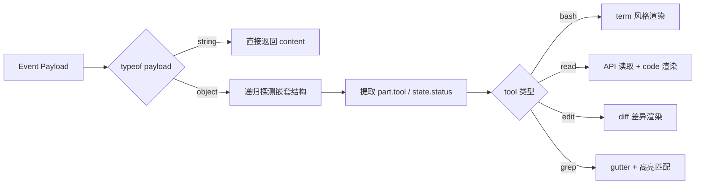

工具窗口组件与指令处理是 Vis 应用中连接 AI 后端工具执行与前端可视化呈现的核心桥梁。本页面向中级开发者系统阐述工具指令（Tool Commands）从 SSE 事件流解析、渲染决策到悬浮窗呈现的完整链路，涵盖 `ToolWindow` 组件家族、`toolRenderers` 工具渲染器、以及 `useFloatingWindows` 窗口管理器之间的协作机制。

## 架构概览：三层渲染决策模型

Vis 的工具窗口系统采用**三层渲染决策模型**：第一层在 `App.vue` 中通过 `toolRendererHelpers` 聚合所有渲染辅助函数；第二层由 `utils/toolRenderers.ts` 中的 `extractFileRead`、`extractPatch` 等函数从 SSE 事件载荷中解析工具指令并生成渲染描述符；第三层由 `useFloatingWindows` 将描述符映射为实际的悬浮窗条目。整个流程的核心设计哲学是**"解析与渲染分离"**——解析层只负责从协议数据中提取结构化信息，而渲染层通过 Web Worker 池异步生成语法高亮 HTML，两者通过函数引用解耦。

```mermaid
flowchart TD
    A[SSE Event Stream] --> B[toolRenderers.ts<br/>extractFileRead / extractPatch]
    B --> C[Rendering Descriptor<br/>{content, variant, title, callId}]
    C --> D[App.vue toolRendererHelpers]
    D --> E[useFloatingWindows.open]
    E --> F[FloatingWindow.vue]
    F --> G{entry.component?}
    G -->|Yes| H[ToolWindow/*.vue 组件]
    G -->|No| I[CodeContent.vue<br/>v-html=resolvedHtml]
    I --> J[Web Worker 渲染池<br/>workerRenderer.ts]
```

Sources: [toolRenderers.ts](app/utils/toolRenderers.ts#L1-L712), [App.vue](app/App.vue#L6802-L6825), [useFloatingWindows.ts](app/composables/useFloatingWindows.ts#L1-L508)

## 工具渲染器：协议解析与描述符生成

`utils/toolRenderers.ts` 是整个工具窗口系统的**协议解析中枢**。它暴露三个核心提取函数：`extractStepFinish` 用于识别步骤结束事件，`extractPatch` 用于解析 `apply_patch` 工具的文件变更集合，`extractFileRead` 则是最通用的工具指令解析器，支持从 `message.part.updated` 等事件类型中提取 `bash`、`read`、`grep`、`glob`、`edit`、`write` 等十余种工具的执行状态。

`extractFileRead` 的实现体现了对多种后端协议格式的兼容性设计。它首先检查 payload 是否为字符串（兼容直接文本输出），然后递归探测 `payload.properties.part`、`record.properties.part`、`record.data`、`record.result` 等多个可能嵌套层级，最终提取出 `tool`、`state.status`、`state.input`、`state.metadata` 等关键字段。每种工具类型在 `switch (tool)` 分支中有独立的渲染逻辑：例如 `bash` 工具会将命令与输出拼接为终端风格文本，`read` 工具会调用 `renderReadHtmlFromApi` 通过后端 API 获取文件内容并渲染为代码高亮，`edit` 工具则生成 diff 描述符供差异渲染器使用。



Sources: [toolRenderers.ts](app/utils/toolRenderers.ts#L192-L711), [toolRenderers.ts](app/utils/toolRenderers.ts#L65-L94)

## 工具支持策略：显式白名单与隐藏列表

并非所有后端工具都会以悬浮窗形式呈现。`App.vue` 中定义了两组集合控制工具窗口的可见性策略：

| 集合名称 | 作用 | 包含的典型工具 |
|---------|------|-------------|
| `TOOL_WINDOW_SUPPORTED` | 明确支持窗口化的工具集合 | `bash`, `read`, `edit`, `grep`, `glob`, `write`, `webfetch`, `websearch`, `codesearch`, `task`, `apply_patch`, `multiedit`, `list` |
| `TOOL_WINDOW_HIDDEN` | 支持但默认不显示窗口的工具 | `question`, `todoread`, `todowrite`, `lsp`, `plan_enter`, `plan_exit`, `task` |

`shouldRenderToolWindow(tool)` 函数通过 `!TOOL_WINDOW_HIDDEN.has(tool) && TOOL_WINDOW_SUPPORTED.has(tool)` 的逻辑决定是否将工具指令渲染为悬浮窗。`question` 和 `permission` 等交互型工具虽然被标记为隐藏不自动弹出，但它们通过独立的 `useQuestions` 和 `usePermissions` 组合式函数以模态对话框形式呈现，形成**指令处理的双轨制**——自动展示型工具走悬浮窗通道，用户交互型工具走对话框通道。

Sources: [App.vue](app/App.vue#L7094-L7121)

## ToolWindow 组件家族：专用渲染组件

`app/components/ToolWindow/` 目录下包含 15 个专用 Vue 组件，按职责可分为三类：

**代码展示类**（通过 `CodeContent` 渲染预生成 HTML）：`Default.vue`、`Read.vue`、`Edit.vue`、`Task.vue` 均直接接收 `html` prop 并委托给 `CodeContent`，区别仅在于 `variant` 属性（`code`、`diff`、`term` 等）。这种设计实现了最大程度的复用，新增工具类型通常只需指定正确的 variant 即可。

**占位与状态类**（运行时状态展示）：`Grep.vue`、`Glob.vue`、`Web.vue` 在 `status === 'running'` 时展示参数占位符（如搜索模式、URL），完成后再切换到代码内容。`Bash.vue` 则采用原生 DOM 结构展示命令行输出，通过 `:deep(.shiki)` 覆盖样式实现透明背景。

**交互与特殊类**：`Question.vue` 实现多选题/单选题的完整交互 UI，支持草稿自动保存（通过 `storageKeys` 每 400ms 延迟持久化）；`Permission.vue` 提供 `once`/`always`/`reject` 三级权限响应；`Shell.vue` 仅为 xterm.js 提供挂载容器；`Reasoning.vue` 和 `Subagent.vue` 通过 `MessageViewer` 渲染 Markdown 内容流。

| 组件 | 核心职责 | 关键 Props |
|-----|---------|-----------|
| `Bash.vue` | 终端风格命令输出 | `command`, `outputHtml` |
| `Grep.vue` | 搜索运行时占位 + 结果高亮 | `html`, `pattern`, `path`, `status` |
| `Question.vue` | 多选/单选问卷交互 | `request`, `contextText`, `isSubmitting` |
| `Permission.vue` | 权限请求审批 | `request`, `isSubmitting` |
| `Shell.vue` | xterm.js 挂载宿主 | `shellId` |
| `Reasoning.vue` | 推理过程 Markdown 流 | `entries`, `theme` |

Sources: [ToolWindow/Bash.vue](app/components/ToolWindow/Bash.vue#L1-L45), [ToolWindow/Question.vue](app/components/ToolWindow/Question.vue#L1-L495), [ToolWindow/Permission.vue](app/components/ToolWindow/Permission.vue#L1-L316)

## 工具窗口工具函数：标题格式化与语言推断

`ToolWindow/utils.ts` 提供一组纯函数用于从工具 `input` 对象中提取可读的窗口标题，以及从文件路径推断语法高亮语言。`formatGlobToolTitle` 将 `pattern`、`path`、`include` 拼接为 `"pattern @ path include ext"` 格式；`formatReadLikeToolTitle` 优先取 `filePath` 否则取 `path`；`resolveReadWritePath` 则在 `input`、`metadata`、`state` 三个层级中逐级回退查找路径信息。

`guessLanguageFromPath` 是 Vis 语法高亮系统的文件类型映射表，覆盖 60 余种扩展名到 Shiki 语言标识符的映射，包括常规编程语言（`.ts` → `typescript`、`.rs` → `rust`）以及生物信息学格式（`.fasta` → `fasta`、`.gtf` → `gtf`）。该函数被 `toolRenderers.ts` 和 `App.vue` 共同使用，确保文件读取和代码差异窗口使用正确的语法高亮主题。

Sources: [ToolWindow/utils.ts](app/components/ToolWindow/utils.ts#L1-L215), [ToolWindow/utils.test.ts](app/components/ToolWindow/utils.test.ts#L1-L19)

## 悬浮窗管理器：窗口生命周期与渲染管线

`useFloatingWindows` 组合式函数是工具窗口的**中央调度器**。每个窗口条目 `FloatingWindowEntry` 包含 `key`、`component`、`props`、`content`、`variant`、`resolvedHtml` 等字段，支持两种渲染模式：若提供 `component` 则通过 Vue 的 `<component :is>` 动态渲染专用组件（如 `Question.vue`）；否则将 `content` 委托给 `renderWorkerHtml` 生成高亮 HTML，再由 `CodeContent.vue` 通过 `v-html` 注入。

窗口生命周期管理包含以下关键机制：

- **过期自动清理**：运行中工具窗口默认 10 分钟 TTL（`TOOL_RUNNING_TTL_MS`），已完成/错误状态仅保留 2 秒（`TOOL_COMPLETED_TTL_MS`），通过 `scheduleExpiry` 和 `timerMap` 实现逐窗口独立计时。
- **渲染版本控制**：`bumpRenderVersion` 为每次内容更新生成单调递增版本号，防止异步渲染结果覆盖更新的内容。
- **位置约束**：`getAxisBounds` 确保窗口始终有部分标题栏留在可视区域内，拖拽超出边界时通过 `snapBack` 以 150ms 缓动动画回归。
- **Z-Index 分层**：手动操作窗口（`closable` 或 `permission:`/`question:` 前缀）获得 `MANUAL_ZINDEX_OFFSET = 10000` 的层级偏移，确保交互窗口始终浮于自动工具窗口之上。

Sources: [useFloatingWindows.ts](app/composables/useFloatingWindows.ts#L43-L133), [useFloatingWindows.ts](app/composables/useFloatingWindows.ts#L207-L311)

## FloatingWindow.vue：窗口壳层与交互行为

`FloatingWindow.vue` 为每个悬浮窗提供壳层容器，处理拖拽、缩放、搜索、聚焦等交互行为。其关键设计决策包括：

- **拖拽性能优化**：拖拽期间直接操作 DOM 样式属性（`--win-x`、`--win-y`），完全绕过 Vue 响应式系统，仅在 `pointerup` 时同步回 `props.entry.x/y`，避免大量窗口同时重排。
- **内容搜索**：集成 `useContentSearch` 组合式函数，支持 `/` 或 `Ctrl+F` 快捷键触发内容内搜索，`Enter`/`Shift+Enter` 导航匹配项。
- **滚动策略**：`useAutoScroller` 根据 `scroll` 模式（`manual`/`follow`/`force`/`none`）自动决定是否跟随内容底部，`showResumeButton` 在脱离跟随状态时显示恢复按钮。
- **变体样式**：通过 `variantToGutterMode` 将 `diff` 映射为双列行号、`code` 映射为单行号、其他变体无行号；`shouldWordWrap` 在 `code`/`diff` 变体下根据用户设置启用软换行。

Sources: [FloatingWindow.vue](app/components/FloatingWindow.vue#L1-L200), [FloatingWindow.vue](app/components/FloatingWindow.vue#L286-L388)

## CodeContent.vue：统一内容渲染层

`CodeContent.vue` 是所有非组件型工具窗口的最终渲染目标。它接收 `html`（由 Web Worker 预渲染的 Shiki HTML）和 `variant` 属性，通过动态 CSS 类名实现六种展示变体：

- **`code`**：标准代码块，单行号 gutter，支持可选软换行
- **`diff`**：差异代码块，双列行号 gutter，附加 `line-added`/`line-removed`/`line-hunk` 背景色
- **`term`**：终端输出，无 gutter，强制 `pre-wrap` 换行
- **`plain`**：纯文本，无 gutter，无特殊样式
- **`message`**：消息内容，无 gutter，强制软换行
- **`binary`**：二进制内容，无 gutter，专用 hexdump 配色

`:deep()` 选择器被大量用于穿透 Shiki 生成的 HTML 结构，覆盖其默认背景色和字体设置，确保工具窗口内容与 Vis 主题系统无缝融合。

Sources: [CodeContent.vue](app/components/CodeContent.vue#L1-L211)

## Web Worker 渲染池：异步高亮管线

`utils/workerRenderer.ts` 管理一个动态大小的 Web Worker 池（默认 4-8 个，基于 `navigator.hardwareConcurrency`），负责将原始代码文本转换为 Shiki 高亮 HTML。其核心特性包括：

- **LRU 缓存**：`completedCache` 最多保留 200 条渲染结果，缓存键由代码内容、语言、主题、 gutter 模式、行偏移等 15 个参数通过 `\u0000` 拼接生成。
- **取消支持**：`startRenderWorkerHtml` 返回 `{promise, cancel}` 对象，允许在窗口关闭或内容更新时取消过期的渲染请求，避免无效计算。
- **渲染状态追踪**：通过 `incrementPendingRenders`/`decrementPendingRenders` 向全局渲染状态报告待处理任务数，用于 UI 加载指示。

Worker 渲染结果最终通过 `resolvedHtml` 字段写入 `FloatingWindowEntry`，触发 `FloatingWindow.vue` 中的 `watch` 监听器更新视图。

Sources: [workerRenderer.ts](app/utils/workerRenderer.ts#L1-L195)

## 交互型工具的双轨处理：Question 与 Permission

`question` 和 `permission` 工具虽然被 `TOOL_WINDOW_HIDDEN` 排除在自动悬浮窗之外，但它们通过独立的组合式函数获得更丰富的交互能力：

`useQuestions` 基于 `useDialogHandler` 构建，提供 `parseQuestionRequest`（从多种字段命名变体中标准化请求结构）、`upsertQuestionEntry`（以 `question:` 前缀打开悬浮窗）、以及 `makeReplyFlow`/`makeRejectFlow`（处理提交状态、错误反馈和窗口关闭）。`Question.vue` 组件内部实现了选项选择、自定义答案输入、草稿自动保存等完整表单逻辑。

`usePermissions` 结构类似，但权限响应只有 `once`/`always`/`reject` 三种离散状态，通过 `handlePermissionReply` 转发至后端适配器的 `replyPermission` 方法。两个系统共享 `DialogRequestBase` 类型约束和 `useDialogHandler` 的通用状态机（`sendingById`、`errorById`）。

Sources: [useQuestions.ts](app/composables/useQuestions.ts#L1-L232), [usePermissions.ts](app/composables/usePermissions.ts#L1-L172), [useDialogHandler.ts](app/composables/useDialogHandler.ts#L1-L204)

## 历史工具窗口的回放机制

已完成的会话历史中的工具指令可以通过 `openToolPartAsWindow` 函数重新打开为悬浮窗。该函数构造一个伪造的 `message.part.updated` 载荷，依次调用 `extractToolPatch` 和 `extractToolFileRead` 解析工具内容，然后通过 `fw.open` 以 `history-tool:` 前缀创建窗口。历史窗口与普通实时窗口的区别在于：它们默认 `closable: true`、`resizable: true`、`expiry: Infinity`，且关闭后不会影响原始会话状态。

`closeHistoryToolWindows` 和 `historyToolWindowKeys` 集合用于批量管理历史窗口的生命周期，确保打开新的历史工具窗口时自动清理旧窗口，避免历史视图堆积。

Sources: [App.vue](app/App.vue#L7517-L7624)

## 与相关模块的边界

工具窗口组件与指令处理系统与以下模块存在明确的职责边界：

- **[消息流处理与增量更新](14-xiao-xi-liu-chu-li-yu-zeng-liang-geng-xin)**：负责 SSE 事件的接收与消息组装，将原始事件流传递给 `toolRenderers` 解析。
- **[悬浮窗生命周期与 Dock 管理](15-xuan-fu-chuang-sheng-ming-zhou-qi-yu-dock-guan-li)**：`useFloatingWindows` 和 `FloatingWindow.vue` 的通用悬浮窗能力在此详述，本页聚焦工具指令特有的渲染逻辑。
- **[代码差异压缩与语法高亮](17-dai-ma-chai-yi-ya-suo-yu-yu-fa-gao-liang)**：Web Worker 渲染池和 Shiki 主题系统的底层实现。
- **[Web Worker 渲染池与缓存策略](10-web-worker-xuan-ran-chi-yu-huan-cun-ce-lue)**：`workerRenderer.ts` 的 Worker 池管理与缓存策略的完整设计。