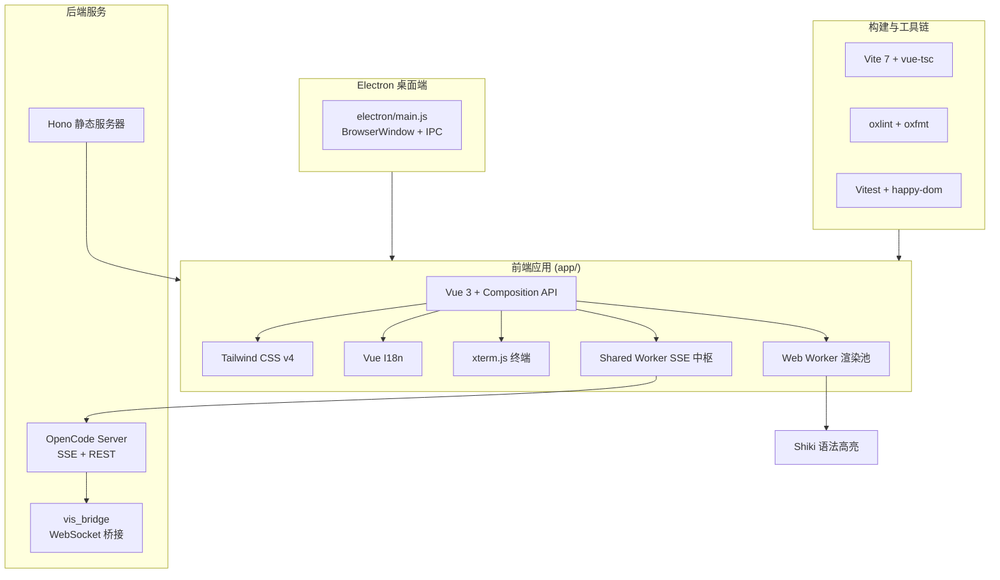

本文档面向初次接触 Vis 项目的开发者，系统梳理项目所依赖的技术栈、运行时环境、构建工具链及关键第三方库的版本要求。理解这些内容将帮助你快速搭建开发环境，并为后续阅读 [Vue 3 应用入口与生命周期](5-vue-3-ying-yong-ru-kou-yu-sheng-ming-zhou-qi)、[模块化后端适配器设计](7-mo-kuai-hua-hou-duan-gua-pei-qi-she-ji) 等核心架构章节打下基础。

Sources: [package.json](package.json#L1-L85), [README.md](README.md#L57-L84)

---

## 运行时与包管理

Vis 是一款基于 Node.js 的现代化前端应用，对运行时和包管理器有明确的版本约束。

| 依赖项 | 版本要求 | 说明 |
|---|---|---|
| Node.js | ≥ 20 | 运行时与构建环境，CI 中实际使用 22 |
| pnpm | 10.29.3（推荐） | 包管理器，通过 `packageManager` 字段锁定 |
| OpenCode Server | 最新版 | 后端服务，提供 SSE 事件流与 REST API |
| 系统 `$EDITOR` | 可选 | 用于"用编辑器打开"功能 |

项目使用 `pnpm-workspace.yaml` 管理单仓库构建依赖，并通过 `packageManager` 字段确保团队成员使用一致的包管理器版本，避免因 lockfile 格式差异导致的安装问题。默认服务端口已从常见的 `3000` 修改为 `23003`，以减少在 WSL 环境下与 Windows 系统服务的端口冲突。

Sources: [package.json](package.json#L83-L84), [server.js](server.js#L37-L38), [README.md](README.md#L74-L85)

---

## 前端技术栈

前端采用 Vue 3 生态为核心，配合 Vite 构建工具与 Tailwind CSS 原子化样式方案，形成轻量且高性能的技术底座。

**核心框架与构建层**：Vue 3（v3.5.28）配合 Composition API 提供响应式 UI 能力；Vite（v7.3.1）作为构建工具，通过 `@vitejs/plugin-vue` 处理单文件组件，并在开发阶段提供极速的热更新体验。TypeScript（v6.0.3）以严格模式运行，配置 `verbatimModuleSyntax` 和 `isolatedModules` 确保编译行为的一致性。

**样式与组件层**：Tailwind CSS v4（v4.1.18）通过 `@import 'tailwindcss'` 方式引入，配合 `@tailwindcss/postcss` 和 `@tailwindcss/typography` 插件实现原子化 CSS 与排版样式。xterm.js（v6.0.0）提供嵌入式终端模拟能力，在 `main.ts` 中直接引入其 CSS 文件。

**国际化**：Vue I18n（v11.3.0）支持英语、简体中文、繁体中文、日语和世界语五种语言，语言配置通过 `createI18n` 初始化并持久化到本地存储。

Sources: [package.json](package.json#L40-L82), [app/main.ts](app/main.ts#L1-L28), [app/i18n/index.ts](app/i18n/index.ts#L1-L64), [app/styles/tailwind.css](app/styles/tailwind.css#L1-L23)

---

## 后端与通信层

项目支持两种后端模式：OpenCode 原生协议与 Codex JSON-RPC 桥接协议。

**HTTP 服务**：生产环境使用 Hono（v4.12.3）配合 `@hono/node-server` 提供轻量级静态文件服务，`server.js` 作为入口文件，默认监听 `127.0.0.1:23003`。开发阶段则由 Vite Dev Server 代理，端口为 `5173`。

**实时通信**：前端通过 SSE（Server-Sent Events）与 OpenCode 服务器保持长连接，事件协议定义了 30 余种标准数据包类型，涵盖会话生命周期、消息增量、权限请求、终端状态等。SSE 连接管理封装在 `sseConnection.ts` 中，支持自动重连与认证失败处理。Shared Worker（`sse-shared-worker.ts`）作为跨标签页状态同步中枢，维护连接池、会话状态构建器与通知管理器。

**Codex 桥接**：`vis_bridge.js` 是一个独立的 Node.js 进程，使用原生 `node:http`/`node:net`/`node:tls` 模块实现 WebSocket 协议转发，将 Codex app-server 的 JSON-RPC 流桥接到 Vis 前端，默认监听 `ws://127.0.0.1:4500`。

Sources: [server.js](server.js#L1-L44), [app/utils/sseConnection.ts](app/utils/sseConnection.ts#L1-L222), [app/workers/sse-shared-worker.ts](app/workers/sse-shared-worker.ts#L1-L200), [vis_bridge.js](vis_bridge.js#L1-L200), [app/types/sse.ts](app/types/sse.ts#L1-L200)

---

## 渲染与性能优化

Vis 在渲染层采用了多线程与缓存策略，以应对大会话量与复杂代码展示场景。

**Web Worker 渲染池**：`render-worker.ts` 基于 Shiki（v3.22.0）和 MarkdownIt 实现语法高亮与 Markdown 渲染，通过 `workerRenderer.ts` 管理的 Worker 池（默认 4–8 个实例，按 `navigator.hardwareConcurrency` 动态调整）将渲染任务卸载到后台线程。渲染结果通过 LRU 缓存（上限 200 条）复用，避免重复计算。

**虚拟滚动**：`OutputPanel.vue` 在会话线程数超过 20 时自动启用虚拟滚动，仅渲染视口内的 `ThreadBlock` 组件，通过绝对定位与 `translateY` 偏移模拟完整滚动高度，显著降低大会话的 DOM 压力。

**增量更新与批处理**：`useMessages.ts` 使用 `shallowRef` 与微任务批处理机制，将 SSE 流中的消息增量更新排队到同一事件循环周期内批量刷新，减少重渲染次数。

Sources: [app/workers/render-worker.ts](app/workers/render-worker.ts#L1-L200), [app/utils/workerRenderer.ts](app/utils/workerRenderer.ts#L1-L195), [app/components/OutputPanel.vue](app/components/OutputPanel.vue#L1-L200), [app/composables/useMessages.ts](app/composables/useMessages.ts#L1-L200)

---

## 桌面端打包

Vis 通过 Electron（v35.0.0）支持跨平台桌面应用构建，覆盖 Windows、macOS 和 Linux。

**主进程**：`electron/main.js` 使用 ESM 模块系统，创建 `BrowserWindow` 时启用 `contextIsolation` 与 `sandbox` 安全策略，开发模式下自动打开 DevTools 并处理 CORS。持久化存储通过 IPC 桥接到主进程的文件系统操作，替代了浏览器的 `localStorage`。

**构建配置**：`electron-builder.yml` 定义了多平台打包规则，包括 DMG/ZIP（macOS x64/arm64）、NSIS（Windows x64/arm64）和 AppImage/DEB（Linux x64）。CI 流程通过 GitHub Actions 在 `macos-latest`、`windows-latest` 和 `ubuntu-latest` 三个矩阵节点上并行构建。

Sources: [electron/main.js](electron/main.js#L1-L200), [electron-builder.yml](electron-builder.yml#L1-L106), [.github/workflows/build-electron.yml](.github/workflows/build-electron.yml#L1-L92)

---

## 代码质量工具链

项目采用 Oxlint 和 oxfmt 替代传统的 ESLint/Prettier 组合，以获得更高的检查与格式化性能。

| 工具 | 版本 | 用途 |
|---|---|---|
| oxlint | v1.47.0 | 静态代码检查，支持 TypeScript |
| oxfmt | v0.32.0 | 代码格式化 |
| oxlint-tsgolint | v0.12.2 | 额外的 TS 规则集 |
| vitest | v4.1.2 | 单元测试框架，配合 happy-dom 环境 |
| vue-tsc | v3.2.4 | Vue 单文件组件类型检查 |

测试配置位于 `vite.config.ts` 中，使用 `happy-dom` 作为 DOM 环境，测试文件匹配 `**/*.test.ts` 模式。项目还包含大量 `.test.ts` 文件覆盖工具函数、状态逻辑与组合式函数。

Sources: [package.json](package.json#L55-L82), [vite.config.ts](vite.config.ts#L63-L68)

---

## 关键依赖库速览

| 库 | 版本 | 用途 |
|---|---|---|
| vue | 3.5.28 | 前端响应式框架 |
| vite | 7.3.1 | 构建工具 |
| hono | 4.12.3 | 轻量 HTTP 框架 |
| tailwindcss | 4.1.18 | 原子化 CSS |
| shiki | 3.22.0 | 语法高亮 |
| vue-i18n | 11.3.0 | 国际化 |
| @xterm/xterm | 6.0.0 | 终端模拟器 |
| electron | 35.0.0 | 桌面应用壳 |
| electron-builder | 26.0.0 | 桌面应用打包 |
| vitest | 4.1.2 | 单元测试 |
| @iconify/vue | 5.0.0 | 图标组件 |
| jszip | 3.10.1 | ZIP 压缩 |
| fflate | 0.8.2 | 流式压缩 |
| nanotar | 0.3.0 | TAR 归档 |
| libarchive-wasm | 1.2.0 | 归档解压（WASM） |

Sources: [package.json](package.json#L40-L82)

---

## 项目结构概览

以下 Mermaid 图展示了技术栈在运行时的分层关系：

Sources: [package.json](package.json#L1-L85), [app/main.ts](app/main.ts#L1-L28), [app/index.html](app/index.html#L1-L29)

---

## 下一步

在确认环境满足要求并完成 `pnpm install` 后，建议按以下顺序继续阅读：

1. **[快速开始](2-kuai-su-kai-shi)** — 完成首次构建与启动
2. **[Vue 3 应用入口与生命周期](5-vue-3-ying-yong-ru-kou-yu-sheng-ming-zhou-qi)** — 深入理解 `App.vue` 的组件架构与状态初始化
3. **[全局状态与事件系统](6-quan-ju-zhuang-tai-yu-shi-jian-xi-tong)** — 掌握 `useMessages`、`useServerState` 等核心组合式函数
4. **[SSE 连接管理与事件协议](8-sse-lian-jie-guan-li-yu-shi-jian-xie-yi)** — 理解实时通信的数据流与重连机制