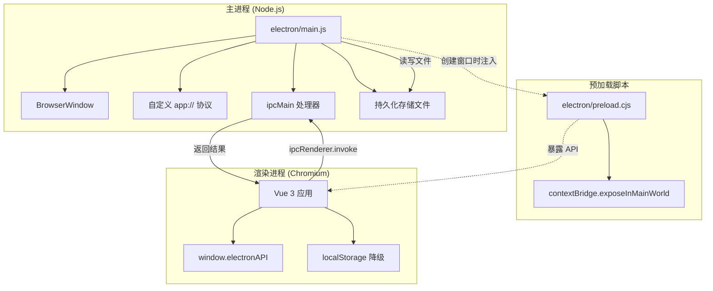
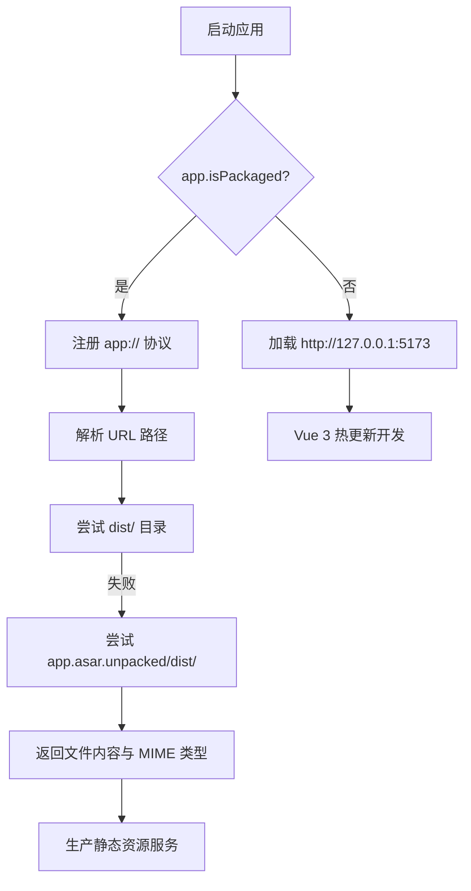
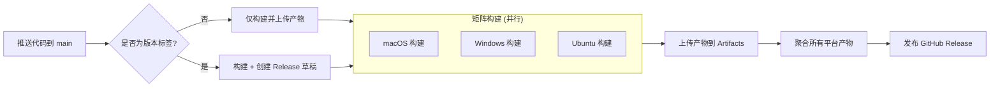

Vis 项目基于 Electron 将 Vue 3 前端应用封装为跨平台桌面客户端，支持 macOS、Windows 与 Linux 三大平台。Electron 桌面端构建的核心目标是在保持 Web 应用开发体验的同时，提供原生级别的系统集成能力——包括本地存储持久化、系统剪贴板访问、安全沙箱隔离以及自动化的 CI/CD 分发流程。本页面向初学者介绍整个 Electron 构建体系的架构组成、开发工作流、安全模型与打包配置，帮助你理解桌面端与纯 Web 部署之间的关键差异。

## 架构概览：主进程、预加载脚本与渲染进程

Electron 应用由三个核心层级构成。**主进程（Main Process）** 运行在 Node.js 环境中，负责创建浏览器窗口、管理应用生命周期、注册自定义协议以及处理系统级 API 调用。**预加载脚本（Preload Script）** 在渲染进程启动前执行，是主进程与渲染进程之间唯一的安全桥梁，通过 `contextBridge` 将白名单化的 API 暴露给前端。**渲染进程（Renderer Process）** 则运行标准的 Vue 3 应用代码，通过 `window.electronAPI` 访问桌面端专属能力。

三者的通信关系可以用下图表示：

主进程通过 `BrowserWindow` 的 `webPreferences.preload` 配置将预加载脚本注入到每个渲染进程中。预加载脚本使用 CommonJS 模块格式（`.cjs`），这是因为 Electron 的预加载环境在特定版本中对 ESM 支持有限，而主进程则采用 ES Module（`.js`）以与现代 Node.js 保持一致。这种模块格式的区分是初学者需要特别注意的细节。

Sources: [electron/main.js](electron/main.js#L1-L10), [electron/preload.cjs](electron/preload.cjs#L1-L5)

## 开发模式与生产模式的双轨加载策略

Electron 桌面端需要同时支持开发调试与生产分发两种场景，项目通过 `app.isPackaged` 属性进行环境区分。在开发模式下，主进程直接加载 Vite 开发服务器地址 `http://127.0.0.1:5173`，并自动打开开发者工具；在生产模式下，则通过自定义的 `app://` 协议从打包后的静态资源目录加载 `index.html`。

`app://` 协议的注册是生产模式的关键基础设施。主进程在 `app.whenReady()` 阶段调用 `protocol.handle('app', ...)` 注册协议处理器，该处理器将 URL 映射到本地文件系统。为了兼容开发预览（未打包）和 asar 打包（生产）两种布局，协议处理器会依次尝试两个候选路径：首先是相对于主进程文件的上级 `dist` 目录，其次是 `app.asar.unpacked/dist` 目录。这种双路径回退机制确保了无论在何种打包状态下，静态资源都能被正确解析。

开发模式的启动由 `scripts/electron-start.mjs` 脚本统一编排。该脚本首先检测 Vite 开发服务器是否已运行，若未运行则自动执行 `pnpm dev` 启动服务器，并轮询等待其就绪（最长 30 秒超时）。服务器就绪后再启动 Electron 进程。当 Electron 进程退出时，脚本会级联终止 Vite 服务器，确保开发环境干净关闭。

Sources: [electron/main.js](electron/main.js#L7-L8), [electron/main.js](electron/main.js#L95-L150), [scripts/electron-start.mjs](scripts/electron-start.mjs#L1-L50)

## 安全模型：Context Isolation 与 IPC 白名单

Electron 桌面端的安全架构遵循现代最佳实践，核心原则是**最小权限暴露**。主进程创建窗口时启用了四项关键安全设置：`contextIsolation: true` 将预加载脚本的上下文与渲染进程隔离，防止恶意脚本直接访问 Node.js API；`nodeIntegration: false` 禁止渲染进程直接使用 Node.js 模块；`sandbox: true` 启用 Chromium 的沙箱机制；`webSecurity: true` 保持同源策略和 CORS 限制。

预加载脚本 `electron/preload.cjs` 不暴露完整的 `ipcRenderer` 对象，而是通过 `contextBridge.exposeInMainWorld` 仅暴露经过严格白名单化的 API。当前暴露的接口包括平台信息（`platform`、`versions`）、应用版本查询（`getAppVersion`）、系统剪贴板写入（`clipboard.writeText`）以及持久化存储操作（`persistentStorage` 的 `getItem`/`setItem`/`removeItem`）。所有 IPC 调用都经过类型校验，例如剪贴板写入会验证参数是否为字符串，非法输入将抛出错误。

主进程中的 `ipcMain` 处理器与预加载脚本暴露的 API 一一对应。以持久化存储为例，预加载脚本使用 `ipcRenderer.sendSync` 进行同步调用，主进程在 `persistent-storage-get`、`persistent-storage-set`、`persistent-storage-remove` 三个通道上处理请求，并将数据序列化到用户数据目录下的 `renderer-storage.json` 文件中。当存储发生变更时，主进程还会通过 `persistent-storage-changed` 事件向所有其他窗口广播，预加载脚本接收到该事件后将其转换为标准的 `StorageEvent`，从而让 Vue 应用中的 `storage` 事件监听器能够正常工作。

Sources: [electron/main.js](electron/main.js#L92-L105), [electron/preload.cjs](electron/preload.cjs#L8-L45), [electron/main.js](electron/main.js#L240-L294)

## 持久化存储：从 localStorage 到文件系统的迁移

在纯 Web 环境中，Vis 使用 `localStorage` 保存用户设置、会话状态和认证信息。但在 Electron 桌面端，`localStorage` 的数据存储在 Chromium 的用户数据目录中，可能因缓存清理或应用重装而丢失。为了解决这一问题，项目实现了一套基于文件系统的持久化存储机制，并提供了从 `localStorage` 的自动迁移能力。

存储后端的选择由 `app/utils/storageKeys.ts` 中的 `resolveStorageBackend()` 函数决定。当检测到 `window.electronAPI.persistentStorage` 存在时，优先使用 Electron 的持久化存储；否则回退到标准的 `localStorage`。在首次切换到 Electron 存储时，`migrateLocalStorageToElectronStorage()` 函数会自动扫描 `localStorage` 中以 `opencode.` 为前缀的所有键值对，并将其复制到 Electron 存储中，确保用户的现有配置不会丢失。此后所有 `storageGet`、`storageSet`、`storageRemove` 操作都会透明地路由到选定的后端。

这种设计使得前端代码无需感知运行环境——无论是在浏览器中访问还是通过 Electron 桌面端运行，存储 API 的行为完全一致。唯一需要注意的是，Electron 存储的变更事件通过 IPC 广播实现，因此在多窗口场景下，一个窗口中的设置修改会实时同步到其他窗口。

Sources: [app/utils/storageKeys.ts](app/utils/storageKeys.ts#L1-L50)

## 打包配置：electron-builder 与跨平台分发

项目的打包工作由 `electron-builder` 负责，配置文件 `electron-builder.yml` 定义了完整的分发策略。应用 ID 为 `com.xenodrive.vis`，产品名称为 `Vis`，输出目录为 `dist-electron`。打包时包含的文件通过 `files` 字段精确控制：仅纳入 `dist/`（Vite 构建产物）、`electron/`（主进程与预加载脚本）和 `package.json`，同时排除 `node_modules`、开发配置文件和文档目录。

asar 压缩默认启用，但 `.node` 原生模块会被自动解包（`asarUnpack`），这是因为原生模块需要直接访问文件系统路径，无法在 asar 虚拟文件系统中运行。macOS 配置启用了 `hardenedRuntime`  hardened runtime，并指定了 `entitlements.mac.plist` 以允许 JIT 编译（部分依赖如 `node-pty` 需要此权限）。Windows 使用 NSIS 安装器，支持用户自定义安装目录和创建桌面快捷方式。Linux 同时生成 AppImage 和 deb 两种格式，满足不同发行版的需求。

| 平台 | 目标格式 | 架构 | 特殊配置 |
|------|---------|------|---------|
| macOS | dmg、zip | x64、arm64 | hardenedRuntime、entitlements、hiddenInset 标题栏 |
| Windows | nsis | x64、arm64 | 自定义安装目录、桌面快捷方式 |
| Linux | AppImage、deb | x64 | 可执行文件名 `vis`、Development 分类 |

构建产物命名遵循统一的模板：`Vis-${version}-${arch}-${Platform}.${ext}`，例如 `Vis-0.4.5-arm64-MacOS.dmg`。发布配置指向 GitHub Releases，当推送以 `v` 开头的标签时，CI 流程会自动创建草稿版本（draft release）。

Sources: [electron-builder.yml](electron-builder.yml#L1-L50), [electron-builder.yml](electron-builder.yml#L51-L105)

## CI/CD 自动化构建

GitHub Actions 工作流 `.github/workflows/build-electron.yml` 实现了全自动化的跨平台构建与发布。工作流在 `main` 分支推送和 `v*` 标签推送时触发，使用矩阵策略在 macOS、Windows 和 Ubuntu 三个运行器上并行构建。每个任务首先检出代码、安装 Node.js 22 和 pnpm，然后通过缓存加速依赖安装，最后执行 `vite build && npx electron-builder --publish never` 完成构建。

构建产物（dmg、zip、exe、AppImage、deb 等）通过 `upload-artifact` 上传，保留 7 天。当触发源为版本标签时，独立的 `release` 任务会下载所有平台的构建产物，并使用 `softprops/action-gh-release` 创建 GitHub Release 草稿，自动生成发布说明。这一流程确保了从代码提交到可分发安装包的全链路自动化，开发者只需推送标签即可获得全平台安装包。

Sources: [.github/workflows/build-electron.yml](.github/workflows/build-electron.yml#L1-L30), [.github/workflows/build-electron.yml](.github/workflows/build-electron.yml#L31-L92)

## 前端集成：检测桌面环境与条件特性

Vue 3 应用通过 `window.electronAPI` 的存在性判断当前是否运行在 Electron 桌面端。TypeScript 类型声明在 `app/vite-env.d.ts` 中扩展了全局 `Window` 接口，定义了 `electronAPI` 的完整类型签名，包括平台信息、版本查询、剪贴板和持久化存储接口。这使得前端代码在访问 `window.electronAPI` 时能够获得完整的类型检查和自动补全。

桌面端专属功能的调用采用**渐进增强**策略。以剪贴板为例，`MarkdownRenderer.vue` 中的 `writeClipboard` 函数优先尝试通过 `electronAPI.clipboard.writeText` 写入，若不可用则回退到 Web 标准的 `navigator.clipboard.writeText`。类似地，字体发现功能通过 `window.queryLocalFonts` 检测浏览器是否支持本地字体访问 API，这在 Electron 中同样可用，因为底层 Chromium 已实现了该实验性 API。

主进程还为 macOS 提供了特殊的标题栏处理：当 `process.platform === 'darwin'` 时，窗口使用 `hiddenInset` 标题栏样式，将窗口控制按钮（关闭、最小化、最大化）嵌入到内容区域中，呈现更现代的原生应用外观；Windows 和 Linux 则使用默认标题栏样式。

Sources: [app/vite-env.d.ts](app/vite-env.d.ts#L15-L30), [app/components/renderers/MarkdownRenderer.vue](app/components/renderers/MarkdownRenderer.vue#L64-L73), [app/utils/fontDiscovery.ts](app/utils/fontDiscovery.ts#L44-L50), [electron/main.js](electron/main.js#L99)

## 常用命令速查

| 命令 | 作用 | 适用场景 |
|------|------|---------|
| `pnpm dev` | 启动 Vite 开发服务器 | 纯前端开发调试 |
| `pnpm electron:start` | 自动启动 Vite 服务器 + Electron 窗口 | 桌面端功能开发 |
| `pnpm build` | 构建前端生产包到 `dist/` | 验证构建产物 |
| `pnpm electron:build` | 构建前端 + 打包 Electron 应用 | 生成分发安装包 |
| `pnpm electron:preview` | 构建并生成未打包的目录结构 | 快速验证打包配置 |
| `pnpm postinstall` | 安装 Electron 原生依赖 | 首次克隆或依赖变更后 |

Sources: [package.json](package.json#L20-L30)

## 下一步

完成 Electron 桌面端构建的学习后，建议继续深入了解以下内容：

- 若希望理解 Vue 3 应用如何在 Electron 窗口中初始化与运行，请参阅 [Vue 3 应用入口与生命周期](5-vue-3-ying-yong-ru-kou-yu-sheng-ming-zhou-qi)
- 若对主进程与渲染进程之间的状态同步机制感兴趣，请参阅 [全局状态与事件系统](6-quan-ju-zhuang-tai-yu-shi-jian-xi-tong)
- 若需要配置后端连接与 API 适配，请参阅 [模块化后端适配器设计](7-mo-kuai-hua-hou-duan-gua-pei-qi-she-ji)