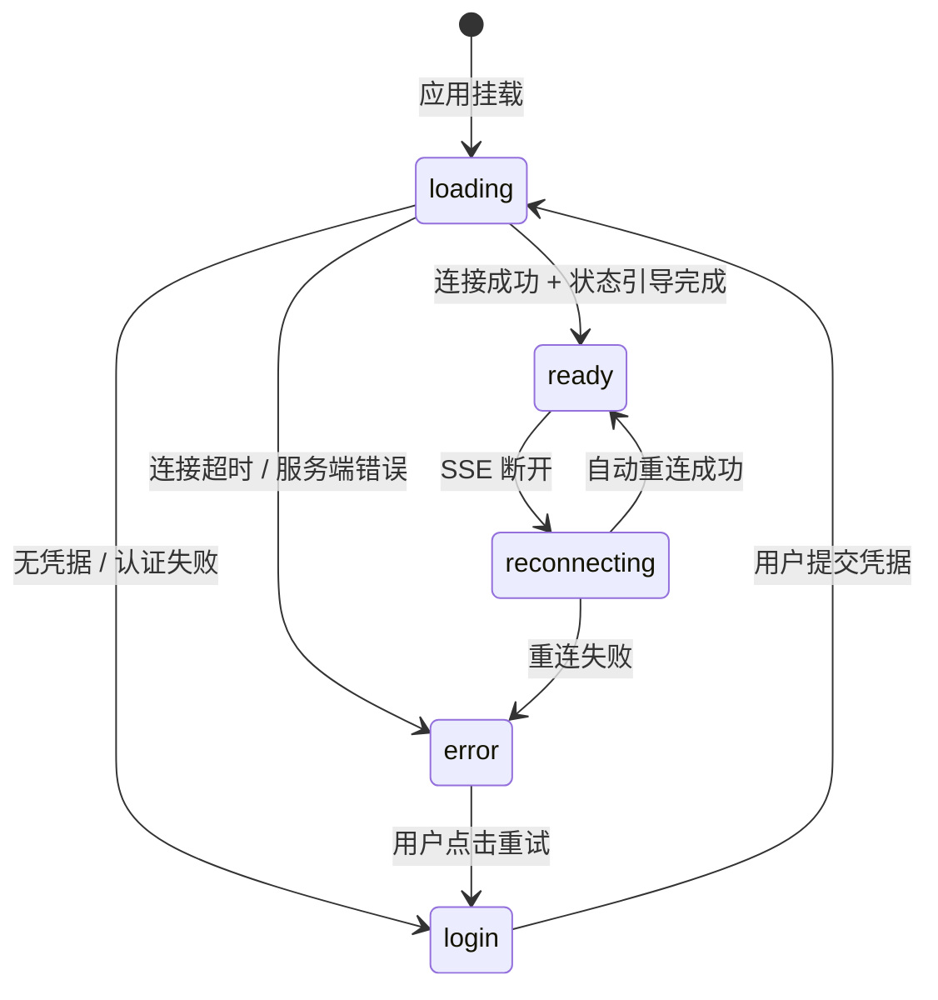

本文档聚焦 Vis 前端应用的 Vue 3 启动流程、根组件生命周期以及核心初始化时序。理解这些机制是掌握整个前端架构的基础——从 `createApp` 的极简入口到 `App.vue` 中近万行逻辑所承载的复杂状态编排，每一步都决定了应用如何连接后端、渲染界面、管理会话。

---

## 应用入口：main.ts 与 index.html

Vis 的浏览器端入口由两个文件协同构成：`index.html` 提供挂载点与全局安全策略，`main.ts` 负责创建 Vue 应用实例并启动渲染。

`index.html` 的核心职责有三：定义严格的 Content Security Policy（限制脚本、样式、连接、图片等来源）、设置 `#app` 挂载容器、引入 `main.ts` 模块。其 CSP 配置允许 `self` 源脚本、`unsafe-inline` 样式、本地与远程 HTTP/HTTPS/WebSocket 连接，以及 blob 与 data URL 图片——这反映了应用需要加载用户附件、连接本地 SSE 服务端、并在 Electron 环境中运行。`html` 标签的 `lang="ja"` 仅为默认属性，实际语言由 Vue I18n 在运行时接管。

Sources: [index.html](app/index.html#L1-L28)

`main.ts` 遵循 Vue 3 的标准应用创建模式，但增加了样式注入与第三方库初始化。它依次导入 xterm 的终端样式、Tailwind 基础样式、根组件 `App.vue` 以及国际化插件，然后调用 `createApp(App)` 创建应用实例，通过 `app.use(i18n)` 挂载国际化，最后执行 `app.mount('#app')` 将虚拟 DOM 渲染到 `#app` 容器。一个值得注意的细节是 `injectHighlightStyles()` 函数：它动态创建 `<style>` 节点注入 CSS Custom Highlight API 的伪元素样式，用于悬浮窗内的高亮搜索匹配项。这种运行时注入避免了构建工具对 `::highlight()` 伪元素可能产生的警告。

Sources: [main.ts](app/main.ts#L1-L28)

---

## 构建配置与运行时环境

理解入口文件需要结合 Vite 构建配置。`vite.config.ts` 将 `app` 目录设为构建根目录，输出到 `../dist`，并配置了基于模块路径的代码分割策略：Vue 核心、Vue I18n、UI 组件库、终端库、工具库分别打包到独立的 vendor chunk 中。这种分割确保了首屏只加载最小必要的 JavaScript，而大型依赖（如 xterm、marked）在首次使用时按需加载。配置中还定义了 `__GIT_REVISION__` 全局常量，供应用展示版本信息。

Sources: [vite.config.ts](vite.config.ts#L1-L68)

运行时类型支持由 `vite-env.d.ts` 提供。除了标准的 Vite 客户端类型外，它还扩展了 `Window` 接口以支持 Electron 桥接 API（`electronAPI`）和本地字体查询 API（`queryLocalFonts`），并声明了 `.vue` 单文件组件的类型。这些类型声明使得 TypeScript 能够识别 Electron 环境中的持久化存储、平台信息以及字体发现功能。

Sources: [vite-env.d.ts](app/vite-env.d.ts#L1-L37)

---

## 根组件 App.vue：架构总览

`App.vue` 是整个前端应用的中枢，采用 Vue 3 `<script setup>` 语法，长度超过 9000 行。它并非一个普通的布局组件，而是承担了**应用级状态容器**的角色——集成了后端连接、会话管理、消息处理、悬浮窗系统、文件树、主题注入、对话框管理等几乎所有跨模块 concern。这种设计选择使得状态流转高度集中，避免了多层 prop drilling，但也意味着 `App.vue` 的复杂度较高。

从模板结构看，`App.vue` 的渲染分为两大分支：当 `uiInitState === 'ready'` 时展示完整应用界面（顶部面板、侧边栏、输出区、输入区、悬浮窗画布、Dock 栏）；否则展示加载/登录视图。这种基于初始化状态的条件渲染确保了在用户完成认证、后端连接建立、项目数据加载之前，不会暴露功能界面。

Sources: [App.vue](app/App.vue#L1-L220)

应用界面采用经典的三栏布局：顶部 `TopPanel` 承载项目与会话导航；主体区域左侧为 `SidePanel`（可折叠的文件树与会话树），右侧为垂直分割的输出区 `OutputPanel` 和输入区 `InputPanel`；最外层是 `FloatingWindow` 的浮动画布和底部的 Dock 面板。所有子组件通过大量 props 和事件与 `App.vue` 通信，形成**中央集权式**的数据流。

Sources: [App.vue](app/App.vue#L220-L440)

---

## 组合式函数（Composables）的集成模式

`App.vue` 的核心逻辑建立在多个组合式函数之上，这些函数遵循 Vue 3 Composition API 的最佳实践，各自封装独立的可复用状态逻辑。以下是 `App.vue` 中集成的关键 composables 及其职责：

| Composable | 职责 | 在 App.vue 中的角色 |
|---|---|---|
| `useCredentials` | 管理认证凭据（URL、用户名、密码、Codex 桥接配置） | 决定初始化时连接哪个后端 |
| `useSettings` | 管理用户偏好设置（字体、主题、窗口行为等） | 驱动 UI 个性化与持久化配置 |
| `useGlobalEvents` | 管理 SSE 连接与全局事件分发 | 应用与后端通信的唯一通道 |
| `useServerState` | 管理项目、沙箱、会话的树状状态 | 接收 Worker 推送的状态更新 |
| `useSessionSelection` | 管理当前选中的项目与会话 | 协调 URL 查询参数与本地状态 |
| `useMessages` | 管理消息流与增量更新 | 处理 SSE 消息事件并缓存 |
| `useFloatingWindows` | 管理悬浮窗生命周期 | 驱动工具窗口、查看器、终端窗口 |
| `useFileTree` | 管理文件树状态与 Git 集成 | 为侧边栏提供文件浏览数据 |
| `useOpenCodeApi` / `useCodexApi` | 封装后端特定 API 调用 | 根据当前后端类型执行操作 |

这些 composables 大多返回响应式引用（`ref`/`computed`）和操作方法，`App.vue` 将它们组合起来形成完整的业务逻辑。例如，`useGlobalEvents` 返回的 `ge` 对象被用于订阅 SSE 事件、发送 Worker 消息、管理连接生命周期；`useSessionSelection` 返回的 `selectedSessionId` 则作为核心状态驱动输出面板和输入面板的渲染。

Sources: [App.vue](app/App.vue#L442-L560)

---

## 初始化生命周期：从挂载到就绪

`App.vue` 的初始化时序在 `onMounted` 钩子中展开，可分为六个阶段：环境准备、凭据恢复、后端连接、状态引导、会话选择、事件订阅。

**第一阶段：环境准备**。`onMounted` 首先请求浏览器通知权限、注册全局键盘监听、执行窗口尺寸计算，并等待字体加载完成后重新计算布局。这些操作确保了后续 UI 渲染在正确的视觉环境中进行。

**第二阶段：凭据恢复**。调用 `credentials.load()` 从 `localStorage` 读取保存的服务器 URL、认证信息和后端类型（OpenCode 或 Codex）。如果凭据已配置，则进入自动连接流程；否则展示登录界面。

**第三阶段：后端连接**。`startInitialization()` 函数根据后端类型执行不同的连接逻辑。对于 OpenCode 后端，它调用 `ge.connect()` 建立 SSE 连接，等待 `connection.open` 事件；对于 Codex 后端，则通过 `codexApi.connect()` 建立 WebSocket 连接。连接成功后进入 `bootstrapping` 状态。

**第四阶段：状态引导**。OpenCode 后端依赖 Shared Worker 推送初始项目状态。`bootstrapSelections()` 函数会等待 `serverState.bootstrapped` 变为 `true`（即收到 Worker 的 `state.bootstrap` 消息），然后才能进行会话选择。Codex 后端则直接设置项目 ID 为固定值 `CODEX_PROJECT_ID`。

**第五阶段：会话选择**。初始化完成后，应用优先使用 URL 查询参数中的 `project` 和 `session` 定位会话；若不存在，则调用 `initializeSessionSelection()` 自动选择最近活跃的会话；若仍无会话，则自动创建新会话。

**第六阶段：事件订阅**。`onMounted` 中注册了超过 20 个全局事件监听器，涵盖连接状态变化、会话更新、消息增量、权限请求、终端事件、文件监视等。这些监听器被收集到 `globalEventUnsubscribers` 数组中，确保在组件卸载时统一清理。

Sources: [App.vue](app/App.vue#L8234-L8442)

---

## 初始化状态机

应用使用 `uiInitState` 和 `connectionState` 两个响应式状态描述初始化进程，形成如下状态转换：

`uiInitState` 控制 UI 展示（加载动画、登录表单、主界面），而 `connectionState` 更细粒度地跟踪网络层状态。两者解耦使得 UI 可以在后台重连时保持 `ready` 外观，仅在必要时展示重连提示。

Sources: [App.vue](app/App.vue#L1489-L1495)

---

## 清理生命周期：onBeforeUnmount

`onBeforeUnmount` 钩子执行与 `onMounted` 对称的清理操作，确保组件卸载时不会留下内存泄漏或僵尸事件监听。清理内容包括：移除所有 `window` 和 `document` 事件监听器（键盘、指针、resize、storage、visibilitychange、focus/blur）、断开 ResizeObserver、取消所有待执行的 `requestAnimationFrame`、清理全局事件订阅器数组、清除重连定时器、释放会话作用域、断开 SSE 连接、销毁所有终端窗口。

特别值得注意的是 `globalEventUnsubscribers` 的模式：所有通过 `ge.on()` 和 `sessionScope.on()` 注册的监听器都返回一个 dispose 函数，`onBeforeUnmount` 通过 `while` 循环逐一调用这些 dispose 函数。这种集中式清理比逐个手动移除更可靠，也更容易维护。

Sources: [App.vue](app/App.vue#L8443-L8485)

---

## 主题与样式的运行时注入

`App.vue` 模板的第一层子组件是 `ThemeInjector`，它本身不渲染任何可见内容，仅调用 `useRegionTheme()` 组合式函数。该函数通过 Vue 的 `watch` 监听主题存储状态，将语义化主题令牌（semantic tokens）同步为 CSS 自定义属性（`--theme-*`），并设置 `data-theme` 属性以激活预设主题样式。

`useRegionTheme` 采用**共享消费者计数**模式：多个组件可能同时调用它，但只有第一个调用者会建立 `watch` 监听和页面卸载事件监听；当最后一个消费者卸载时，才会清理 DOM 属性和样式变量。这种模式避免了重复监听，同时保证主题系统在整个应用生命周期中持续生效。

Sources: [ThemeInjector.vue](app/components/ThemeInjector.vue#L1-L8), [useRegionTheme.ts](app/composables/useRegionTheme.ts#L90-L177)

基础样式由 `styles/tailwind.css` 提供，使用 Tailwind CSS v4 的 `@import 'tailwindcss'` 语法。除了标准的 Tailwind 工具类外，它还定义了自定义主题变量（如 `--font-sans`、surface 色阶、语义化颜色）和一套统一的滚动条样式。这些 CSS 变量与 `useRegionTheme` 动态设置的变量协同工作，形成完整的主题系统。

Sources: [tailwind.css](app/styles/tailwind.css#L1-L90)

---

## 依赖注入：跨层级的对话框 API

`App.vue` 通过 Vue 的 `provide` API 向所有后代组件暴露两个异步对话框函数：`showPrompt` 和 `showConfirm`。这两个函数基于原生 HTML `<dialog>` 元素实现，通过 Promise 返回用户输入结果，使得深层嵌套的子组件无需层层传递回调即可发起确认或提示。

`showPrompt` 打开一个模态输入框，支持默认值和自动聚焦；`showConfirm` 展示一条确认消息并返回布尔结果。两者都利用 `promptResolve` / `confirmResolve` 闭包变量将对话框的关闭事件与 Promise 的 resolve 关联起来。由于 `provide` 在 `<script setup>` 中执行，所有子组件通过 `inject('showPrompt')` 和 `inject('showConfirm')` 即可访问这些功能。

Sources: [App.vue](app/App.vue#L1471-L1473)

---

## 下一步阅读

掌握应用入口与生命周期后，建议继续深入以下相关主题：

- **[全局状态与事件系统](6-quan-ju-zhuang-tai-yu-shi-jian-xi-tong)** — 详细解析 `useGlobalEvents`、`useServerState` 和 `useMessages` 如何实现跨组件状态同步与 SSE 事件路由
- **[模块化后端适配器设计](7-mo-kuai-hua-hou-duan-gua-pei-qi-she-ji)** — 了解 `backends/registry.ts` 如何抽象 OpenCode 与 Codex 两种后端，以及 `App.vue` 如何动态切换适配器
- **[SSE 连接管理与事件协议](8-sse-lian-jie-guan-li-yu-shi-jian-xie-yi)** — 深入 `useGlobalEvents` 中的 Shared Worker 与直接传输两种模式，以及事件分发的实现细节
- **[目录优先的会话树模型](12-mu-lu-you-xian-de-hui-hua-shu-mo-xing)** — 理解 `useSessionSelection` 和 `useServerState` 如何协同构建项目-沙箱-会话的三层树状结构
- **[主题令牌与区域配色系统](21-zhu-ti-ling-pai-yu-qu-yu-pei-se-xi-tong)** — 探索 `useRegionTheme` 与 `themeTokens.ts` 中的语义化颜色模型和持久化策略