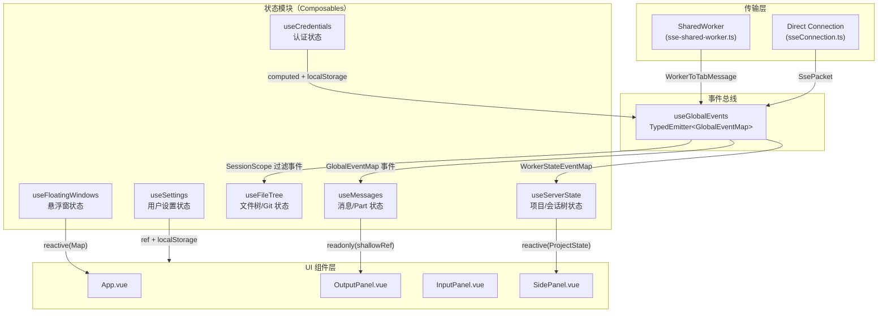
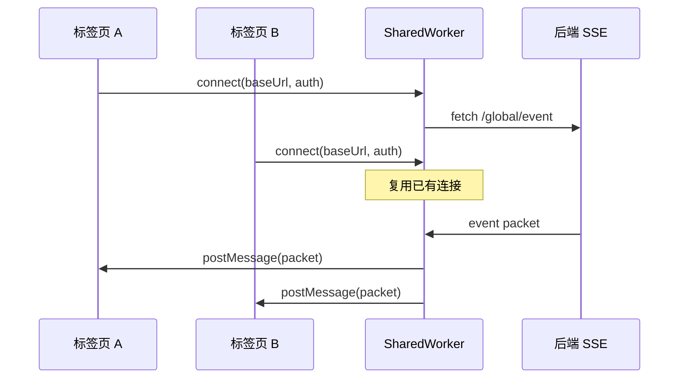
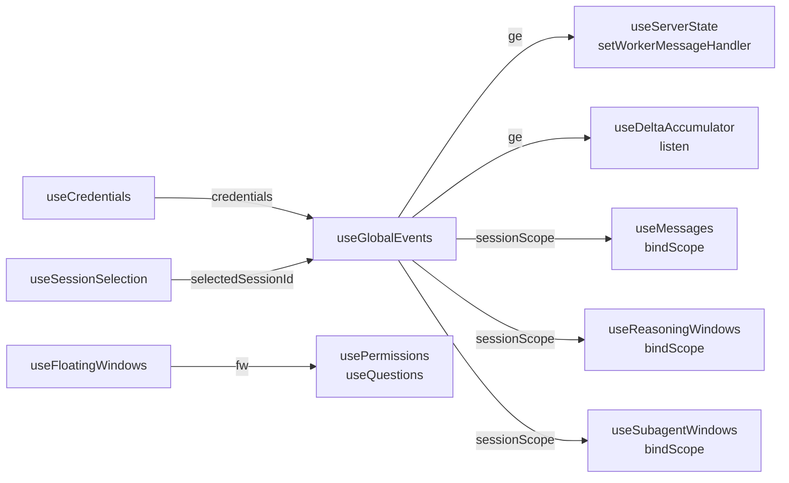

本文档深入解析 Vis 前端应用的全局状态管理与事件分发架构。整个系统围绕 **SSE（Server-Sent Events）实时事件流** 构建，通过分层的状态容器和类型安全的事件总线，将服务端推送的 30+ 种事件类型转化为响应式的 UI 状态更新。理解这一架构是掌握 Vis 数据流设计的关键入口。

---

## 核心架构概览

全局状态系统采用 **"事件驱动 + 模块级状态容器"** 的混合模式，而非传统的集中式 Store（如 Pinia/Vuex）。其设计哲学是：让状态尽可能靠近消费方，通过强类型事件契约实现模块间的松耦合通信。



**架构分层说明：**

| 层级 | 职责 | 关键文件 |
|------|------|----------|
| 传输层 | SSE 连接管理、自动重连、SharedWorker 多标签页共享 | [sseConnection.ts](app/utils/sseConnection.ts), [sse-shared-worker.ts](app/workers/sse-shared-worker.ts) |
| 事件总线 | 类型安全的事件分发、会话作用域过滤 | [useGlobalEvents.ts](app/composables/useGlobalEvents.ts), [eventEmitter.ts](app/utils/eventEmitter.ts) |
| 状态模块 | 领域状态管理、服务端事件到 UI 状态的转换 | [useMessages.ts](app/composables/useMessages.ts), [useServerState.ts](app/composables/useServerState.ts) 等 |
| UI 层 | 纯展示组件、通过 Vue 响应式系统订阅状态 | [App.vue](app/App.vue), 各 Panel 组件 |

Sources: [useGlobalEvents.ts](app/composables/useGlobalEvents.ts#L336-L522), [eventEmitter.ts](app/utils/eventEmitter.ts#L1-L31), [sseConnection.ts](app/utils/sseConnection.ts#L57-L222)

---

## 类型安全的事件总线：TypedEmitter

所有全局事件的底层分发机制是 `TypedEmitter<EventMap>`，一个轻量级的泛型事件发射器。它通过 TypeScript 的映射类型确保 **订阅者与发射者之间的类型契约**。

```typescript
export class TypedEmitter<EventMap extends Record<string, unknown>> {
  private listeners = new Map<keyof EventMap, Set<Listener<any>>>();

  on<K extends keyof EventMap>(event: K, listener: Listener<EventMap[K]>): () => void {
    let set = this.listeners.get(event);
    if (!set) {
      set = new Set();
      this.listeners.set(event, set);
    }
    set.add(listener);
    return () => { set!.delete(listener); if (set!.size === 0) this.listeners.delete(event); };
  }

  emit<K extends keyof EventMap>(event: K, payload: EventMap[K]): void {
    const set = this.listeners.get(event);
    if (!set) return;
    for (const listener of set) { listener(payload); }
  }

  dispose(): void { this.listeners.clear(); }
}
```

**核心特性：**

- **完全类型安全**：`emitter.on('message.updated', handler)` 中的 `handler` 参数类型自动推断为 `MessageUpdatedPacket`
- **自动清理**：取消订阅时会检测该事件是否还有监听器，无则删除键值对
- **零依赖**：仅依赖原生 `Map` 和 `Set`，无第三方库开销

事件类型契约定义在 [types/sse.ts](app/types/sse.ts#L496-L535) 中的 `GlobalEventMap`，覆盖消息、会话、权限、待办、PTY、工作树等 30+ 种事件类型。

Sources: [eventEmitter.ts](app/utils/eventEmitter.ts#L3-L30), [eventEmitter.test.ts](app/utils/eventEmitter.test.ts#L1-L54), [sse.ts](app/types/sse.ts#L493-L535)

---

## 全局事件入口：useGlobalEvents

`useGlobalEvents` 是整个前端与后端 SSE 流之间的唯一网关。它负责 **连接管理、事件路由、会话作用域过滤** 三大职责。

### 双传输策略

为支持多标签页共享同一个 SSE 连接，系统实现了两种传输层，运行时自动选择：

| 模式 | 适用场景 | 实现 |
|------|----------|------|
| **SharedWorker 模式** | 浏览器支持 SharedWorker 时，多标签页共享单一 SSE 连接 | [createSharedWorkerTransport](app/composables/useGlobalEvents.ts#L220-L334) |
| **直连模式** | 降级方案，每个标签页独立维护 SSE 连接 | [createDirectTransport](app/composables/useGlobalEvents.ts#L138-L218) |



### 会话作用域过滤

这是 `useGlobalEvents` 最核心的设计。服务端推送的是全局事件流，但 UI 组件通常只关心 **当前选中会话及其子会话** 的事件。系统提供两种作用域：

**`session()` 作用域**：监听当前会话及其所有后代会话的事件

```typescript
function session(
  selectedSessionId: Ref<string>,
  sessionParentById: Readonly<Record<string, string | undefined>>,
): SessionScope {
  let allowed = new Set<string>();
  const stop = watchEffect(() => {
    allowed = computeAllowedSessionIds(selectedSessionId.value, sessionParentById);
  });
  // ... 过滤逻辑：仅当 payload 中的 sessionId 在 allowed 集合中时才触发监听器
}
```

**`mainSession()` 作用域**：仅监听当前选中会话的事件（不包含子会话）

```typescript
function mainSession(selectedSessionId: Ref<string>): MainSessionScope {
  // ... 严格匹配 sessionId === selectedSessionId.value
}
```

`computeAllowedSessionIds` 通过遍历 `parentID` 链构建允许集合，确保子会话的事件能正确冒泡到根会话的监听者。

Sources: [useGlobalEvents.ts](app/composables/useGlobalEvents.ts#L429-L497), [useGlobalEvents.ts](app/composables/useGlobalEvents.ts#L110-L132)

---

## 领域状态模块

### 服务端状态：useServerState

`useServerState` 管理 **项目（Project）和通知（Notification）** 两级状态，这些数据由 SharedWorker 维护并同步给所有标签页。

```typescript
export function useServerState() {
  const projects = reactive<Record<string, ProjectState>>({});
  const notifications = reactive<Record<string, WorkerNotificationEntry>>({});
  const bootstrapped = ref(false);
  // ...
}
```

Worker 通过 `state.bootstrap`、`state.project-updated`、`state.notifications-updated` 等消息推送全量或增量状态。`useServerState` 的 `handleStateMessage` 方法负责将这些消息转换为 Vue 的响应式对象。

`ProjectState` 的结构设计体现了 **"目录优先"** 的会话树模型：每个项目包含多个 Sandbox（按目录键值），每个 Sandbox 包含平铺的 `sessions` 对象和有序的 `rootSessions` 数组。

Sources: [useServerState.ts](app/composables/useServerState.ts#L1-L68), [worker-state.ts](app/types/worker-state.ts#L1-L89)

---

### 消息状态：useMessages

`useMessages` 是系统中最复杂的状态模块，负责管理 **消息（Message）和消息部件（Part）** 的全生命周期。它采用 **模块级单例模式**（module-level singleton），确保跨组件共享同一份状态。

**核心数据结构：**

```typescript
type MessageEntry = {
  info?: MessageInfo;           // 消息元数据
  parts: Set<ShallowRef<MessagePart>>;  // 部件集合
};

// 模块级单例
const messages = shallowRef(new Map<string, ShallowRef<MessageEntry>>());
const parts = new Map<string, ShallowRef<MessagePart>>();
```

**批量更新机制：** 为避免流式传输期间频繁触发 Vue 重新渲染，`useMessages` 实现了基于 `queueMicrotask` 的批处理系统：

```typescript
const pendingMessageTriggers = new Set<ShallowRef<MessageEntry>>();
let flushScheduled = false;

function scheduleFlush() {
  if (flushScheduled) return;
  flushScheduled = true;
  queueMicrotask(() => {
    flushScheduled = false;
    for (const ref of pendingMessageTriggers) { triggerRef(ref); }
    pendingMessageTriggers.clear();
    if (pendingCollectionTrigger.value) { triggerRef(messages); }
  });
}
```

**增量 Delta 处理：** `message.part.delta` 事件表示文本片段的增量更新。`useMessages` 与 `useDeltaAccumulator` 协作，先由累加器合并增量，再通过 `triggerRef` 触发细粒度的 UI 更新。

Sources: [useMessages.ts](app/composables/useMessages.ts#L26-L72), [useMessages.ts](app/composables/useMessages.ts#L259-L283), [useDeltaAccumulator.ts](app/composables/useDeltaAccumulator.ts#L1-L89)

---

### 增量累加器：useDeltaAccumulator

`useDeltaAccumulator` 是一个独立的状态容器，专门处理 **流式增量事件** 的合并。它维护一个 `Map<string, AccumulatedMessage>`，在内存中实时拼接文本片段：

```typescript
ge.on('message.part.delta', (packet) => {
  const entry = messages.get(packet.messageID);
  const part = entry.parts.get(packet.partID);
  const field = packet.field as keyof typeof part;
  if (field in part && typeof part[field] === 'string') {
    (part[field] as string) += packet.delta;  // 增量追加
  }
});
```

当消息完成（`time.completed` 存在或出错）时，累加器会自动清理对应条目，避免内存泄漏。

Sources: [useDeltaAccumulator.ts](app/composables/useDeltaAccumulator.ts#L57-L70)

---

### 悬浮窗状态：useFloatingWindows

`useFloatingWindows` 管理应用中的所有 **悬浮窗（Floating Window）**，包括代码查看器、差异对比、权限对话框、问题对话框等。

**核心设计决策：**

- **`reactive(new Map())`** 存储窗口条目，保证添加/删除操作的响应性
- **`shallowRef`** 暴露已就绪的窗口列表，避免深层代理非序列化值（如 Vue 组件）
- **`markRaw`** 包裹组件实例和回调函数，防止 Vue 的响应式系统破坏其内部结构

```typescript
const entriesMap = reactive(new Map<string, FloatingWindowEntry>());
const entries = shallowRef<FloatingWindowEntry[]>([]);

function sanitizeEntry(entry: FloatingWindowEntry): FloatingWindowEntry {
  if (entry.component) entry.component = markRaw(entry.component);
  if (entry.beforeOpen) entry.beforeOpen = markRaw(entry.beforeOpen);
  // ...
}
```

**窗口生命周期管理：** 每个窗口具有 `expiresAt` 时间戳，系统通过 `setTimeout` 自动关闭过期窗口。运行中的工具窗口 TTL 为 10 分钟，已完成/出错的窗口仅保留 2 秒。

Sources: [useFloatingWindows.ts](app/composables/useFloatingWindows.ts#L103-L115), [useFloatingWindows.ts](app/composables/useFloatingWindows.ts#L117-L197)

---

### 流式窗口管理器：useStreamingWindowManager

`useStreamingWindowManager` 是 `useReasoningWindows` 和 `useSubagentWindows` 的底层抽象，负责将流式消息部件（reasoning/subagent text）转换为实时悬浮窗。

其设计模式是 **"订阅-聚合-开窗"**：

1. **订阅** `SessionScope` 的 `message.part.delta` / `message.part.updated` / `message.updated` 事件
2. **聚合** 同一 session 的文本片段到 `entriesBySession`
3. **开窗** 当文本到达时自动创建/更新悬浮窗，消息完成时调度关闭

```typescript
function subscribe(scope: SessionScope, handlers: {
  onPartUpdated: (packet: MessagePartUpdatedPacket) => void;
  onPartDelta: (packet: MessagePartDeltaPacket) => void;
  onMessageUpdated: (packet: MessageUpdatedPacket) => void;
}) {
  unsubs.push(scope.on('message.part.updated', handlers.onPartUpdated));
  unsubs.push(scope.on('message.part.delta', handlers.onPartDelta));
  unsubs.push(scope.on('message.updated', handlers.onMessageUpdated));
}
```

Sources: [useStreamingWindowManager.ts](app/composables/useStreamingWindowManager.ts#L29-L154)

---

### 持久化设置：useSettings

`useSettings` 管理所有用户偏好设置，采用 **ref + localStorage 同步** 的双向绑定模式：

```typescript
const enterToSend = ref(storageGet(StorageKeys.settings.enterToSend) === 'true');
watch(enterToSend, (value) => { storageSet(StorageKeys.settings.enterToSend, String(value)); });
```

所有设置项在初始化时从 `localStorage` 读取，变更时同步写回。`storageKeys.ts` 提供统一的键名管理和 Electron 存储后端适配。

Sources: [useSettings.ts](app/composables/useSettings.ts#L155-L200), [storageKeys.ts](app/utils/storageKeys.ts#L1-L138)

---

### 认证状态：useCredentials

`useCredentials` 是另一个模块级单例，管理后端连接所需的认证信息。它提供 `baseUrl` 和 `authHeader` 两个计算属性，供 `useGlobalEvents` 订阅以自动触发连接：

```typescript
const authHeader = computed(() => {
  const credentials = `${username.value}:${password.value}`;
  return `Basic ${btoa(credentials)}`;
});

const baseUrl = computed(() => url.value.replace(/\/+$/, ''));
```

`useGlobalEvents` 内部通过 `watch` 监听这两个计算属性，当 URL 或认证信息变化时自动重新建立 SSE 连接。

Sources: [useCredentials.ts](app/composables/useCredentials.ts#L70-L87), [useGlobalEvents.ts](app/composables/useGlobalEvents.ts#L374-L391)

---

## 状态初始化与绑定流程

在 `App.vue` 的 setup 阶段，所有状态模块按严格顺序初始化和绑定：



关键绑定代码（位于 `App.vue` 底部）：

```typescript
const ge = useGlobalEvents(credentials);
ge.setWorkerMessageHandler(serverState.handleStateMessage);

const deltaAccumulator = useDeltaAccumulator();
deltaAccumulator.listen(ge);

const sessionScope = ge.session(selectedSessionId, sessionParentRecord);
const msg = useMessages();
msg.bindScope(sessionScope);
reasoning.bindScope(sessionScope);
subagentWindows.bindScope(sessionScope);
```

这一绑定顺序确保：
1. 认证信息就绪后才能建立 SSE 连接
2. Worker 状态消息优先路由到 `useServerState`
3. 增量累加器在消息状态模块之前监听，保证数据合并的时序正确
4. 所有 UI 相关模块共享同一个 `SessionScope`，避免重复过滤

Sources: [App.vue](app/App.vue#L6827-L6838)

---

## 事件类型总览

`GlobalEventMap` 定义了系统支持的全部事件类型，按领域分组如下：

| 领域 | 事件类型 | 说明 |
|------|----------|------|
| **消息** | `message.updated` / `message.removed` / `message.part.updated` / `message.part.delta` / `message.part.removed` | 消息 CRUD 及增量更新 |
| **会话** | `session.created` / `updated` / `deleted` / `diff` / `error` / `status` / `compacted` | 会话生命周期 |
| **权限** | `permission.asked` / `permission.replied` | 权限请求与响应 |
| **问题** | `question.asked` / `question.replied` / `question.rejected` | 交互式问题 |
| **待办** | `todo.updated` | 待办列表更新 |
| **PTY** | `pty.created` / `updated` / `exited` / `deleted` | 终端会话 |
| **工作树** | `worktree.ready` / `worktree.failed` | Git 工作树 |
| **项目** | `project.updated` | 项目元数据 |
| **VCS** | `vcs.branch.updated` | 分支变更 |
| **文件** | `file.edited` / `file.watcher.updated` | 文件变更 |
| **LSP** | `lsp.updated` / `lsp.client.diagnostics` | 语言服务 |
| **连接** | `connection.open` / `connection.error` / `connection.reconnected` | 连接生命周期 |

Sources: [sse.ts](app/types/sse.ts#L496-L535)

---

## 状态同步辅助工具

### waitForState

`waitForState` 提供了一个基于 Vue `watch` 的异步等待工具，常用于会话切换时等待服务端状态就绪：

```typescript
export function waitForState<T>(
  source: () => T,
  predicate: (value: T) => boolean,
  timeoutMs = 30_000,
): Promise<T> {
  return new Promise((resolve, reject) => {
    const current = source();
    if (predicate(current)) { resolve(current); return; }
    const timer = setTimeout(() => reject(new Error('Timed out')), timeoutMs);
    const stop = watch(source, (value) => {
      if (!predicate(value)) return;
      clearTimeout(timer); stop(); resolve(value);
    }, { deep: true });
  });
}
```

`useSessionSelection` 在 `switchSession` 中使用此工具确保目标会话在服务端状态中存在后才完成切换。

Sources: [waitForState.ts](app/utils/waitForState.ts#L1-L39), [useSessionSelection.ts](app/composables/useSessionSelection.ts#L113-L134)

---

## 设计模式总结

| 模式 | 应用场景 | 示例 |
|------|----------|------|
| **模块级单例** | 跨组件共享同一份状态 | `useMessages`, `useCredentials` |
| **ref + shallowRef 混合** | 深层对象用 `shallowRef` 避免不必要的代理开销 | `useMessages` 中的 `messages` |
| **reactive + Map** | 需要响应式的键值集合 | `useFloatingWindows` 的 `entriesMap` |
| **queueMicrotask 批处理** | 高频事件合并为单次 UI 更新 | `useMessages` 的 `scheduleFlush` |
| **计算属性派生** | 从原始状态派生 UI 所需视图 | `roots`, `streaming`, `childrenByParent` |
| **watch 双向同步** | 状态与持久化存储同步 | `useSettings` 与 `localStorage` |

---

## 与其他模块的关联

- **[SSE 连接管理与事件协议](8-sse-lian-jie-guan-li-yu-shi-jian-xie-yi)**：深入解析 `sseConnection.ts` 的自动重连机制与 `parsePacket` 协议解析
- **[Shared Worker 状态同步机制](9-shared-worker-zhuang-tai-tong-bu-ji-zhi)**：详细说明 `sse-shared-worker.ts` 的多标签页状态共享实现
- **[消息流处理与增量更新](14-xiao-xi-liu-chu-li-yu-zeng-liang-geng-xin)**：`useMessages` 与 `useDeltaAccumulator` 的协作细节
- **[悬浮窗生命周期与 Dock 管理](15-xuan-fu-chuang-sheng-ming-zhou-qi-yu-dock-guan-li)**：`useFloatingWindows` 的完整窗口管理策略
- **[存储键命名与持久化策略](28-cun-chu-jian-ming-ming-yu-chi-jiu-hua-ce-lue)**：`storageKeys.ts` 的键名规范与 Electron 存储迁移