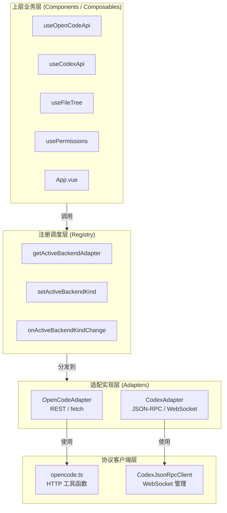

本文档深入解析 Vis 前端应用中的**模块化后端适配器架构**。该设计的核心目标是在单一前端代码库中，以透明的方式同时支持两种截然不同的后端服务：基于 REST 的 **OpenCode** 服务器，以及基于 JSON-RPC over WebSocket 的 **Codex** 桥接器。通过引入统一的接口契约、能力声明与注册中心，所有上层业务逻辑（会话管理、文件操作、终端、权限等）均无需关心底层后端的具体实现，从而实现了真正的后端无关性。

---

## 架构总览：三层隔离模型

整个后端适配体系由三个层次构成：**类型契约层**、**适配实现层**与**注册调度层**。这种分层确保了新增后端类型时，上层业务代码零侵入。



**设计要点**：上层业务仅通过 `getActiveBackendAdapter()` 获取当前激活的适配器实例，所有后端差异被完全封装在适配器内部。当用户切换后端类型时，注册中心通过发布-订阅模式通知监听者，完成全局状态的无缝迁移。

Sources: [registry.ts](app/backends/registry.ts#L1-L77), [types.ts](app/backends/types.ts#L1-L118)

---

## 类型契约层：BackendAdapter 接口

`BackendAdapter` 是整套架构的**核心契约**。它使用 TypeScript 类型系统定义了后端必须提供的全部操作，同时通过可选属性（`?`）和能力标记（`capabilities`）允许后端按需实现。

### 能力声明系统

每个适配器实例必须暴露一个 `capabilities` 对象，明确声明自身支持的功能域：

| 能力键 | OpenCode | Codex | 说明 |
|--------|----------|-------|------|
| `projects` | `true` | `false` | 项目与工作区管理 |
| `worktrees` | `true` | `false` | Git 工作树操作 |
| `sessions` | `true` | `true` | 会话生命周期 |
| `sessionFork` | `true` | `true` | 会话分叉 |
| `sessionRevert` | `true` | `true` | 会话回退 |
| `files` | `true` | `true` | 文件系统读写 |
| `terminal` | `true` | `true` | PTY 终端 |
| `permissions` | `true` | `true` | 权限请求处理 |
| `questions` | `true` | `true` | 交互式问题 |
| `todos` | `true` | `false` | 待办事项 |
| `status` | `true` | `true` | 状态监控 |

这种显式能力声明使得 UI 层可以**动态判断功能可用性**。例如，`App.vue` 中的 `requireBackendMethod` 辅助函数会在调用可选方法前进行检查，若当前后端不支持则抛出友好错误，而非产生运行时异常。

Sources: [types.ts](app/backends/types.ts#L3-L15), [openCodeAdapter.ts](app/backends/openCodeAdapter.ts#L8-L20), [codexAdapter.ts](app/backends/codex/codexAdapter.ts#L1120-L1131), [App.vue](app/App.vue#L6886-L6889)

### 接口设计哲学

`BackendAdapter` 中的方法分为两类：**核心必选方法**（如 `createSession`、`listSessions`）和**可选扩展方法**（如 `listFiles?`、`readFileContent?`、`sendCommand?`）。这种设计体现了**渐进式适配**的思想：新接入的后端无需一次性实现全部功能，只需覆盖其核心场景即可运行。

Sources: [types.ts](app/backends/types.ts#L53-L118)

---

## 适配实现层：双后端策略对比

### OpenCode 适配器：薄层代理模式

`OpenCodeAdapter` 是一个**纯代理型适配器**。它几乎不做任何业务逻辑转换，直接将 `BackendAdapter` 接口映射到 `app/utils/opencode.ts` 中的底层 HTTP 工具函数。`opencode.ts` 内部维护全局的 `baseUrl` 与 `authorization` 状态，通过 `fetch` 发送 REST 请求。

这种设计的优势在于**极致的简洁性**——OpenCode 适配器文件仅有 84 行，所有复杂度被下放到通用的 HTTP 客户端工具中。当后端 API 与前端接口语义高度一致时，薄层代理是最优选择。

Sources: [openCodeAdapter.ts](app/backends/openCodeAdapter.ts#L1-L85), [opencode.ts](app/utils/opencode.ts#L1-L568)

### Codex 适配器：协议转换与语义归一化

`CodexAdapter` 则是一个**厚适配器**，承担了大量的协议转换与数据归一化工作。它封装了三个核心子模块：

| 子模块 | 职责 | 关键文件 |
|--------|------|----------|
| `CodexJsonRpcClient` | WebSocket 连接管理、请求-响应匹配、超时控制、通知路由 | [jsonRpcClient.ts](app/backends/codex/jsonRpcClient.ts#L1-L321) |
| `bridgeUrl` | WebSocket 与 HTTP URL 的协议转换、Token 附加 | [bridgeUrl.ts](app/backends/codex/bridgeUrl.ts#L1-L25) |
| `normalize` | Codex 原生数据模型（Thread/Turn/Item）到前端统一模型（MessageInfo/MessagePart）的转换 | [normalize.ts](app/backends/codex/normalize.ts#L1-L256) |

#### JSON-RPC 客户端内部机制

`CodexJsonRpcClient` 实现了完整的 JSON-RPC 2.0 客户端语义：

- **请求-响应关联**：通过自增 `nextId` 将每个出站请求与入站响应匹配，使用 `Map<CodexJsonRpcId, PendingRequest>` 维护挂起状态。
- **超时熔断**：每个请求默认 30 秒超时，超时后自动清理挂起记录并拒绝 Promise。
- **消息分类路由**：入站消息被解析为三类——**响应**（含 `id` 与 `result`/`error`）、**服务端请求**（含 `id` 与 `method`）、**通知**（仅含 `method`），分别路由到不同的处理器集合。
- **连接生命周期**：`connect()` 返回可复用的 Promise，避免重复建连；`disconnect()` 会拒绝所有挂起请求并清理资源。

Sources: [jsonRpcClient.ts](app/backends/codex/jsonRpcClient.ts#L1-L321)

#### 数据模型归一化

Codex 后端使用 `thread`/`turn`/`item` 的层级模型，而前端内部使用 `session`/`message`/`part` 的扁平模型。`normalize.ts` 中的 `normalizeCodexTurnItems` 和 `normalizeCodexTurnsToHistory` 负责完成这一转换：

- `userMessage` 类型的 item 被转换为 `UserMessageInfo` + `TextPart`
- `agentMessage` 类型的 item 被转换为 `AssistantMessageInfo` + `TextPart`
- `commandExecution` 类型的 item 被转换为 `ToolPart`（工具名映射为 `bash`）
- `fileChange` 类型的 item 被转换为 `ToolPart`（工具名映射为 `edit`）

这种归一化使得 `useMessages` 等上层模块可以**无差别地处理**来自 OpenCode 或 Codex 的消息数据。

Sources: [normalize.ts](app/backends/codex/normalize.ts#L1-L256), [normalize.test.ts](app/backends/codex/normalize.test.ts#L1-L99)

#### 能力缺口处理

对于 Codex 不支持的功能（如 `projects`、`worktrees`、`todos`），适配器选择**显式拒绝**而非静默忽略，返回带有明确错误信息的 rejected Promise。这种设计避免了上层代码因假设功能存在而产生不可预期的行为。

Sources: [codexAdapter.ts](app/backends/codex/codexAdapter.ts#L1999-L2013)

---

## 注册调度层：运行时后端切换

`registry.ts` 是全局唯一的后端调度中心，其核心职责包括：

### 适配器实例管理

```typescript
let adapters: Record<BackendKind, BackendAdapter | undefined> = {
  opencode: createOpenCodeAdapter(),
  codex: createCodexAdapter({ url: appendCodexBridgeToken(...) }),
};
```

两个适配器实例在应用启动时即被创建，但仅有一个处于**激活状态**。`activeBackendKind` 变量跟踪当前激活的后端类型。

### 激活状态切换

`setActiveBackendKind(kind)` 执行以下操作：
1. 验证目标适配器已注册
2. 更新 `activeBackendKind`
3. 遍历 `listeners` 集合，通知所有订阅者

`onActiveBackendKindChange` 提供标准的**发布-订阅接口**，返回取消订阅的清理函数。

### 配置注入

注册层暴露了两个配置函数，用于将用户凭证注入对应适配器：

- `configureOpenCodeBackend({ baseUrl, authorization })`：设置 REST 端点与认证头
- `configureCodexBackend({ bridgeUrl, bridgeToken })`：重建 WebSocket URL 并重新实例化 Codex 适配器

Codex 适配器的重新实例化是必要的，因为 WebSocket URL 在构造时即被固定，无法动态变更。

Sources: [registry.ts](app/backends/registry.ts#L1-L77)

---

## 上层集成：透明的后端调用

### Composable 中的使用模式

上层业务代码通过 `getActiveBackendAdapter()` 获取当前适配器，然后直接调用其方法。以下是典型的使用模式：

```typescript
// useFileTree.ts
const listFiles = getActiveBackendAdapter().listFiles;
const entries = await listFiles({ directory, path });

// usePermissions.ts
const replyPermission = getActiveBackendAdapter().replyPermission;
await replyPermission(requestId, { reply: 'accept' });

// useQuestions.ts
const replyQuestion = getActiveBackendAdapter().replyQuestion;
await replyQuestion(requestId, { answers: [...] });
```

这种模式的关键在于：**调用方不判断后端类型，完全依赖适配器的能力声明和方法存在性**。

Sources: [useFileTree.ts](app/composables/useFileTree.ts#L12), [usePermissions.ts](app/composables/usePermissions.ts#L4), [useQuestions.ts](app/composables/useQuestions.ts#L4)

### App.vue 中的统一封装

`App.vue` 作为顶层容器，进一步封装了适配器调用模式：

1. **`backend()` 快捷函数**：`() => getActiveBackendAdapter()`，用于模板和脚本中的快速访问
2. **`requireBackendMethod<T>()` 运行时守卫**：在调用可选方法前断言其存在，若当前后端不支持则抛出明确错误
3. **后端特定的路径归一化**：`normalizeProjectDirectoryForActiveBackend` 和 `splitFileContentPathForActiveBackend` 根据当前激活后端类型，选择不同的路径解析策略（Codex 需要严格沙箱限制）

Sources: [App.vue](app/App.vue#L6859-L6905)

### 双 API Composable 的共存

尽管存在统一的适配器层，`App.vue` 仍然同时实例化了 `useOpenCodeApi` 和 `useCodexApi`。这是因为两种后端在**状态同步机制**上存在本质差异：

- **OpenCode**：通过 Shared Worker 推送增量状态更新，前端维护完整的 `ProjectState` 树
- **Codex**：通过 WebSocket 通知推送事件，前端需要主动拉取线程列表和消息历史

`useOpenCodeApi` 封装了基于状态等待的重试逻辑（`waitWithRetry`），而 `useCodexApi` 封装了连接管理、线程选择、历史加载等 Codex 特有的交互流程。两者在 `App.vue` 中根据 `activeBackendKind` 的条件分支分别调用。

Sources: [App.vue](app/App.vue#L1241-L1242), [useOpenCodeApi.ts](app/composables/useOpenCodeApi.ts#L1-L431), [useCodexApi.ts](app/composables/useCodexApi.ts#L1-L2118)

---

## 测试策略

后端适配器的测试覆盖了两个维度：

### 单元测试：协议客户端

`jsonRpcClient.test.ts` 使用 Mock WebSocket 对 `CodexJsonRpcClient` 进行全面测试，包括连接建立、请求-响应匹配、错误响应处理、通知路由、服务端请求应答等场景。测试中使用 `vi.useFakeTimers()` 控制超时逻辑。

Sources: [jsonRpcClient.test.ts](app/backends/codex/jsonRpcClient.test.ts#L1-L242)

### 集成测试：适配器行为

`codexAdapter.test.ts` 在 Mock WebSocket 之上测试 `CodexAdapter` 的初始化流程（`initialize`/`initialized` 握手）、线程操作、文件操作等。`normalize.test.ts` 则专注于数据模型转换的正确性。

Sources: [codexAdapter.test.ts](app/backends/codex/codexAdapter.test.ts#L1-L890), [normalize.test.ts](app/backends/codex/normalize.test.ts#L1-L99)

---

## 扩展指南：新增后端类型

若需接入第三种后端服务，按以下步骤进行：

1. **定义类型**：在 `types.ts` 中扩展 `BackendKind` 联合类型
2. **实现适配器**：创建新的适配器目录（如 `app/backends/newBackend/`），实现 `BackendAdapter` 接口
3. **注册实例**：在 `registry.ts` 的 `adapters` 对象中加入新实例
4. **配置注入**：在 `registry.ts` 中添加对应的 `configureXxxBackend` 函数
5. **UI 适配**：若新后端有特殊的路径、状态或交互语义，在 `App.vue` 中添加条件分支

整个过程中，**上层业务代码无需任何修改**，真正实现了后端的可插拔性。

---

## 相关阅读

- [OpenCode API 与 REST 接口](23-opencode-api-yu-rest-jie-kou) — 深入了解 OpenCode 后端的 REST API 设计
- [Codex 桥接器与 JSON-RPC 转发](24-codex-qiao-jie-qi-yu-json-rpc-zhuan-fa) — Codex 桥接器的协议细节与事件转发机制
- [全局状态与事件系统](6-quan-ju-zhuang-tai-yu-shi-jian-xi-tong) — 前端状态管理与后端事件的联动关系
- [SSE 连接管理与事件协议](8-sse-lian-jie-guan-li-yu-shi-jian-xie-yi) — OpenCode 后端使用的 Server-Sent Events 通信层