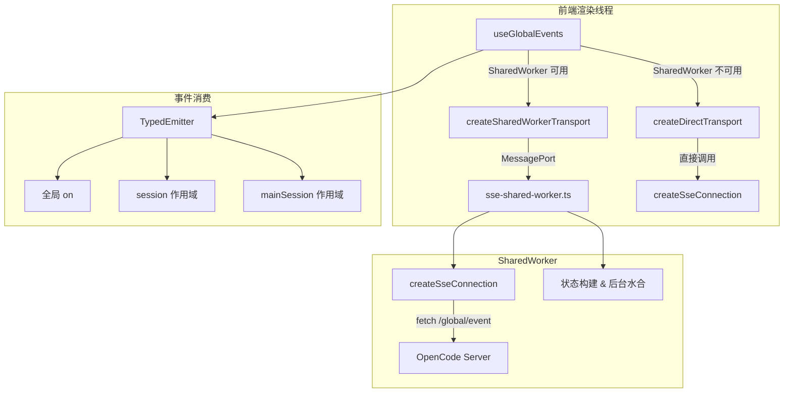
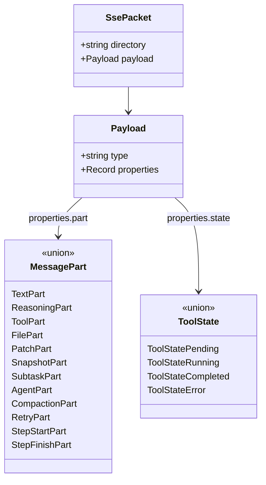

本文档阐述 Vis 应用中 Server-Sent Events（SSE）的完整连接管理体系与事件协议规范。SSE 作为前端与 OpenCode 后端之间的单向实时通信通道，承载了消息流、会话状态、权限请求、工具执行等全部核心事件。整个架构分为三层：**连接层**（`sseConnection.ts`）负责底层的 Fetch API 流式读取与重连；**传输层**（`useGlobalEvents.ts`）提供直接连接与 Shared Worker 两种传输模式，并实现事件路由与会话作用域隔离；**状态层**（`sse-shared-worker.ts` + `useServerState.ts`）在 Shared Worker 中聚合多标签页连接，维护项目、会话、沙盒的权威状态，并通过后台水合机制按需补全数据。理解这三层的职责边界，是掌握 Vis 实时通信架构的关键。

## 连接层：Fetch API 流式读取与自动重连

SSE 连接层不依赖浏览器原生 `EventSource`，而是基于 `fetch()` + `ReadableStream` 实现，以获得对请求头（如 `Authorization`）和响应状态的完全控制。`createSseConnection` 工厂函数返回一个包含 `connect`、`disconnect`、`isConnected` 方法的对象，内部通过 `AbortController` 管理请求生命周期。

连接建立时，客户端向 `GET {baseUrl}/global/event` 发起请求，携带 `Accept: text/event-stream` 头与可选的 `Authorization` 认证头。响应体通过 `ReadableStreamDefaultReader` 逐块读取，使用 `TextDecoder` 将 `Uint8Array` 流解码为文本，并以 `\n\n` 作为 SSE 块分隔符进行解析。每个有效块必须以 `data: ` 前缀开头，后续 JSON 内容经 `parsePacket` 校验后分发。`parsePacket` 执行严格的结构校验：要求根对象包含 `directory`（字符串，缺失时默认为空字符串）与 `payload` 对象，`payload` 必须具有 `type`（字符串）和 `properties`（对象）两个字段，任何不匹配均返回 `null` 并输出警告。

连接层实现了固定间隔（1 秒）的自动重连机制。当流异常关闭或网络错误发生时，`scheduleReconnect` 会递增 `reconnectAttempt` 计数器并设置定时器；连接成功后计数器归零。若收到 HTTP 401 响应，则判定为认证失败，直接触发 `onError` 回调且**不再重连**。`disconnect()` 方法会设置 `disconnectRequested` 标志，清除重连定时器，并中止当前请求，确保连接被干净关闭。连接配置变更（如切换 baseUrl 或 token）时，若 `keyOf` 计算出的标识符发生变化，旧连接会被强制中止并重新建立。

| 场景 | 行为 |
|------|------|
| 首次连接成功 | `onOpen(false)` + 开始读取流 |
| 流正常结束 | `onError('SSE stream closed')` + 1 秒后重连 |
| 网络异常/读取错误 | `onError(message)` + 1 秒后重连 |
| HTTP 401 | `onError(message, 401)` + **不重连** |
| HTTP 非 2xx（非 401） | `onError('HTTP {status}')` + 1 秒后重连 |
| 主动 disconnect | 中止请求、清除定时器、标记断开 |

Sources: [sseConnection.ts](app/utils/sseConnection.ts#L57-L222)

## 传输层：事件路由与双模式传输

`useGlobalEvents` 组合式函数是前端与 SSE 通道交互的统一入口。它根据环境能力自动选择传输模式：当浏览器支持 `SharedWorker` 时使用 `createSharedWorkerTransport`，否则回退到 `createDirectTransport`。两种模式对外暴露一致的 `Transport` 接口（`connect`、`disconnect`、`sendToWorker`），使得上层逻辑无需感知底层差异。

直接传输模式在渲染线程内直接实例化 `createSseConnection`，所有事件回调在主线执行。Shared Worker 传输模式则通过 `new SseSharedWorker()` 启动共享工作线程，所有 SSE 连接、状态维护、后台数据水合均在 Worker 中完成，多标签页共享同一物理连接。前端通过 `MessagePort` 与 Worker 交换消息：发送 `TabToWorkerMessage`（如 `connect`、`disconnect`、`selection.active`、`load-sessions`），接收 `WorkerToTabMessage`（如 `packet`、`connection.open`、`state.bootstrap`、`state.project-updated`、`notification.show`）。

事件路由的核心是 `TypedEmitter<GlobalEventMap>`。所有已知 SSE 事件类型被枚举在 `KNOWN_EVENT_TYPES` 集合中（共 30 余种），`routePacket` 函数根据 `payload.type` 将数据包分发为强类型事件。前端可通过 `on(event, listener)` 订阅全局事件，或通过 `session(selectedSessionId, sessionParentById)` 创建**会话作用域监听器**——该作用域利用 `computeAllowedSessionIds` 预计算指定根会话及其全部后代会话 ID 集合，仅放行属于该子树的事件，实现高效的会话级事件隔离。`mainSession` 则提供更严格的单会话过滤，仅允许与当前选中会话 ID 完全匹配的事件通过。

传输层还负责凭证同步。通过 `watch` 监听 `baseUrl` 与 `authHeader` 的变化，当凭证发生实质变更时自动重连；当 `baseUrl` 被清空时自动断开连接，防止无效请求。

Sources: [useGlobalEvents.ts](app/composables/useGlobalEvents.ts#L1-L522)

## 状态层：Shared Worker 中的权威状态管理

`sse-shared-worker.ts` 是 SSE 架构中最复杂的模块，承担了三项核心职责：**连接复用**、**状态构建**、**按需水合**。Worker 内部维护 `connections: Map<string, ConnectionState>`，以 `baseUrl + authorization` 为键聚合连接。每个 `ConnectionState` 包含一个 `SseConnection` 客户端、一个 `Set<MessagePort>` 记录所有关联标签页、一个 `stateBuilder` 维护项目/会话树状态，以及一个 `notificationManager` 跟踪待处理通知。

当新标签页通过 `connect` 消息附加到 Worker 时，`attachPort` 会检查是否已存在相同凭证的连接：若存在，则复用现有连接并将新端口加入广播集合；若不存在，则创建新的 `ConnectionState` 并启动 SSE 连接。当最后一个端口 detached 时，`cleanupIfUnused` 自动断开底层连接并清理状态，实现连接生命周期与标签页生命周期的解耦。

状态构建由 `createStateBuilder` 完成，其内部维护 `ServerState`（项目 → 沙盒 → 会话 的三级树形结构）。Worker 仅处理 12 种 `WorkerStateEventType` 事件（`session.created/updated/deleted/status`、`project.updated`、`vcs.branch.updated`、`permission.asked/replied`、`question.asked/replied/rejected`、`worktree.ready`），这些事件通过 `parseWorkerStatePacket` 进行严格的运行时类型守卫校验（包含 `isSessionInfo`、`isProjectInfo`、`isPermissionAskedProperties` 等数十个校验函数），拒绝任何结构不符的数据包，确保状态树的完整性。

连接首次建立或重连后，`bootstrapState` 被触发：它先通过 `listProjects` 获取项目列表，再为每个项目的 worktree 及 sandboxes 并行加载会话列表、会话状态映射和 VCS 分支信息，最终构建完整的初始状态并向所有端口广播 `state.bootstrap`。在引导期间到达的 SSE 数据包会被缓冲到 `bufferedStatePackets`，引导完成后再批量处理，避免状态竞争。

Sources: [sse-shared-worker.ts](app/workers/sse-shared-worker.ts#L1-L1293), [stateBuilder.ts](app/utils/stateBuilder.ts#L1-L825)

## 后台水合：分层加载与并发控制

SSE 事件流仅推送增量变更，但初始状态可能不包含所有会话的完整信息。Worker 实现了分层水合策略来补全数据。`loadDirectorySessions` 函数按目录加载会话，支持 `preview` 与 `full` 两种水合级别；`loadDirectoryVcs` 加载 Git 分支信息。两者均通过 `runOpencodeReadTask` 访问 OpenCode REST API，并受全局并发槽位限制。

并发控制通过信号量实现：`OPENCODE_READ_CONCURRENCY = 12` 定义最大并行读取任务数。`acquireOpencodeReadSlot` 在槽位不足时将任务加入 FIFO 队列等待；`releaseOpencodeReadSlot` 在任务完成后唤醒队列中的下一个任务。这一机制防止在大型工作区中同时发起过多 HTTP 请求导致服务器过载。

`scheduleBackgroundHydration` 实现了优先级感知的水合调度：首先立即加载当前激活目录（`pendingSelectedDirectory`）的完整数据，然后将其余目录分批处理（每批 20 个），批次之间延迟 80 毫秒。这种设计确保用户当前关注的项目获得最低延迟的数据补全，同时避免一次性大量请求阻塞事件循环。水合结果通过 `state.project-updated` 消息广播到所有前端标签页，由 `useServerState` 中的 `handleStateMessage` 合并到 Vue 的 `reactive` 状态中。

| 水合类型 | 数据来源 | 并发限制 | 触发时机 |
|---------|---------|---------|---------|
| 初始引导 | `listProjects` + `listSessions` + `getVcsInfo` | 12 槽位 | 连接建立/重连 |
| 激活目录优先 | `listSessions` + `getVcsInfo` | 12 槽位 | `selection.active` 消息 |
| 后台批量 | `listSessions` + `getVcsInfo` | 12 槽位，20 目录/批，80ms 间隔 | 引导完成后 |

Sources: [sse-shared-worker.ts](app/workers/sse-shared-worker.ts#L55-L798), [useServerState.ts](app/composables/useServerState.ts#L1-L67)

## 事件协议：数据包结构与类型体系

SSE 事件流中的每条消息遵循统一的信封结构。`SsePacket` 包含 `directory`（事件作用域，通常为项目目录）与 `payload`（事件体）。`payload` 内部再分为 `type`（事件名称）和 `properties`（事件专属字段）。应用定义了 `GlobalEventMap` 将 30 余种事件名称映射到强类型载荷，覆盖消息、会话、权限、问题、待办、PTY、工作树、项目、VCS、文件、LSP、命令、安装、MCP 等全部领域。

消息领域的事件最为密集：`message.updated` 推送完整消息对象，`message.part.updated` 推送消息片段（Part）的完整替换，`message.part.delta` 则推送片段字段的增量文本（如流式生成的文本内容）。Part 类型采用**可辨识联合**（discriminated union）设计，共 12 种子类型：`text`、`reasoning`、`tool`、`file`、`patch`、`snapshot`、`subtask`、`agent`、`compaction`、`retry`、`step-start`、`step-finish`。每种类型在共享的 `id/sessionID/messageID` 基础字段之上扩展专属属性，例如 `ToolPart` 包含 `callID`、`tool` 名称和 `state`（状态机：`pending` → `running` → `completed|error`）。

会话领域的事件驱动会话树的状态变更：`session.created/updated/deleted` 维护会话元数据，`session.status` 报告会话当前状态（`idle`、`busy`、`retry`），`session.diff` 推送代码变更摘要，`session.compacted` 标记会话已被压缩。权限与问题事件则构成请求-响应对：`permission.asked` / `question.asked` 由服务器发起，用户响应后通过 REST API 回传，服务器再以 `permission.replied` / `question.replied` 确认。

Sources: [sse.ts](app/types/sse.ts#L1-L581), [SSE.md](docs/SSE.md#L1-L576)

## 通知管理：权限、问题与空闲状态

`notificationManager` 在 Worker 中维护一个轻量级的通知索引，以**根会话 ID** 为键（通过 `resolveRoot` 将任意会话 ID 解析到其所属根会话），每个条目记录 `projectId`、`sessionId` 和待处理的 `requestIds` 集合。当 `permission.asked` 或 `question.asked` 事件到达时，对应请求 ID 被加入通知索引，并向所有端口广播 `notification.show`；当 `permission.replied` 或 `question.replied/rejected` 到达时，请求 ID 被移除。

空闲通知是一个特殊类别：当 `session.status` 事件报告某会话树进入 `idle` 状态（通过 `stateBuilder.isSessionTreeIdle` 判定整棵树无 busy 会话）时，Worker 会生成 `idle:{projectId}:{rootSessionId}` 形式的伪请求 ID 加入通知。若用户当前正聚焦于该会话树（通过 `activeSelection` 比对），则空闲通知被抑制，避免干扰当前工作。通知索引的任何变更都会触发 `state.notifications-updated` 广播，前端 `useServerState` 将通知状态同步到 `reactive(notifications)`，供 UI 层（如状态栏徽章）消费。

Sources: [notificationManager.ts](app/utils/notificationManager.ts#L1-L145), [sse-shared-worker.ts](app/workers/sse-shared-worker.ts#L891-L999)

## 测试与可靠性

`sseConnection.test.ts` 为连接层提供了完整的单元测试覆盖，使用 Vitest 的 `vi.useFakeTimers()` 控制重连定时器，使用 `TransformStream` 模拟 SSE 流。测试用例涵盖：有效数据包解析、多数据块流式读取、401 认证失败不重连、空 baseUrl 自定义错误、流关闭自定义错误消息、干净断开状态断言等。这些测试确保了连接层在异常场景下的行为可预期，是实时通信可靠性的基础保障。

Shared Worker 层面的运行时可靠性则通过多重机制实现：所有外部输入（SSE 数据包、REST API 响应）均经过严格的类型守卫函数校验；水合任务中的异常被 `.catch(() => {})` 静默捕获，防止单个目录加载失败拖垮整体状态；`isBootstrappingState` 标志与包缓冲机制避免引导期内的状态竞争；连接复用确保多标签页场景下不会建立冗余连接。

Sources: [sseConnection.test.ts](app/utils/sseConnection.test.ts#L1-L255)

## 相关阅读

SSE 连接管理与事件协议是 Vis 实时通信架构的基石。其上层依赖包括：[Shared Worker 状态同步机制](9-shared-worker-zhuang-tai-tong-bu-ji-zhi) 进一步阐述 Worker 与多标签页的协作细节；[消息流处理与增量更新](14-xiao-xi-liu-chu-li-yu-zeng-liang-geng-xin) 深入解析 `message.part.delta` 的增量渲染管线；[OpenCode API 与 REST 接口](23-opencode-api-yu-rest-jie-kou) 说明后台水合所调用的 REST 端点规范。建议按此顺序深入阅读，以建立从传输层到表现层的完整认知。