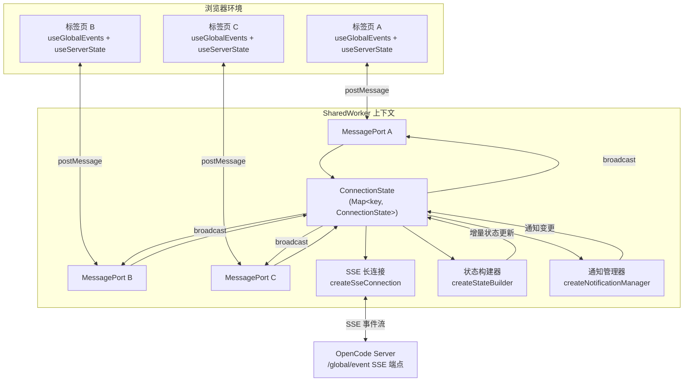

本文档深入解析 Vis 应用中 SSE Shared Worker 的架构设计与实现细节。该 Worker 作为跨标签页的单例状态中枢，负责维护与服务器的 SSE 长连接、聚合项目与会话状态、管理通知队列，并通过 MessagePort 向所有连接的浏览器标签页广播增量更新。理解这一机制对于掌握应用的全局状态一致性、多标签协作以及性能优化策略至关重要。

## 架构总览：多标签页共享的状态中枢

Vis 应用采用 **SharedWorker** 作为 SSE 连接与状态管理的单例层，解决了多标签页场景下的连接复用与状态一致性问题。当用户打开多个标签页时，所有页面共享同一个 Worker 实例，Worker 内部维护一条 SSE 长连接，接收服务器推送的事件流，并将解析后的状态变更广播给每个连接的页面。

前端页面通过 `useGlobalEvents` 组合式函数与 Worker 通信。该组合式函数检测浏览器是否支持 SharedWorker，若支持则创建 `SharedWorkerTransport`，否则回退到 `DirectTransport` 直接在页面内管理 SSE 连接。`useServerState` 组合式函数则负责在 Vue 响应式系统中维护 Worker 同步过来的项目状态与通知状态。

Worker 内部以 `ConnectionState` 为核心数据结构，每个唯一的 `(baseUrl, authorization)` 组合对应一个连接状态实例。该实例聚合了 SSE 连接客户端、状态构建器、通知管理器、端口集合以及会话/VCS 数据的水合追踪状态。

Sources: [sse-shared-worker.ts](app/workers/sse-shared-worker.ts#L23-L51)

## 消息协议：Tab 与 Worker 之间的双向通信

Worker 与页面之间的通信基于严格的类型化消息协议，定义在 `app/types/sse-worker.ts` 中。消息分为两类：**TabToWorkerMessage**（页面发往 Worker）和 **WorkerToTabMessage**（Worker 发往页面）。

页面发往 Worker 的消息包括连接控制、会话加载、活跃选区同步以及沙箱删除通知：

| 消息类型 | 方向 | 作用 |
|---|---|---|
| `connect` | Tab → Worker | 建立 SSE 连接，携带 baseUrl 与 authorization |
| `disconnect` | Tab → Worker | 断开当前端口的连接 |
| `selection.active` | Tab → Worker | 同步当前活跃的 projectId/sessionId/directory |
| `load-sessions` | Tab → Worker | 请求加载指定目录的完整会话列表 |
| `sandbox.deleted` | Tab → Worker | 通知 Worker 删除指定沙箱目录 |

Worker 发往页面的消息包括连接生命周期、状态快照、增量更新以及通知提示：

| 消息类型 | 方向 | 作用 |
|---|---|---|
| `packet` | Worker → Tab | 透传原始 SSE 数据包 |
| `connection.open` | Worker → Tab | SSE 连接已建立 |
| `connection.error` | Worker → Tab | 连接错误，含状态码 |
| `connection.reconnected` | Worker → Tab | 断线重连成功 |
| `state.bootstrap` | Worker → Tab | 全量状态快照（projects + notifications） |
| `state.project-updated` | Worker → Tab | 单个项目状态增量更新 |
| `state.project-removed` | Worker → Tab | 项目被移除 |
| `state.notifications-updated` | Worker → Tab | 通知队列全量替换 |
| `notification.show` | Worker → Tab | 触发浏览器通知（permission/question/idle） |

`useGlobalEvents` 在页面侧通过 `instance.port.onmessage` 接收 Worker 消息，并将状态类消息路由给 `useServerState.handleStateMessage` 处理。`useServerState` 使用 Vue 的 `reactive` 对象存储 `projects` 与 `notifications`，确保状态变更自动触发 UI 更新。

Sources: [sse-worker.ts](app/types/sse-worker.ts#L1-L72), [useGlobalEvents.ts](app/composables/useGlobalEvents.ts#L220-L333), [useServerState.ts](app/composables/useServerState.ts#L1-L67)

## 连接生命周期：端口绑定与连接复用

Worker 通过 `self.onconnect` 监听新的标签页连接。每个连接会获得一个独立的 `MessagePort`，Worker 将其绑定到对应的 `ConnectionState` 上。连接复用的核心逻辑在 `attachPort` 函数中：Worker 以 `toKey(baseUrl, authorization)` 为键查找现有连接，若存在则复用，否则调用 `createConnectionState` 新建。

`createConnectionState` 初始化一个完整的连接状态实例，其中最关键的是 `createSseConnection` 回调配置。当 SSE 连接打开时，Worker 广播 `connection.open` 给所有端口，并触发 `bootstrapState` 进行状态初始化；当收到数据包时，Worker 先广播原始 `packet` 给所有页面（供消息流处理使用），再调用 `handleStatePacket` 进行状态解析与增量更新。

当页面关闭或主动断开时，`detachPort` 将端口从 `ConnectionState.ports` 中移除。若该连接的所有端口均已断开，`cleanupIfUnused` 会自动关闭 SSE 连接并清理 `connections` 映射，避免资源泄漏。

Sources: [sse-shared-worker.ts](app/workers/sse-shared-worker.ts#L1105-L1195), [sseConnection.ts](app/utils/sseConnection.ts#L57-L221)

## 状态构建器：从 SSE 事件到规范化状态

`createStateBuilder` 是 Worker 内部的状态核心，负责将离散的 SSE 事件转换为规范化的 `ServerState` 树。状态模型采用三级结构：**ServerState → ProjectState → SandboxState → SessionState**。每个 Sandbox 代表一个 VCS 分支/worktree，其下的 `rootSessions` 数组按 `timeUpdated` 降序维护根会话的显示顺序，所有子会话扁平存储在 `sessions` 记录中。

状态构建器内部维护三组索引以加速查询：

- `projectIdByDirectory`: 目录路径到项目 ID 的映射
- `sessionLocationById`: 会话 ID 到其所在项目/目录的映射
- `ephemeralLastSeenAt` / `ephemeralLastActiveAt`: 子会话的活跃时间戳（用于自动清理）

状态构建器暴露两类 API：**批量应用 API**（`applyProjects`、`applySessions`、`applyStatuses`、`applyVcsInfo`）用于初始化或全量刷新；**增量处理 API**（`processSessionCreated`、`processSessionUpdated`、`processSessionDeleted`、`processSessionStatus`、`processProjectUpdated`、`processVcsBranchUpdated`）用于处理单个 SSE 事件。

会话的 `upsertSession` 逻辑尤为关键。它处理会话的创建、更新、目录迁移以及父子关系绑定。当会话带有 `parentID` 时，系统会自动将其归入根会话所在的沙箱目录，确保子会话与父会话在状态树中的物理一致性。根会话的变更还会触发 `moveRootDescendantsToRootSandbox`，将所有后代会话迁移到新的根目录。

Sources: [stateBuilder.ts](app/utils/stateBuilder.ts#L120-L825), [worker-state.ts](app/types/worker-state.ts#L1-L89)

## 事件处理与状态增量同步

Worker 通过 `handleStatePacket` 函数处理所有与状态相关的 SSE 事件。该函数首先调用 `parseWorkerStatePacket` 对原始 SSE 包进行类型守卫验证，确保 `properties` 符合预期的结构。支持的状态事件类型定义在 `WORKER_STATE_EVENT_TYPES` 中，共 12 种：

- 会话生命周期：`session.created`、`session.updated`、`session.deleted`
- 会话状态：`session.status`
- 项目与 VCS：`project.updated`、`vcs.branch.updated`、`worktree.ready`
- 交互请求：`permission.asked`、`question.asked`
- 交互响应：`permission.replied`、`question.replied`、`question.rejected`

处理流程遵循统一的模式：调用 `stateBuilder` 的对应处理函数获取变更的项目 ID，然后通过 `emitProjectUpdated` 广播增量更新；若涉及通知变更，则通过 `emitNotificationsUpdated` 广播通知状态。

对于 `session.status` 事件，Worker 会进一步计算会话树的空闲状态。通过 `stateBuilder.isSessionTreeIdle` 遍历根会话及其所有后代，若整棵树均为 `idle` 状态且当前用户未聚焦该会话树，则生成 `idle` 通知。这一机制实现了"后台会话完成时提醒用户"的产品需求。

Sources: [sse-shared-worker.ts](app/workers/sse-shared-worker.ts#L891-L1031), [sse.ts](app/types/sse.ts#L549-L569)

## 数据水合：按需加载与后台批量刷新

SSE 事件流仅推送增量变更，初始状态需要通过 REST API 主动拉取。Worker 实现了分层水合策略，平衡了首屏性能与数据完整性。

**Bootstrap 水合**在 SSE 连接建立后执行。`bootstrapState` 函数首先通过 `listProjects` 获取项目列表，然后对每个项目的目录并行拉取 `listSessions`（根会话）、`getSessionStatusMap`（状态映射）和 `getVcsInfo`（分支信息）。所有数据通过 `stateBuilder` 的批量 API 应用后，Worker 广播 `state.bootstrap` 全量快照，并清空 `bufferedStatePackets` 中在初始化期间缓冲的实时事件。

**按需水合**响应页面的 `load-sessions` 消息。`loadDirectorySessions` 函数以目录为粒度，支持 `preview` 与 `full` 两级水合级别。若该目录已处于 `full` 级别，则直接返回；若存在进行中的水合请求，则等待其完成。水合完成后更新 `sessionHydrationLevelByDirectory` 映射。`loadDirectoryVcs` 则负责按需加载 VCS 分支信息。

**后台批量水合**在 Bootstrap 完成后启动。`scheduleBackgroundHydration` 将非活跃目录分批处理，每批 20 个目录，批次间延迟 80ms，避免一次性发起大量请求阻塞主线程。当前活跃目录（`pendingSelectedDirectory`）会被优先水合。

Sources: [sse-shared-worker.ts](app/workers/sse-shared-worker.ts#L616-L784), [sse-shared-worker.ts](app/workers/sse-shared-worker.ts#L1033-L1103)

## 通知管理：请求去重与会话级聚合

`createNotificationManager` 实现了通知请求的去重与会话级聚合。通知以根会话为维度组织：每个 `NotificationEntry` 包含 `projectId`、`sessionId`（已解析为根会话）以及 `requestIds` 集合。

当 `permission.asked` 或 `question.asked` 事件到达时，Worker 调用 `addNotification` 将请求 ID 加入对应根会话的集合。若该会话首次出现通知，则触发 `notification.show` 消息，页面侧可据此显示浏览器原生通知。当用户回复或拒绝请求时，`removeNotification` 清理对应 ID。若用户切换选区到某会话，`selection.active` 消息会触发该会话 `idle` 通知的清除。

通知管理器采用不可变更新策略：每次增删操作创建新的 `Map` 实例，确保快照一致性。`getState` 将内部 `Set<string>` 序列化为 `string[]`，便于通过 `postMessage` 传输。

Sources: [notificationManager.ts](app/utils/notificationManager.ts#L1-L145), [sse-shared-worker.ts](app/workers/sse-shared-worker.ts#L820-L856)

## 并发控制与资源管理

Worker 内部实现了多层并发控制机制，防止资源耗尽或竞态条件。

**OpenCode 读取并发槽**通过 `acquireOpencodeReadSlot` / `releaseOpencodeReadSlot` 实现全局信号量，最大并发数 `OPENCODE_READ_CONCURRENCY = 12`。所有涉及 REST API 的读取操作（Bootstrap、水合、未知目录解析）均需先获取槽位，确保不会因标签页激增导致服务器过载。

**水合去重**通过 `sessionHydrationInFlightByDirectory` 和 `vcsHydrationInFlightByDirectory` 映射实现。同一目录的并发水合请求会复用进行中的 Promise，避免重复拉取。水合完成后通过 `finally` 清理映射，并校验 Promise 身份防止过期请求误删活跃映射。

**Bootstrap 状态缓冲**通过 `isBootstrappingState` 标志与 `bufferedStatePackets` 数组实现。Bootstrap 期间到达的实时 SSE 事件被缓冲而非立即处理，待 Bootstrap 完成后通过 `flushBufferedStatePackets` 顺序回放，确保状态一致性。

**子会话自动清理**通过 `pruneEphemeralChildren` 实现。非活跃（非 busy/retry）的子会话若在 `CHILD_SESSION_PRUNE_TTL_MS`（20 分钟）内未被查看或激活，将被自动从状态树中移除，防止长期积累的子会话数据膨胀。

Sources: [sse-shared-worker.ts](app/workers/sse-shared-worker.ts#L55-L77), [sse-shared-worker.ts](app/workers/sse-shared-worker.ts#L786-L793), [stateBuilder.ts](app/utils/stateBuilder.ts#L375-L399)

## 未知目录解析与会话归属修复

在多项目/多沙箱场景中，SSE 事件可能携带 Worker 尚未知晓的目录路径。`resolveUnknownSessionDirectory` 函数处理这一边界情况：当 `session.created` 或 `session.updated` 事件无法解析到已知项目时，Worker 通过 `getCurrentProject` REST API 查询该目录所属的项目信息，然后调用 `registerSandboxDirectory` 将目录注册到正确的项目下，最后重新应用会话变更。

这一机制确保了即使在项目结构动态变化（如新建 worktree、切换分支）时，状态树仍能正确维护会话与项目的归属关系。

Sources: [sse-shared-worker.ts](app/workers/sse-shared-worker.ts#L858-L889), [stateBuilder.ts](app/utils/stateBuilder.ts#L691-L704)

## 前端集成：从 Worker 消息到 Vue 响应式状态

页面侧的状态消费链路如下：`useGlobalEvents` 接收 Worker 消息 → 通过 `setWorkerMessageHandler` 将状态消息委托给 `useServerState.handleStateMessage` → `useServerState` 更新 `reactive(projects)` 与 `reactive(notifications)` → Vue 组件通过计算属性或模板引用响应式地读取状态。

`App.vue` 在初始化时执行 `ge.setWorkerMessageHandler(serverState.handleStateMessage)`，建立消息路由。当用户切换会话或目录时，`syncActiveSelectionToWorker` 通过 `ge.sendToWorker({ type: 'selection.active', ... })` 将选区同步给 Worker，Worker 据此更新 `activeSelection` 并抑制对应会话的 `idle` 通知。

`App.vue` 还通过 `watch([selectedProjectId, selectedSessionId, activeDirectory], syncActiveSelectionToWorker)` 实现选区的自动同步，确保 Worker 始终掌握用户的当前上下文。

Sources: [App.vue](app/App.vue#L6827-L6828), [App.vue](app/App.vue#L4965-L4976), [useServerState.ts](app/composables/useServerState.ts#L28-L52)

## 降级策略：SharedWorker 不可用时的直接连接

当浏览器不支持 SharedWorker（或处于隐私模式等限制环境）时，`useGlobalEvents` 自动降级到 `createDirectTransport`。该模式直接在页面内创建 `createSseConnection` 实例管理 SSE 连接，所有状态处理逻辑由页面自身承担。虽然失去了跨标签页状态共享的能力，但保证了核心功能在受限环境中的可用性。

降级检测发生在 `useGlobalEvents` 初始化时：`typeof SharedWorker !== 'undefined' ? createSharedWorkerTransport(...) : createDirectTransport(...)`。两种 Transport 实现统一的 `Transport` 接口，对上层代码透明。

Sources: [useGlobalEvents.ts](app/composables/useGlobalEvents.ts#L349-L372), [useGlobalEvents.ts](app/composables/useGlobalEvents.ts#L138-L217)

## 阅读延伸

Shared Worker 状态同步机制是 Vis 实时通信层的核心组件，与以下模块紧密协作：

- **[SSE 连接管理与事件协议](8-sse-lian-jie-guan-li-yu-shi-jian-xie-yi)** — 了解 SSE 连接的底层实现、重连策略与事件包解析
- **[全局状态与事件系统](6-quan-ju-zhuang-tai-yu-shi-jian-xi-tong)** — 探索前端事件总线 `TypedEmitter` 与 `useGlobalEvents` 的会话作用域隔离
- **[消息流处理与增量更新](14-xiao-xi-liu-chu-li-yu-zeng-liang-geng-xin)** — 理解 SSE `packet` 如何被转换为消息、部件与增量更新
- **[目录优先的会话树模型](12-mu-lu-you-xian-de-hui-hua-shu-mo-xing)** — 深入会话树的三级状态模型与沙箱目录映射