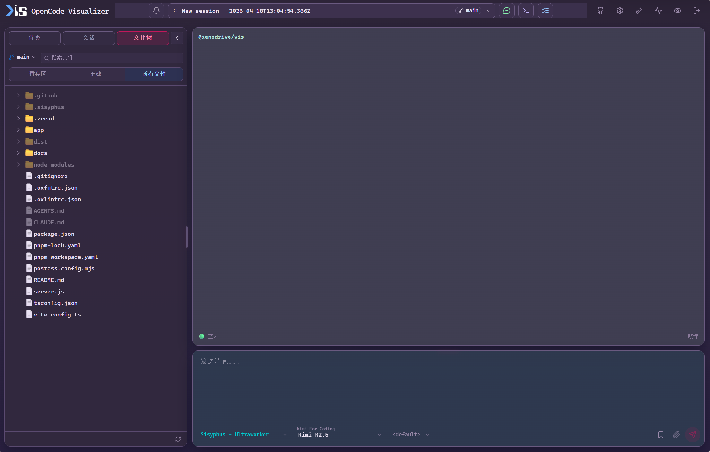
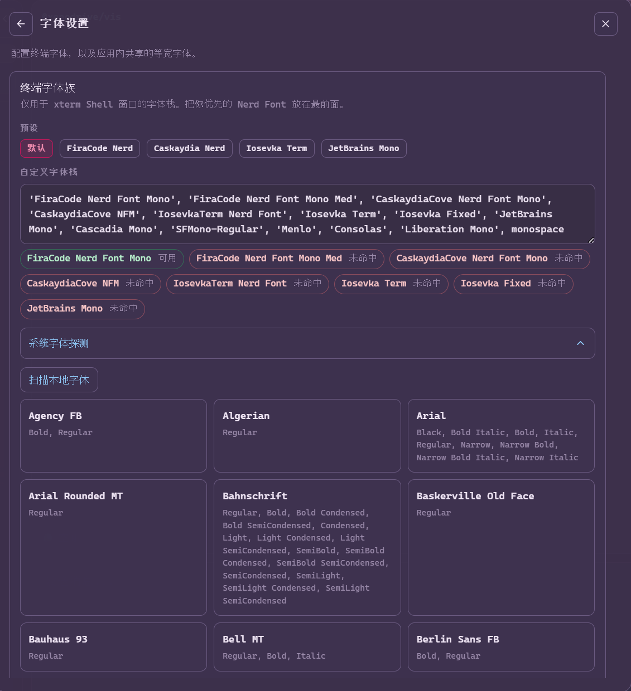
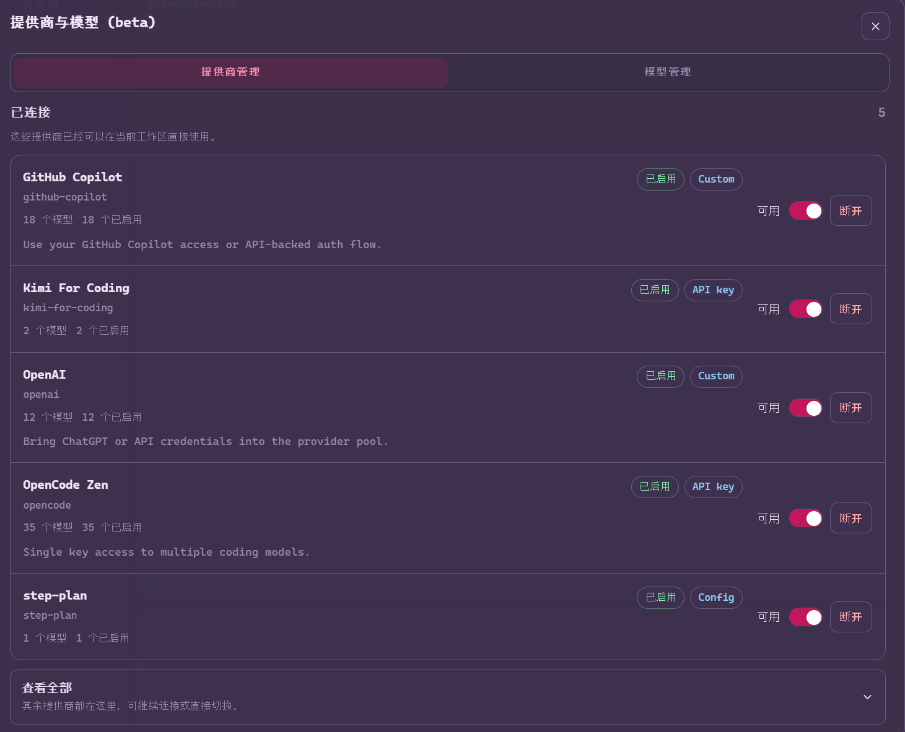
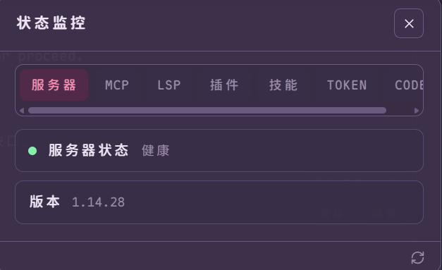
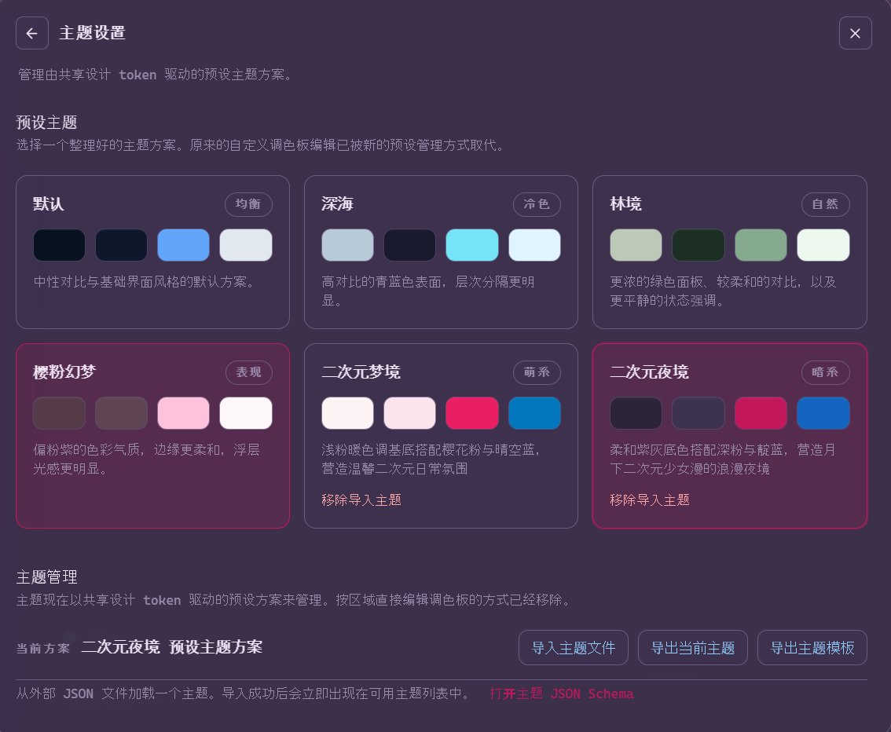
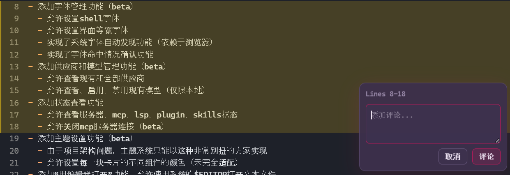
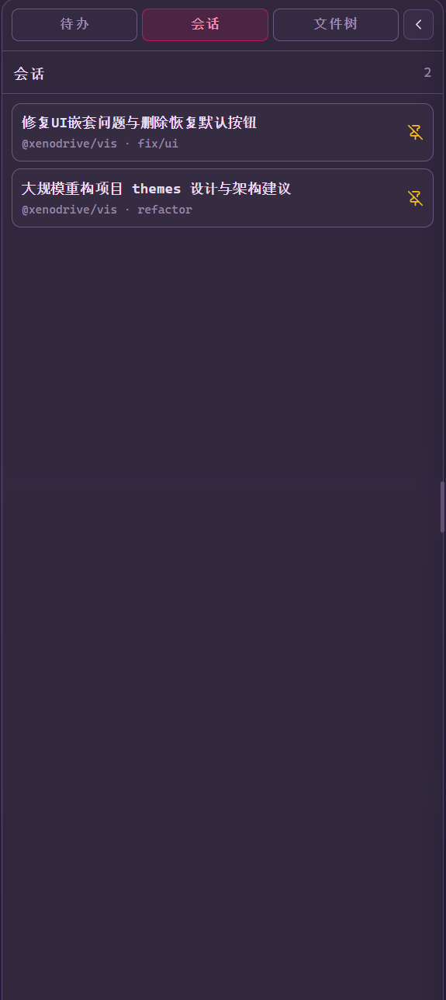
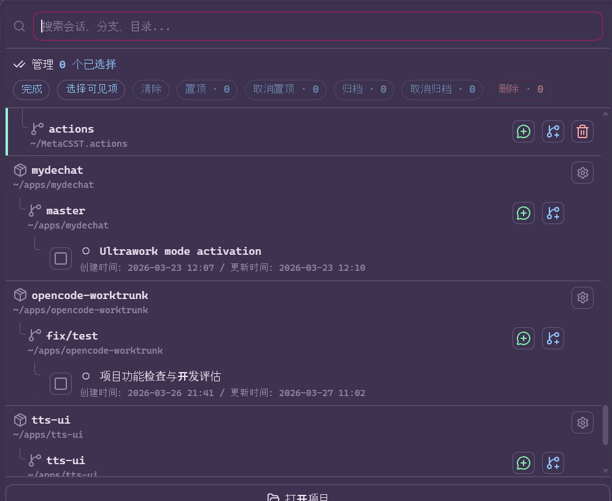
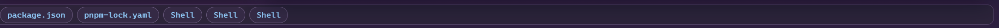

# OpenCode Visualizer CN

[English](#english) | [中文](#中文)

---

<a name="中文"></a>
## 简介

本项目是 [OpenCode](https://github.com/sst/opencode) 的一个第三方 Web UI，fork 自 [vis](https://github.com/xenodrive/vis)。由于上游仓库不接受 PR，我们将其作为独立项目持续维护，并进行了大量功能改进、性能优化和本地化支持。

> **核心改进方向**：界面汉化与 i18n 支持、字体与主题管理、会话批量操作与 Pin 功能、悬浮窗与 Dock 栏管理、性能优化、桌面应用打包。

---

## 功能特性

### 上游原始功能（由 [xenodrive/vis](https://github.com/xenodrive/vis) 提供）

本项目完整保留了上游 [Vis](https://github.com/xenodrive/vis) 的所有核心功能：

- **审阅优先的悬浮窗口** — 以审阅为核心设计的浮动窗口系统，保持工具输出和智能体推理过程的完整上下文，支持交互式审阅与回溯
- **多项目与会话管理** — 支持多项目和工作树（Worktree）的会话组织，轻松切换不同代码库与分支上下文
- **代码与 Diff 查看器** — 内置语法高亮，支持多种编程语言的代码展示与 diff 对比，专为快速、自信的代码审阅设计
- **交互式智能体工作流** — 权限请求、问题提示等人机协作交互，让 AI 代理在关键操作前获得用户确认
- **嵌入式终端** — 基于 xterm.js 的完整终端模拟器，支持 Shell 交互与命令执行

> 原项目同时支持 **Cloud（托管版免安装）** 和 **Local（本地部署）** 两种使用方式。本项目在此基础上扩展了更多功能。

### 本项目新增功能

| 功能类别 | 改进内容 | 状态 |
|---|---|---|
| **国际化 (i18n)** | 完整 i18n 框架支持，添加简体中文翻译 | ✅ 已上线 |
| **字体管理** | 支持设置 Shell 字体、界面等宽字体，系统字体自动发现 | 🅱️ Beta |
| **供应商与模型管理** | 查看/启用/禁用本地模型和供应商 | 🅱️ Beta |
| **状态监控** | 查看服务器、MCP、LSP、Plugin、Skills 状态，支持关闭 MCP 连接 | ✅ 已上线 |
| **主题设置** | 自定义各卡片不同组件颜色 | 🅱️ Beta |
| **编辑器集成** | 使用系统 `$EDITOR` 打开文本文件 | ✅ 已上线 |
| **代码行评论** | 鼠标拖拽选择范围，评价并附加到输入框 | ✅ 已上线 |
| **会话 Pin** | 侧栏增加 Sessions 栏，Pin 常用会话 | ✅ 已上线 |
| **批量管理** | 顶栏 Management 按钮，多选 Session 操作 | ✅ 已上线 |
| **取消归档** | 找回已归档的 Session | ✅ 已上线 |
| **悬浮窗管理** | 全面覆盖的关闭/最小化按钮，底部 Dock 栏存放最小化窗口 | ✅ 已上线 |
| **快捷命令** | 支持 `@` 显式召唤代理 | ✅ 已上线 |
| **性能优化** | 超大 Session 懒加载、超多 Session 后台 Hydration、冷启动加速 | ✅ 已上线 |
| **桌面应用** | Electron 桌面端打包，支持 Windows / macOS / Linux | ✅ 已上线 |

> 📋 **详细变更日志**：请参阅 [CHANGELOG.md](./CHANGELOG.md)  
> 🗺️ **路线图与计划**：请参阅 [RoadMap.md](./RoadMap.md)

---

## 技术栈

| 层级 | 技术 | 说明 |
|---|---|---|
| **前端框架** | [Vue 3](https://vuejs.org/) + Composition API | 响应式 UI 框架 |
| **构建工具** | [Vite](https://vitejs.dev/) | 极速开发与构建 |
| **样式方案** | [Tailwind CSS v4](https://tailwindcss.com/) + PostCSS | 原子化 CSS |
| **终端组件** | [xterm.js](https://xtermjs.org/) | 嵌入式终端模拟器 |
| **代码高亮** | [Shiki](https://shiki.style/) | 语法高亮与 Markdown 渲染 |
| **国际化** | [Vue I18n](https://vue-i18n.intlify.dev/) | 多语言支持 |
| **后端服务** | [Hono](https://hono.dev/) + `@hono/node-server` | 轻量级 HTTP 服务 |
| **桌面端** | [Electron](https://www.electronjs.org/) | 跨平台桌面应用打包 |
| **代码规范** | [oxlint](https://oxc.rs/docs/guide/usage/linter.html) + oxfmt | 高性能 JS/TS 代码检查与格式化 |
| **测试框架** | [Vitest](https://vitest.dev/) | 单元测试 |

---

## 环境要求

在开始前，请确保你的环境满足以下条件：

| 依赖 | 版本要求 | 说明 |
|---|---|---|
| [Node.js](https://nodejs.org/) | ≥ 20 | 运行时与构建环境 |
| [pnpm](https://pnpm.io/) | 10.29.3 (推荐) | 包管理器，本项目使用 `packageManager` 锁定 |
| [OpenCode Server](https://github.com/sst/opencode) | 最新版 | 后端服务，提供 API 与智能体能力 |
| 系统 `$EDITOR` | 可选 | 用于"用编辑器打开"功能（如 VS Code、Neovim 等） |

> 💡 **提示**：本项目默认端口已从 `3000` 修改为 `23003`，以减少在 WSL 上与 Windows 服务的端口冲突。

---

## 快速开始

```bash
git clone https://github.com/qiyuanhuakai/opencode-visualizer-cn
cd opencode-visualizer-cn
pnpm install
pnpm build
node server.js
```

建议使用 `nohup node server.js 2>&1 &` 将服务器放在后台持久运行。

然后打开 `http://localhost:23003`。

---

## 功能展示

### 1. 主界面与简体中文支持

<--  -->

### 2. 字体管理

<--  -->

### 3. 供应商与模型管理

<--  -->

### 4. 状态监控

<--  -->

### 5. 主题设置

<--  -->

### 6. 代码行评论

<--  -->

### 7. Session Pin

<--  -->

### 8. 批量管理

<--  -->

### 9. 悬浮窗与 Dock 栏

<--  -->

---

## 开发与构建

### Web 开发

```sh
pnpm install
pnpm dev
```

### Electron 桌面端

本项目支持将 Web UI 打包为原生桌面应用，基于 Electron 框架，支持 **Windows**、**macOS** 和 **Linux** 三大平台。

**桌面端特性：**
- 独立应用窗口，无需浏览器，支持 macOS 隐藏式标题栏
- 安全沙箱（`contextIsolation` + `sandbox`），外部链接通过系统浏览器打开
- 开发模式下自动处理 CORS，便于本地调试
- 支持 NSIS / AppImage / deb / dmg 各平台安装包

```bash
# 桌面端开发模式（热重载）
pnpm electron:start

# 打包预览（不生成安装器）
pnpm electron:preview

# 完整构建（生成各平台安装包）
pnpm electron:build
```

构建产物输出到 `dist-electron/`，包含：
- **Windows**：`.exe` (NSIS)
- **macOS**：`.dmg` / `.zip` (Intel / Apple Silicon)
- **Linux**：`.AppImage` / `.deb`

---

## 声明

本项目是为 OpenCode 构建的第三方 Web UI，**并非**由 OpenCode 团队开发，且与他们**没有任何关联**。

本项目基于 [xenodrive/vis](https://github.com/xenodrive/vis) 构建，感谢原作者的出色工作。

## License

MIT

---

<a name="english"></a>
## Introduction

This project is a third-party Web UI for [OpenCode](https://github.com/sst/opencode), forked from [vis](https://github.com/xenodrive/vis). Since the upstream repository does not accept PRs, we maintain it as an independent project with significant feature improvements, performance optimizations, and localization support.

> **Core Improvement Areas**: UI internationalization (i18n), font & theme management, session batch operations & Pin functionality, floating window & Dock bar management, performance optimization, desktop app packaging.

---

## Features

### Original Features (from [xenodrive/vis](https://github.com/xenodrive/vis))

All upstream [Vis](https://github.com/xenodrive/vis) core features are fully preserved:

- **Review-first Floating Windows** — Window-style floating panels designed around code review, preserving full context of tool output and agent reasoning for interactive review and backtracking
- **Multi-project Session Management** — Organize sessions across multiple projects and worktrees, easily switch between different codebases and branch contexts
- **Code & Diff Viewer** — Built-in syntax highlighting supporting multiple programming languages, with diff comparison designed for fast, confident code review
- **Interactive Agent Workflows** — Permission requests, question prompts, and other human-in-the-loop interactions, allowing AI agents to get user confirmation before critical operations
- **Embedded Terminal** — Full terminal emulator based on xterm.js with Shell interaction and command execution

> The original project supports both **Cloud (hosted, no installation)** and **Local (self-hosted)** deployment modes. This project extends it with additional features.

### New Features in This Project

| Category | Feature | Status |
|---|---|---|
| **Internationalization (i18n)** | Full i18n framework with Simplified Chinese | ✅ Available |
| **Font Management** | Shell font, UI monospace font, system font auto-discovery | 🅱️ Beta |
| **Provider & Model Management** | View/enable/disable local models and providers | 🅱️ Beta |
| **Status Monitor** | View server, MCP, LSP, Plugin, Skills status; close MCP connections | ✅ Available |
| **Theme Settings** | Customize colors for different card components | 🅱️ Beta |
| **Editor Integration** | Open text files with system `$EDITOR` | ✅ Available |
| **Code Line Comment** | Drag to select range and append comment to input | ✅ Available |
| **Session Pin** | Pinned Sessions panel in sidebar | ✅ Available |
| **Batch Management** | Multi-select session operations via Management button | ✅ Available |
| **Unarchive** | Restore previously archived sessions | ✅ Available |
| **Floating Window Management** | Close/minimize buttons for all popups, bottom Dock bar | ✅ Available |
| **Quick Commands** | `@` shortcut to explicitly summon agents | ✅ Available |
| **Performance** | Lazy loading for large sessions, background hydration, faster cold start | ✅ Available |
| **Desktop App** | Electron desktop packaging for Windows / macOS / Linux | ✅ Available |

> 📋 **Detailed changelog**: [CHANGELOG.md](./CHANGELOG.md)  
> 🗺️ **Roadmap & Plans**: [RoadMap.md](./RoadMap.md)

---

## Tech Stack

| Layer | Technology | Description |
|---|---|---|
| **Frontend Framework** | [Vue 3](https://vuejs.org/) + Composition API | Reactive UI framework |
| **Build Tool** | [Vite](https://vitejs.dev/) | Fast development and production builds |
| **Styling** | [Tailwind CSS v4](https://tailwindcss.com/) + PostCSS | Atomic CSS utility framework |
| **Terminal** | [xterm.js](https://xtermjs.org/) | Embedded terminal emulator |
| **Code Highlighting** | [Shiki](https://shiki.style/) | Syntax highlighting and Markdown rendering |
| **Internationalization** | [Vue I18n](https://vue-i18n.intlify.dev/) | Multi-language support |
| **Backend Service** | [Hono](https://hono.dev/) + `@hono/node-server` | Lightweight HTTP server |
| **Desktop** | [Electron](https://www.electronjs.org/) | Cross-platform desktop app packaging |
| **Linting** | [oxlint](https://oxc.rs/docs/guide/usage/linter.html) + oxfmt | High-performance JS/TS linting and formatting |
| **Testing** | [Vitest](https://vitest.dev/) | Unit testing framework |

---

## Requirements

Before getting started, ensure your environment meets the following criteria:

| Dependency | Version | Description |
|---|---|---|
| [Node.js](https://nodejs.org/) | ≥ 20 | Runtime and build environment |
| [pnpm](https://pnpm.io/) | 10.29.3 (recommended) | Package manager, locked via `packageManager` |
| [OpenCode Server](https://github.com/sst/opencode) | Latest | Backend service providing API and agent capabilities |
| System `$EDITOR` | Optional | For "Open in Editor" feature (e.g., VS Code, Neovim) |

> 💡 **Tip**: This project changed the default port from `3000` to `23003` to reduce conflicts with Windows services when using WSL.

---

## Quick Start

```bash
git clone https://github.com/qiyuanhuakai/opencode-visualizer-cn
cd opencode-visualizer-cn
pnpm install
pnpm build
node server.js
```

We recommend using `nohup node server.js 2>&1 &` to run the server persistently in the background.

Then open `http://localhost:23003`.

---

## Development & Building

### Web Development

```sh
pnpm install
pnpm dev
```

### Electron Desktop App

This project supports packaging the Web UI as a native desktop application using Electron, supporting **Windows**, **macOS**, and **Linux**.

**Desktop Features:**
- Standalone app window, no browser required, supports macOS hidden-inset title bar
- Secure sandbox (`contextIsolation` + `sandbox`); external links open in system browser
- Auto CORS handling in development mode for local debugging
- Supports NSIS / AppImage / deb / dmg installers for each platform

```bash
# Desktop dev mode (hot reload)
pnpm electron:start

# Preview build (no installer)
pnpm electron:preview

# Full build (generate platform installers)
pnpm electron:build
```

Build artifacts are output to `dist-electron/`, including:
- **Windows**: `.exe` (NSIS)
- **macOS**: `.dmg` / `.zip` (Intel / Apple Silicon)
- **Linux**: `.AppImage` / `.deb`

---

## Disclaimer

This is a third-party Web UI for OpenCode. It was **not** developed by the OpenCode team and has **no affiliation** with them.

This project is built on top of [xenodrive/vis](https://github.com/xenodrive/vis). We thank the original authors for their excellent work.

## License

MIT
